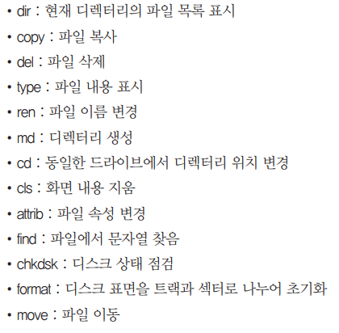
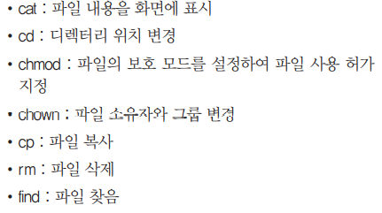
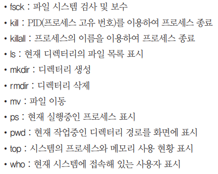
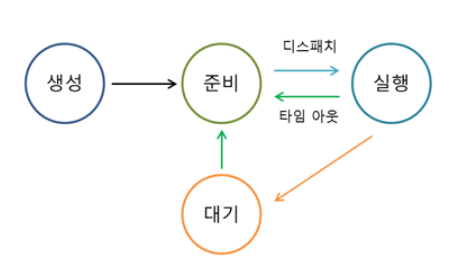
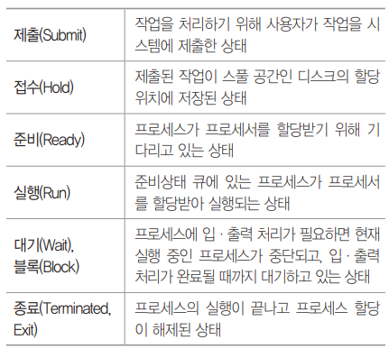

# Application_SW

### 이민아 

---

## Index

- [운영체제](#운영체제)

  - Windows
  - UNIX
    - MAC
  - LINUX
    - Andoroid
- [기억장치](#기억장치)
  - 가상기억장치
  - 페이징 교체 알고리즘
- [프로세스 관리](#프로세스-관리)
- 비선점 스케줄링
  
- 선점 스케줄링
- [교착상태](#교착상태)
- [네트워크](#네트워크)
  - IP주소
  - IPv6
  - 도메인 네임
  - 네트워크 관련 장비 (3계층)
- [프로토콜](#프로토콜)
  - OSI 참조 모델 (7계층)
    - 하위 계층 (물리 → 데이터링크 → 네트워크 ) 
    - 상위 계층 (전송 → 세션 → 표현 → 응용)
  - TCP / IP (4계층)
    - 응용계층
    - 전송계층
    - 인터넷계층
    - 액세스계층
  - 라우팅
- [데이터 교환 방식](#데이터-교환-방식)
  - 회선 교환 방식
  - 패킷 교환 방식
- [가상화](#가상화)
- [클라우딩](#클라우딩)

----

## 운영체제

### 1. 운영체제 

#### (1) Operating System (OS)

- **시스템 자원** 효율적 관리
- 사용자가 컴퓨터 편리하고 효과적으로 사용할 수 있도록 **환경** 제공하는 **여러 프로그램**의 모임

#### (2) 목적 / 성능 평가 기준

- **처리 능력** 향상 : 일정 시간 내 시스템 처리하는 **일의 양**
- **신뢰도** 향상 : 주어진 **문제** 시스템 정확하게 해결
- **사용 가능도** 향상 : 시스템 사용할 필요시 **즉시 사용 가능** 정도
- **반환 시간** 단축 : **작업 의뢰** 시간부터 **처리** 완료 시간

#### (3) 핵심 기능

- 중앙 처리 장치
- 메모리
- 스토리지
- 주변 기기 관리
- 프로세스 관리
- 메모리에 있는 프로그램을 CPU로 이동시켜 관리

#### (4) MMU (Memory Management Unit)

- CPU가 메모리에 접근하는 것을 관리하는 하드웨어 부품
- **가상 메모리를 실제 메모리 주소로 변환**하는 장치

### 2. Winodws

#### (1) 기능

- **GUI (Graphic User Interface)** : 마우스 아이콘 메뉴

  CUI(Command User Interface) : 명령어 직접 입력

- **선점형** 멀티태스킹 : 동시에 여러 개 프로그램 실행하는 멀티태스킹을 하면서 각 작업의 CPU 이용 시간 제어하여 실행중 문제 발생하면 해당 프로그램 강제 종료 후 모든 시스템 자원 반환

- **PnP(Plug and Play)** : 하드웨어 설치시 필요 환경을 자동으로 운영체제가 구성

- **OLE(Object Linking and Embedding)** : 개체를 현재 작성 중인 문서에 자유롭게 연결하거나 삽입하여 편집할 수 있게 하는 기능

#### (2) CLI 기본 명령어

- `dir`(Windows) = `ls` (UNUX) : 파일 전체 나열
- `chkdsk` : 현재 드라이브 상태

### 3. LINUX 

#### (1) 정의

- UNIX와 완벽하게 호환되며 거의 동일
- 소스코드 **무료 공개**
- 리누스 토발즈가 UNIX 기반 개발 운영체제
- 구역내 **근거리 통신망이나 대형기종**에서만 작동하던 UNIX를 386종의 **개인용 컴퓨터**에서도 작동할 수 있게 만든 운영 체제

#### (2) 커널 (Kernel)

- 가장 **핵심**
- **하드웨어 보호 (캡슐화)** 
- 프로그램들과 **하드웨어** 간의 **인터페이스** 역할
- 프로세스, 기억장치, 입출력관리, 데이터 전송 및 변환 등 기능
- **주기억장치**에 적재되어 상주

#### (3) 쉘 (Shell) ★

- **명령어 해석기**
- 사용자의 명령어 인식하여 프로그램 호출
- 시스템과 **사용자** 간의 **인터페이스**
- DOS의 COMMAND.COM과 같은 기능

#### (4) 안드로이드 ★

- 휴대전화를 비롯한 **휴대용 장치**를 위한 **운영체제, 미들웨어, 사용자 인터페이스** 그리고 표준 응용 프로그램을 포함
- **리눅스** 모바일 운영체제
- **자바와 코틀린 언어**로 응용프로그램 작성
- 컴파일된 **바이트코드** 구동할 수 있도록 **런타임 라**이브러리 제공

#### (5) 쿠버네티스 

- 파일럿을 의미하는 그리스어에서 유래
- 리눅스 재단에 의해 관리되는 컨테이너화된 애플리케이션 자동배포, 스케일링 등을 제공하는 오픈 소스 기반 관리 시스템

### 4. UNIX 

#### (1) 정의

- 벨 연구소, MIT, General Electric 공동 개발 운영체제
- 시분할 시스템을 위해 설계된 대화기 운영 체제
- 소스 공개된 개방형 시스템
- C 언어로 작성되어 이식성이 높고 장치 프로세스 간 호환서 높다
- 다중 사용자
- 트리 구조 시스템

#### (2) CLI 기본 명령어 (LINUX)

- `chmod` : 파일에 대한 액세스(읽기, 쓰기, 실행) 권한 설정하여 사용자에게 제한적인 권한
- `cat` : 파일 내용 화면 표시
- `rm` : 파일 삭제
- `fsck` : 파일 시스템 검사 및 보수 무결성 검사
- `dir` (Windows) = `ls` (UNUX) : 파일 전체 나열
- `chown` : 파일 소유자 변경 

#### (3) MAC

- 유닉스 기반 GUI 운영체제 (Apple사)

---

## 기억장치

### 1. 기억장치 관리 전략

#### (1) 정의

- **보조기억장치**의 프로그램이나 데이터를 **주기억장치에** 적재시키는 시기, 적재 위치 등을 지정하여 **공간 효율적 사용**

#### (2) 전략

- 반입 전략 (Fetch) : 보관중인 데이터 언제 적재 / 요구 반입과 예상 반입 
- 배치 전략 (Placement) : 새로 반입 데이터 어디 적재 
  - 최초 적합 (First Fit) : 빈 여역 중에서 첫번째
  - 최적 적합 (Best Fit) : 단편화 가장 적게 남기는
  - 최악 적합 (Worst Fit) : 단편화 가장 많이 남기는
- 교체 전략 (Replacement) : **페이지 교체 알고리즘**
  - FIFO (선입선출)
  - LRU (최근 가장 오랫동안 사용하지 않은 페이지)
  - LFU (최근 사용빈도가 가장 적은 페이지)

### 2. 가상기억장치 (Virtual Memory)

#### (1) 정의

- 보조기억장치(하드디스크)의 일부를 주기억장치처럼 사용
- 운영체제에서 흔히 사용되는 기법

#### (2) 구현 기법

- 페이징 기법 : 내부단편화O / 동일한 크기 분할
- 세그멘테이션 기법 : 외부단편화O / 다양한 크기 분할

#### (3) 기타 관리 사항

- 워킹셋 : 일정시간 동안 **자주 참조**하는 페이지들의 집합
- 페이지 부재 : 참조할 페이지 주기억장치에 없는 경우로 페이지부재빈도
- 스래싱 : 프로세스 처리 시간보다 페이지 교체 시간이 더 많은 경우
- 국부성(Locality)
  - 시간 구역성 : 하나의 페이지를 **일정 시간 동안** 집중적으로 액세스
  - 공간 구역성 : **일정 위치 페이지**를 집중적으로 액세스
  - 프로세스가 실행되는 동안 주기억장치를 참조할 때 **일부 페이지만 집중적으로 참조하는 성질로 워킹셋 이론의 기반**

### 3. 페이지 교체 알고리즘 ★

#### (1) NUR (Not Used Recently)

- 최근에 사용하지 않은 페이지를 교체
- **참조비트와 변형비트** 사용

#### (2) LFU (Least Frequently Used)

- 사용**빈도가** 가장 적은 페이지 교체

#### (3) LRU (Least Recently Used)

- 최근에 **가장 오랫동안 사용하지 않은** 페이지 교체 

#### (4) SCR (Second Chance Replacement / 2차 기회 교체)

- 가장 오랫동안 주기억장치에 있던 페이지 중 **자주** 사용되는 페이지의 교페를 방지하기 위한 것으로 **FIFO 보완**

#### (5) FIFO 

- 각 페이지가 주기억장치에 적재될 때마다 그 때의 시간을 기억시켜 가장 먼저 들어와서 **가장 오래있었던** 페이지 교체

#### (6) OPT (Optimal replacement)

- **앞으로** 가장 오랫동안 사용하지 않을 페이지 교체

---

## 프로세스 관리

### 1. 프로세스

#### (1) 정의

- **프로세서(처리기, CPU)에 의해 처리**되는 사용자 프로그램, 시스템 프로그램 즉 **실행중인** 프로그램 의미
- 작업, 태스크
- 실기억장치에 저장된 프로그램
- PCB를 가진 프로그램
  - **PCB (Process Control Block)** : 운영체제가 프로세스의 정보를 표현
  - **문맥 교환** : CPU가 현재 실행하는 프로세스 상태를 PCB에 저장하고 다음 프로세스의 PCB로부터 문맥 복원 작업
- 비동기적 행위 일으키는 주체
- **디스패치**가 가능한 단위
- 프로시저가 활동중인 것

#### (2) 상태 전이 

#### (3) 상태 전이 관련 용어 ★

- **Dispatch** : 준비상태에서 **대기** 프로세스 중 하나가 프로세서 할당받아 **실행상태 전이**

- **Wake Up** : 입출력 작업 완료 후 프로세스가 **대기** 상태에서 **준비** 상태로 전이

- **Spooling** 

  - 입출력 장치의 공유 및 상대적으로 느린 입출력 장치의 처리 속도 보완하고 **다중 프로그래밍 시스템 성능** 향상

  - 직접 입출력 장치에 보내지 않고 **나중에 한꺼번에** 입출력하기 위해 **디스크에 저장**

- **타이머 런 아웃**  : 실행 상태에서 **준비** 상태로 전이

- 블록  : 입출력 등 발생 으로 **대기** 상태로 전이

- Swap-in :다시 기억장치가 할당 

- Swap-out : 기억장치를 잃은 경우

### 2. 프로세스 스케줄링 

#### (1) 정의

- CPU를 사용하려고 하는 **프로세스들 사이의 우선순위**를 관리하는 작업
- 처리율과 CPU 이용률을 증가
- 오버헤드, 응답시간, 반환시간, 대기시간 을 최소화 

#### (2) 용어 ★

- 서비스 시간  : **결과 산출**까지 소요되는 시간 
- 응답 시간 : **입력**되고 **수행 결과를 산출**하기까지 소요되는 시간 **(대기시간+수행시간)** 
- 대기시간 : 프로세스가 프로세서에 **할당 대기**까지 큐에 대기하는 시간 
- 종료 시간 
- 시간 할당량  : 프로세서 **독점**을 막기 위해 서비스되는 시간 할당량 
- **응답률 (HRN 공식)**  : **(대기시간  + 서비스 시간) / 서비스 시간**  

### 3. 비선점 스케줄링 ★

#### (1) 정의

- 한 프로세스가 CPU를 할당받으면 **작업 종료 후 CPU 반환 시까지** 다른 프로세스는 **CPU 점유가 불가능한** 프로세스 방식

#### (2) 유형

- 에이징 기법
  - 시스템 특정 프로세스의 우선순위가 낮아 무한정 기다리게 되는 경우 한 번야보하거나 기다린 시간에 비례하여 **일정 시간이지나면 우선순위를 한 단계씩 높여** 나가는 기법
- 우선순위
  - 프로세스 별로 **우선순위**가 주어지고, **준비상태 큐**에서 기다리는 각 프로세스의 우선순위에 따라 CPU를 할당
  - 동일 순위는 FCFS
- 기한부
  - 작업들이 명시된 시간이나 **기한 내에 완료**되도록 계획
- **FCFS (First Come First Service / 선입선출)**
  - 프로세스가 **대기 큐에 도착한 순서**에 따라 CPU를 할당 
  - FIFO 알고리즘이라고도 함
- SJF (Shorteset Job Frist / 단기 작업 우선)
  - 프로세스가 도착하는 시점에 따라 그 당시 **가장 작은 서비스시간**을 갖는 프로세스가 종료 시까지 자원 점유 
  - 준비 큐 작업 중 가장 짧은 작업부터 수행, **평균 대기시간 감소** 
  - CPU 요구 시간이 긴 작업과 짧은 작업 간의 **불평등**이 심하여, CPU 요구 시간이 긴 프로세스는 **기아 현상 발생**
- **HRN (Highest Response Raion Next)**
  - 대기 중인 프로세스 중 현재 **응답률**이 가장 높은 것을 선택 
  - **SJF의 약점인 기아 현상을 보완**한 기법으로 긴 작업과 짧은 작업  **간의 불평등 완화** 
  - HRN의 우선순위 =**(대기시간+서비스시간) / 서비스시간**

### 4. 선점 스케줄링 ★

#### (1) 정의

- 하나의 프로세스가 cpu를 차지하고 있을때, **우선순위가 높은** 다른 프로세스가 **현재 프로세스를 중단**시키고 cpu를 점유하는 스케줄링 방식

#### (2) 유형

- 선점 우선순위
  - 준비상태 큐의 프로세스들 중에서 우선순위가 가장 높은 프로세스에게 먼저CPU 할당
- **라운드 로빈 (RR)**
  - 시분할 시스템 프로세스는 같은 크기의 **CPU시간을 할당**
  - 할당 시간 내에 처리를 못하면 준비 **큐 리스트의 가장 뒤로 보내지고**
  - CPU는 대기  중인 **다음 프로세스로** 넘어감
  - **선점 FCFS(FIFO)**
- **SRT (Shortest Remaining Time First)**
  - **가장 짧은 시간**이 소요되는 프로세스를 먼저 수행하고, **남은 처리 시간이 더 짧다고 판단되는 프로세스가 준비 큐에 생기면 언제라도  프로세스가 선점**
  - **선점 SJF**
- 다단계 큐(MQ)
  - 작업들을 **여러 종류 그룹**으로 분할, 여러 개의 큐를 이용하여 상위단계 작업에 의한 하위단계 작업이 선점 당함 
  - 각 큐는 자신만의 독자적인 스케줄링을 가짐
- 다단계 피드백 큐(MFQ)
  - 입출력 위주와 CPU위주인 프로세스의 특성에 따라 **큐마다 서로  다른 CPU시간 할당량**을 부여 
  - **FCFS**와 **라운드 로빈** 스케줄링 기법을 혼합한 것으로, 새로운 프로세스는 높은 우선순위, 프로세스의  실행 시간이 길어질수록 점점 낮은 우선순위 큐로 이동하고 마지막  단계에는 라운드로 로빈 방식을 적용

---

## 교착상태

### 1. 교착상태

#### (1) 정의

- **상호 배제**에 의한 문제점으로 둘 이상의 프로세스들이 **자원을 점유**한 상태에서 **서로 다른** 프로세스가 점유하고 있는 자원을 **요구**하며 **무한정 대기**

#### (2) 필요충분조건

- 상호 배제
- 점유와 대기 
- 비선점
- 환형 대기

### 2. 해결방법

#### (1) 예방기법

- **사전**에 시스템 제어 (**네 가지 필요충분** 조건 중에서 어느 하나를 제거)

#### (2) 회피기법 

- 은행원 알고리즘
- 교착상태가 발생할 가능성을 배제하지 않고 발생하면 적절히 피하기

#### (3) 발견기법 

- 시스템 교착 사태 발생 점검
- 자원 할당 그래프 등 활용

#### (4) 회복기법

- 교착상태 일으킨 프로세스 종료하거나 교착 상태 프로세스에 할당된 자원 선점하여 프로세스나 자원 회복

---

## 네트워크

### 1. 네트워크

#### (1) 정의

- **두 대 이상**의 컴퓨터를 **전화선이나 케이블 등으로 연결**하여 **자원을 공유**하는 것

#### (2) 유형

- 근거리 통신망 (**LAN**/Local Area Network)
- 광대역 통신망(**WAN**/Wide Area Network)

### 2. IPv4

#### (1) 정의  ★

- 인터넷에 연결된 모든 **컴퓨터 자원**을 **구분**하기 위한 **고유한 주소**
- 숫자로 8비트씩 4부분, **총 32비트 구성**

#### (2) 유형

> 네트워크 부분의 길이에 따라 5가지

- Class A : 국가나 대형
- Class B : 중대형
- Class C : 소형
- Class D : 멀티캐스트
- Class E : 실험용으로 공용되지 않음

#### (3) 서브넷 마스크

> **4바이트**의 IP 주소 중 네트워크 주소와 호스트 주소를 구분하기 위한 비트

#### (4) IPv4 전송방식 ★

- **유니캐스트** : 단일 송신자와 단일 수신자 간 (1:1)
- **멀티캐스트** : 단일 송신자와 **다중** 수신자 간 (1:N)
- **브로드캐스트**

#### (5) URI

- 인터넷에 있는 자원을 나타내는 **유일한 주소**

### 3. IPv6 (Internet Protocol version 6) ★

#### (1) 정의

- 현재 사용하고 있는 IP 주소 체계인 IPv4의 **주소 부족** 문제를 해결하기 위해 개발
- 16비트씩 8부분, 총 **128비트**로 구성
- 각 부분을 16진수로 표현 `:` **콜론**으로 구분
- 자료 전송 속도가 빠르고 **IPv4와 호환성**이 뛰어나다
- 인증성, 기밀성, 데이터의 무결성의 지원으로 **보안 문**제 해결

#### (2) IPv6 주소 체계 ★

- **유니캐스트** : 단일 송신자와 단일 수신자 간 (1:1)
- **멀티캐스트** : 단일 송신자와 **다중** 수신자 간 (1:N)
- **애니캐스트** : 단일 송신자와 가장 **가까이** 있는 단일 수신자 간의 통신 (1:1)
  - 브로드캐스트 : **IPv4** 전송방식 

### 4. 도메인 네임

#### (1) 정의

- 숫자로된 IP주소를 사람이 이해하기 쉬운 문자 형태로 표현
- 왼쪽에서 오른쪽으로 갈수록 상위 도메인

#### (2) DNS (Domain Name System)

- 문자로 된 도메인 네임을 컴퓨터가 이해할 수 있는 IP주소로 변환하는 역할하는 **시스템** (DNS 서버는 이런 역할을 하는 서버)

### 5. 네트워크 장비 (OSI 7계층)

> 하위 계층 (물리 → 데이터링크 → 네트워크 ) → 상위 계층 (전송 → 세션 → 표현 → 응용)

#### (1) 1계층 (물리계층)

- 허브 : 여러 대 연결 또는 하나에서 여러대 컴으로 송신하며 각 회선을 통합적으로 관리하며 신호 증폭 기능을 하는 **리피터의 역할도 포함**
  - 더미 허브 : 모든 데이터를 단순히 연결
  - 스위칭 허브 (데이터링크계층) : 네트워크 상 흐르는 데이터의 유무 및 흐름 제어하여 각각의 노드가 허브의 최대 대역폭을 사용할 수 있는 지능형 허브
- 리피터 : 물리 계층의 장비로 전송되는 신호 형태가 **왜곡되거나 약해질 경우** 원래 신호 형태로 재생하는 신호 증폭

#### (2) 2계층  (데이터링크계층)

- 브리지 : 2개의 LAN(근거리 통신망) 연결
- L2 스위치 : OSI 모델 2계층 (MAC 주소를 기반으로 프레임 전송)
- NIC
- 스위칭 허브

#### (3) 3계층 (네트워크계층) ★

- **라우터** : 네트워크 계층의 장비로 LAN과 LAN의 연결 및 경로 선택하며 서로 다른 LAN이나 **LAN과 WAN 연결**
- **게이트웨이 ** 
  - **전 계층 (1~7계층)**의 프로토콜 구조가 **전혀 다른** 네트워크 연결 수행
  - **LAN에서** 다른 네트워크데이터를 보내거나 다른 네트워크로부터 데이터를 받는 **출입구**
- L3 스위치 : OSI 모델 3계층 L2 스위치에 라우터 기능 추가 (IP 주소를 기반으로 패킷을 전송)
- 인터넷 공유기
- 망 스위치 허브

#### (4) 스위치 

> 브리지와 같이 LAN과 LAN을 연결하여 더 큰 LAN을 만드는 장치

- L2 스위치 : OSI 모델 2계층(데이터링크계층) (**MAC 주소**를 기반으로 **프레임** 전송)
- L3 스위치 : OSI 모델 3계층(네트워크계층) L2 스위치에 **라우터** 기능 추가 (**IP 주소**를 기반으로 **패킷**을 전송)
- L4 스위치 : OSI 모델 4계층(전송계층) **(IP 주소 및 TCP/UDP**를 기반으로 사용자들의 요구를 부하가 **적은** 곳에 배분하는 **로드밸런싱)**
- L7 스위치 : OSI 모델 7계층(응용계층) (**IP 주소 및 TCP/UDP** 포트 정보에 **패킷 내용까지** 참조하여 세밀하게 로드밸런싱)

---

## 프로토콜

### 1. 프로토콜

#### (1) 정의

- 서로 **다른** 시스템이나 기기 간 **데이터 교환을** 원활히 하기 위**한 표준화된**
  **통신 규약**
- 네트워크 프로토콜 : 컴퓨터나 통신장비 사이에서 메시지 교환 통신규약

#### (2) 기본 요소 ★

- **구문**(Syntax) : 전송하고자 하는 **데이터**의 **형식**, **부호화, 신호 레벨** 등 규정
- **의미**(Semantics) : 두 기기 간의 **효율적이고 정확한 정보** 전송을 위한 **협조 사항과 오류 관리를 위한 제어** 정보 규정
- **시간**(Timing) : 두 기기 간의 **통신 속도, 메세지의 순서 제어** 등

#### (3) 특징

- 단편화
- 재조립
- 캡슐화
- 연결제어 : 데이터 전송량 , 속도 제어
- 오류 제어
- 동기화 : 송수신 시점을 맞추는 기법
- 다중화 : 하나의 통신 회선에 여러 기기 접속
- 주소지정

#### (4) 프레임 릴레이

- ISDN(Integrated Service Digital Network / 종합 정보 통신망)을 사용하기 위한 프로토콜

### 2. OSI 참조모델 

#### (1) 정의

- Open System Interconnection
- 다른 시스템 간의 원활한 통신을 위해 ISO(국제표준화기구)에서 제안한 통신 규약(프로토콜)

#### (2) 7계층 ★

- **하위** 계층 (**물**리 → **데**이터링크 → **네**트워크 ) 
  - **물**리 계층 **(비트)** : 전송에 필요한 두 장치 간의 실제 좁석과 절단 등 **기계적, 전기적 기능적, 절차적** 특성에 대한 규칙 (**비트**스트림을 전송)
  
  - **데**이터링크 계층 **(프레임)** : 두 개의 인접한 시스템들 간에 **신뢰성 있고 효율적인** 정보 전송 (**흐름** 제어, **프레임** 동기화, 오류 제어, 순서 제어)
  
  - **네**트워크 계층 / 망 계층 **(패킷)** : 개방 시스템들 간의 **네트워크 연결을** 관리하는 기능 (**경로** 설정, 트래픽 제어, **패킷** 정보 전송)
  
    - **IPSec** 
  
      무결성과 인증을 보장하는 **인증헤더(AH)**와 기밀성을 보장하는 **암호화 (ESP)**를 이용한 프로토콜
  
      망 계층(네트워크 계층)에서 **보안성**을 제공해주는 표준화된 기술
- **상위** 계층 (**전**송 → **세**션 → **표**현 → **응**용)
  
  - **전**송 계층 : **종단** 시스템 간의 전송 연결 설정, 데이터 전송, 연결 해제 기능 (주소 설정, 다중화, 오류제어, 흐름제어)
  - **세**션 계층 : **송수신** 측 간의 관련성을 유지하고 **대화 제어**를 담당 (대화 구성 및 동기 제어, 데이터 교환 관리 기능)
  - **표현** 계층 : 응용 계층과 세션 계층 사이에서 **데이터를 변환** (코드 변환, 데이터 암호화, 데이터 압축, 구문 검색, 정보 형식/포맷 변환, 문맥 관리 기능)
  - **응**용 계층 : 사용자(응용프로그램)가 **OSI 환경에 접근**할 수 있도록 **응용 프로세스** 간의 정보 교환, 전자 사서함, 파일 전송, 가상 터미널 등의 서비스 제공

### 3. TCP / IP ★

#### (1) 정의

> 인터넷에 연결된 **서로 다른 기종**의 컴퓨터들이 **데이터**를 주고받을 수 있도록 하는 **표준 프로토콜**

- TCP (Transmission Control Protocol)
  - 신뢰성 있는 **연결형**
  - 패킷의 **다중화,** 순서 제어, 오류 제어, 흐름 제어 기능
  - 스트림 전송 기능
- IP (Internet Protocol)
  - 데이터그램을 기반으로 하는 **비연결형** 서비스 (신뢰성이 보장되지 않음)
  - 패킷의 **분해/조립,** 주소 지정, 경로 선택 기능 
  - 헤더의 길이는 최소 20Byte에서 최대 60Byte

#### (2) OSI 7계층 및 TCP / IP 4계층

| OSI                         | TCP / IP        | 기능                                        |
| --------------------------- | --------------- | ------------------------------------------- |
| 응용(7) / 표현(6) / 세션(5) | 응용            | **응용프로그램 간**의 **데이터** 송수신     |
| 전송(4)                     | 전송            | **호스트들 간**의 **신뢰성** 있는 통신      |
| 네트워크(3)                 | 인터넷          | 데이터 전송을 위한 **주소 지정, 경로 설정** |
| 물리(1) / 데이터링크(2)     | 네트워크 액세스 | 실제 **데이터(프레임)**을 송수신            |

#### (3) 4계층 ★ 

- 응용계층
  - **FTP** (File Transfer Protocol) : **원격 파일** 전송 프로토콜
  - SMTP (Simple Mail Transfer Protocol) : **전자 우편** 교환 서비스
  - TELNET : 멀리 떨어져 있는 컴퓨터에 접속하여 **자신의 컴퓨터**처럼 사용
  - SNMP (Simple Network Management Protocol) : **TCP / IP 네트워크 관리** 프로토콜, **라우터나 허브** 등 네트워크 기기의 **네트워크 정보**를 네트워크 관리 시스템에 보내는 데 사용되는 표준 통신 규약
  - DNS (Domain Name System) : **도메인 네임**을 **IP 주소로 매핑**하는 시스템
  - **HTTP** (HyperText Transfer Protocol) : **월드와이드엡(WWW)에서 HTML 문서**를 송수신하기 위한 표준프로토콜

- **전송계층** ★
  - **TCP** (Transmission Control Protocol) ★
    - 양방향 **연결형** 서비스 (**신뢰성** 및 메세지 전송 감독) 
    
    - **가상 회선** **연결** 형태 (**패킷** 교환 방식) 
    - 스트림 위주 전달 (**패킷** 단위)
    
  - **UDP** (User Diagram Protocol) ★
    - 데티어 전송 전에 연결 설정하지 않는 **비연결형** (신뢰성 < **속도**)
    - TCP에 비해 상대적으로 **단순한 헤더** 구조(오버헤드가 적다)
    - **고속**의 안전성
    - **동시에** 여러 사용자에게 데이터 전달
    - 정기적으로 반복해서 전송할 경우
    - **실시간** 전송
    
  - RTCP(Real Time Control Protocol) 
  
    - RTP(Real Time Transport Protocol) 패킷의 **전송 품질**을 제어하기 위한 제어 프로토콜
    - 세션에 참여한 각 참여자들에게 **주기적으로 제어 정보** 전송
    - 하위 프로토콜은 **데이터 패킷과 제어 패킷의 다중화**를 제공
  
- **인터넷계층** ★
  - IP (Internet Protocol) : 전송할 데이터에 주소 지정 및 경로 설정 등의 기능을 하며, **비연결형**인 **데이터그램 방식**(패킷 교환 방식)을 사용하므로 **신뢰성이 보장되지 않음**
  - **ICMP** (Internet Control Message Protocol) : IP와 조합하여 통신중에 발생하는 오류의 처리와 전송 경로 변경 등을 위한 **제어** 메시지를 관리하는 역할을 하며 헤더는 8Byte
  - IGMP (Internet Group Management Protocol) : 멀티캐스트(단일 송신자와 **다중** 수신자 간 (1:N) IPv6)를 지원하는 호스트나 라우터 사이에서 **멀티캐스트 그룹** 유지
  - **ARP** (Address Resolution Protocol) : 호스트의 **IP 주소**를 호스트와 연결된 네트워크 접속 장치의 **물리적 주소(Mac Address)** 로 바꿈
  - RARP (Reverse Address Resolution Protocol) : 물리적 주소를 IP 주소로 변환

- 네트워크 액세스 계층
  - Ethernet(IEEE802.3) : CSMA / CD 방식의 LAN
  - IEEE 802 : **LAN을 위한** 표준 프로토콜
  - HDLC : 비트 위주의 데이터 링크 제어 프로토콜
  - **X.25** : **패킷 교환망**을 통한 **DTE와 DCE 간의 인터페이스(두 단말장치가 원환할 패킷 전송)**를 제공하는 프로토콜
  - RS-232C : 공중 전화 교환망(PSTN)을 통한 DTE와 DCE 간의 인터페이스를 제공하는 프로토콜

### 4. 라우팅 (Routing / 경로 제어) ★

#### (1) 정의

- 송수신 간의 **전송 경로** 중에서 **최적 패킷 교환 경로**를 **결정**하는 기능
- 경로 제어표(라우팅 테이블) 참조해서 이루어지며 라우터에 의해 수행
- 패킷스위칭 네트워크에서 패킷 전달 및 일반적으로 라우터, 브릿지, 게이트웨이, 방화벽 또는 스위치로 불리는 **중간 노드를 거쳐 출발지부터 최종목적지**까지 논맂넉으로 주소가 부여된 **패킷 변환 총괄**

#### (2) 프로토콜

- **RIP** (Routing Information Protocol) 

  - **최초** 라우팅 프로토콜 
  - **소**규모 동종 네트워크 내 효율 
  - **최대 홉수 15** 
  - 자율시스템(AS) 내에서 사용하는 **거리백터알고리즘** 
  - 변화 업데이트 시 많은 시간 소요 
  - 라우팅 루프 발생 가능

- IGRP (Interior Gateway Routing Protocol) 

  - RIP 개선 
  - **중**규모 네트워크 
  - **거리백터알고리즘** (경로의 지연, 회성의 대역폭, 신뢰성 및 부하 고려 결정)

- **OSPF** (Open Shortest Path First Protocol) 

  - **링크 상태 알고리즘** 사용 

  - **대**규모 네트워크 
  - 라우팅 정보에 변화가 생길 경우 **변화된 정보만** 네트워크 내의 모든 라우터에 알린다 
  - 홉수 제한 없음

- BGP (Boeder Gateway Protocol) 

  - 대형 사업자 간 라우팅  
  - 자율 시스템(AS) 간의 라우팅 프로토콜로 EGP의 단점 보완

#### (3) 알고리즘

- **거리 벡터 알고리즘 (RIP / IGRP)** 
  - **인접**해 있는 라우터 간의 **거리와 방향**에 대한 정보로 **최적**의 경로를 찾고 
  - 최적을 이용할 수 **없는 경우 다른** 경로를 찾는 알고리즘
  - 라우팅 테이블 전송시기 **일정 주기(30초)**
  - 최대지원 네트워크 크기 **15개**
- **링크 상태 알고리즘 (OSPF)** 
  - 라우터와 라우터 간의 **모든** 경로 파악하여 **미리 대체 경로 마련** (거리 벡터 알고리즘 보완)
  - 라우팅 테이블 전송시기 **변화 발생시에만**
  - 최대지원 네트워크 크기 **255개**

### 5. SOAP

-  Simple Object Access Protocol
- HTTP, HTTPS, SMTP를 통해 **XML 기반**의 데이터 주고받는 **프로토콜**
- 웹 서비스 방식에서 HTTP 기반의 SOAP을 사용하여 송수신
- 레스트풀 프로토콜 대체 가능 **RESTful**

---

## 데이터 교환 방식

### 1. 회선 교환 방식

#### (1) 정의

- 통신을 원하는 **두 지점을 교환기**를 위용하여 **물리적**으로 접속 
- 기존의 음성의 전화망
- 접속에는 **긴 시간**
- 접속되면 전송 지연 거의 없어 **실시간 전송**
- 데이터 전송에 필요한 전체 시간이 축적 교환 방식에 비해 길다
- 일정한 데이터 전송률을 제공하므로 동일한 전송 속도

#### (2) 유형

- 공간 분할 교환 방식 : 기계식 접점과 전자식 접점 등을 이용하여 교환 수행 (음성 전화용 교환기)
- 시분할 교환 방식 : 전자 부품이 갖는 고속성과 디지털 교환 기술 이용하여 다수의 디지털 신호를 시분할적으로 동작시켜 다중화

### 2. 패킷 교환 방식

#### (1) 정의

- 메세지를 일정한 길이의 **패킷으로 잘라서** 전송
- 장애 발생 시의 재전송을 위해 **패킷 교환기**에 **일시 저장**되었다가 곧 전송되며 전송 후 폐기
- 전송 시 교환기, 회선 등의 장애가 있어도 다른 정상적 경로로 **우회**
- 음성 전송보다 **데이터 전송**에 더 적합
- **패킷 교환망은 OSI 7계층**

#### (2) 유형

- 가상 회선 방식
  -  TCP/IP **전송계층의 TCP**
  - 단말 장치 상호간에 **논리적인 가상 통신 회선**을 미리 설정하여 송수신자 간의 **연결**을 확립한 후에 경로를 따라 패킷들을 **순서적으로 운반**
- 데이터그램 방식
  -  TCP/IP **인터넷계층의 IP**
  - **연결 경로를 설정하지 않고** 인접한 노드들의 트래픽(전송량)을 감안하여 각각의 패킷들을 **순서에 상관없이 독립적**으로 운반

### 3. ATM

- 비동기 전송모드인 광대역 전송에 사용되는 스위칭 기법

### 4. 서킷 스위칭

- 네트워크 리소스를 특정 사용계층이 독점하여 통신

---

## 가상화

### 1. 정의 

- 물리적인 리소스들을 사용자에게 하나로 보이게 하거나 하나의 물리적 리소스를 여러 개로 보이게 하는 기술

### 2. 유형

#### (1) 플랫폼 가상화 

- 플랫폼 위에 독립된 환경

#### (2) 리소스 가상화 

- 독립된 하드웨어에서 SW가 실행되는 것처럼 활용하는 기법

#### (3) 컴퓨터 가상화 

- 물리적인 리소스를 논리적 리소스로 이용 (Hyper V)

#### (4) 분산 처리 기술

- 여러 대 컴퓨터 이용하여 대용량 처리

---

## 클라우딩

### 1. 정의

- 인터넷을 통해 **클라우드 서버를 접속**하여 리소스를 제공하고
- **자원들을** 네트워크를 통해서 **어디서든** 접속

### 2. 유형

#### (1) 인프라형 (IasS)

- **서버, 스토리지** 같은 시스템 자원 클라우드 제공

#### (2) 플랫폼형 (PaaS)

- 인프라 생성 및 관리하는 **복잡함을 없애고** 애플리케이션 개발과 실행시 사용

#### (3) 소프트웨어형 (SaaS)

- 데이터는 **중앙에 호스팅**
- 사용자는 **웹 브라우저** 등의 **클라이언트를** 통해 접속하여 SW 서비스 형태 이용

---

## References

- 시나공 정보처리기사 실기 대비용 핵심요약

---

