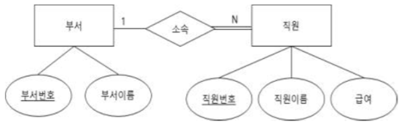
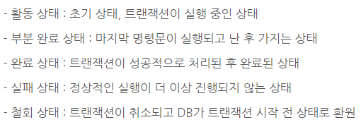

# Data

### 이민아 

---

## Index

- [DB](#db)
  - DBMS
  - 분산 데이터베이스
  - 고급 데이터베이스
- [ER](#er)
- [데이터 모델](#데이터-모델)
  - 구성 요소
    - 개체
    - 속성
    - 관계
  - 절차
    - 개념적 데이터 모델
    - 논리적 데이터 모델
    - 물리적 데이터 모델
  - 요소
    - 구조
    - 연관
    - 제약 조건
- [이상 및 종속](#이상-및-종속)
- [정규화 및 반정규화](#정규화-및-반정규화)
- [데이터 관련 용어](#데이터-관련-용어)

  - 인덱스
  - 뷰
  - 트랜잭션
  - 클러스터
  - 파티션
    - 범위 분할(Range) 
    - 해시 분할(Hash) 
    - 조합 분할(Composite)
  - DB 용량 설계
  - 데이터 조작 프로시저
    - 프로시저
    - APM
    - 옵티마이저
    - Secure DB 
  

---

## DB

### 1. DBMS (데이터베이스 관리시스템)

#### (1) DB 

- 정의 : 조직 업무 수행하는 데 필요한 **상호 관련 데이터 모임**
- 특징
  - 데이터 무결성 : 정확성, 일관성, 유효성
  - 데이터 일관성 : 저장 후 데이터는 일정
  - 데이터 회복성 : 장애 발생 시 회복 가능
  - 데이터 보안성 : 불법적 노출 변경 손실로부터 보호
  - 데이터 효율성 : 응답시간, 저장 공간 활용 등 최적화
- 유형
  - 통합된 데이터 : 중복 최소
  - 저장된 데이터 : 컴퓨터 접근 저장 매체 저장된 데이터
  - 운영 데이터 : 고유 업무 존재가치 확실 반드시 필요
  - 공용 데이터
- 파일시스템 : **파일**에 이름을 부여하고 어디에 위치시켜야 하는지 등을 정의한 뒤 DB의 **전 단계 데이터를 관리**

#### (2) DBMS ★

- 정의

  - 사용자와 DB 사이에서 **사용자 요구** 따라 **정보 생성 및 DB 관리(추가, 삭제, 검색, 변경, 보안, 백업, 권한 등) SW**
  - 데이터 관리 복잡성 해결

- 필수 기능

  - 정의 기능 : 데이터형과 구조 정의, 이용방식, 제약조건
  - 조작 기능 : 검색, 갱신, 삽입, 삭제 (사용자와 DB 인터페이스)
  - 제어 기능 : 무결성 유지 

- 유형

  - **NoSQL (Not Only SQL)**
    - 전통적 RDBMS와 달리 데이터 저장 필요한 **테이블 스키마 불요**
    - JOIN연산도 하지 않는 **수평적 확징**

  - 계층형 DBMS (HDBMS) 

    - **트리** 구조(상위, 하위 관계) 
    - **1:N**
    - 접근 **속도 빠르다**
    - **유연성 떨어진다 (종속적 구조)**

  - 망형 DBMS (NDBMS) 

    - **그래프** 구조 (상위, 하위 관계) 
    - **다대다**까지 가능 
    - 논리적으로 표현
    - 설계가 **복잡**

  - **관계형** **DBMS (RDBMS)**

    - 계층형과 망형 복잡한 구조 단순화
    - 테이블의 일부를 다른 테이블과 상하관계로 표기
    - 파일처 구조처럼 2차원적 표를 하나의 DB로 묶어서 **테이블과의 상관관계 표현**
    - 가장 **보편화** 
    - **유연성이 좋다(유지보수 용이)**
    - 속성들 간의 관계를 설정하거나 테이블 간의 관계를 설정하여 이용

    

### 2. 분산 DB

#### (1) 정의

- 논리적으로 같은 시스템
- 물리적으로는 컴퓨터 네트워크로 분산

#### (2) 목표

- 위치 투명성 : 논리적 명칭으로만 접근 (실제 위치 불필요)
- 중복 투명성 : 중복되더라도 하나의 데이터만 존재하는 것처럼 
- 병행 투명성 : 다수의 트랜잭션드리 동시에 실행되더라도 결과 영향X
- 장애 투명성 : 장애에도 불구하고 트랜잭션 정확히 수행

### 3. 고급 DB ★

#### (1) 데이터 웨어하우스

- 급증하는 **다량**의 데이터를 효과적으로 분석하여 정보화
- **여러 계층** 사용자들이 효율적으로 사용할 수 있도록 한 DB

#### (2) 데이터 마트

- 전사적으로 구축된 데이터 웨어하우스로부터 **특정 주제나 부서** 중심으로 구성된 **소규모 단일 주제의 데이터 웨어하우스**

#### (3) 데이터 마이닝 ★

- 웨어하우스에 저장된 데이터 집합에서 **사용자의 요구**에 따라 **유용하고 가능성** 있는 정보를 **발견**하기 위한 기법

#### (4) OLAP (Online Analytical Processing) ★

- **다차원**으로 이루어진 데이터로부터 **통계적 요약 정보** 분석

#### (5) OLTP (Online Transaction Processing)

- 온라인업무 처리 형태의 하나로 네트워크상의 **여러 이용자가 실시간**으로 DB 데이터 **갱신 혹은 검색**

#### (6) 빅데이터

- 주어진 비용과 시간을 초과한 페타바이트 크기의 정형 데이터

### 4. RDBMS (관계 데이터베이스) ★

#### (1) 정의

- **릴레이션** : 데이터들을 표의 형태로 표현한 것
- 스키마
- 인스턴스 : 실제값

#### (2) 구조

- **튜플 (행)** : Record / **카디널리티 / 기수** / 대응수

- **속성 (열)** : Field  / **디그리 / 차수**

- 도메인 : 하나의 **속성**이 취할 수 있는 같은 타입의 원자값들의 집합, 실제 속성 값이 나타날 때 그 값의 합법 여부를 시스템이 검사하는 데도 사용

  ex : 호봉의 속성을 1에서 6으로 제한

- 인스턴스 : 개체를 구성하는 속성들에 데이터타입이 정의되어 구체적인 값을 가진 상태

  

### 5. 키 개념 ★

#### (1) 정의

- DB 조건에 만족하는 튜플을 찾거나 순서대로 정렬하는 기준이 되는 속성

#### (2)  유형

- 슈퍼키 : 한 릴레이션 내에 있는 속성들의 집합으로 구성된 키 (유일성O 최소성X)
- **후보키** : 릴레이션 구성하는 속성들 중에서 유일하게 튜플을 식별하기 위해 **(유일성O 최소성O)**
- 기본키 : **후보키 중에서** 특별히 선정된 키로 **중복된 값과 NULL값 불가**
- 대체키 : **후보키 중에서** 기본키 제외한 나머지 후보키
- **외래키** : 다른 릴레이션의 기본키를 참조하는 속성 또는 속성들의 집합 (릴레이션 간 관계)

### 6. 무결성 ★

#### (1) 정의

- 데이터베이스에 **저장**된 값과 그것이 표현하는 현실 세계의 **실제**값이 일치하는 정확성

#### (2) 유형

- **개체 무결성(실체 무결성)** : 기본 테이블의 **기본키**를 구성하는 어떤 속성도 **Null값이나 중복값 불가**
- 도메인 무결성(영역 무결성) : 주어진 속성 값이 정의된 도메인에 속한 값이어야 한다는 규정
- **참조 무결성** : **외래키값**은 **Null값**이거나 참조 릴레이션의 **기본키 값과 동일**해야 함 (참조할 수 없는 외래키를 가질 수 없다)
- 사용자 정의 무결성 : 사용자가 정의한 제약 조건에 속성값들이 만족
- NULL 무결성 : 릴레이션 **특정 속성** 값이 NULL이 될 수 없도록 하는 규정
- **고유 무결성** : 릴레이션의 **특정 속성**에 대해 **각 튜플이 갖는 속성값들이 서로 달라야 한다**
- 키 무결성 : 하나의 릴레이션에는 **적어도 하나의 키**가 존재해야 한다는 규정
- 관계 무결성 : 릴레이션에는 어느 **한 튜플**의 **삽입 가능 여부** 또는 다른 릴레이션의 **튜플들** 사이의 **관계**에 대한 적절성 여부 지정한 규정

---

## ER

### 1. ER 도형

#### (1) 정의

- 피터 첸에 의해 제안
- 데이터 **모델링**

#### (2) 도형

- 다이아몬드 : **관계** 타입
- 사각형 : **객체** 타입
- 타원 : **속성**
- 선 : 속성과 개체 집합 연결, 개체 집합과 관계 연결
- 타원 + 밑줄 : 기본키

#### (3) 기본 요소 ★

> 데이터 모델의 기본 요소와 동일

- **개체 / 엔티티 : 현실 세계 사물이나 사건 (사각형)**
- **속성 : 엔티티가 가진 요소 또는 성질 (원)**
- **관계 : 두 개체 간의 관계 (마름모)**

### 2. ER 관계 및 관계 타입

#### (1) 정의

- 관계 : 2개 이상의 개체 사이에 존재하는 연관성
- 관계타입 : 같은 관계들의 집합 또는 틀

#### (2) 유형

- 차수에 따른 관계의 종류
  - 참여하는 개체 타입의 개수에 대한 차수
  - 단항, 이항, 삼항, n항
- 대응 카디널리티에 따른 종류
  - 참여하는 **개체 어커런스의** 개수에 대한 **대응 카디널리티**
  - **1:1, 1:N, 다대다**

#### (3) 관계형 데이터 모델로 변환

- **개념적** 데이터 모델 : **ER 모델**
- **논리적** 데이터 모델 : 릴레이션 스키마

----

## 데이터 모델

### 1. 정의

- 현실 세계 정보들을 컴퓨터에 표현하기 위해 단순화, 추상화하여 체계적으로 표현한 개념적 모형

### 2. 구성요소 ★

#### (1) 개체 / 속성 / 관계

- **개체** (Entity) : DB에 표현하려는 것으로 개념이나 정보단위와 같은 현**실 세계의 대상체**
- **속성** (Attribute) : 데이터의 가장 **작은 논리적 단위**로서 파일 구조상의 데**이터 항목 또는 필드에 해당**
- **관계** (Relationship) : 개체 간의 관계 또는 속성 간의 **논리적** 연결 

#### (2) 용어

- 온톨로지 : 설계 시 개념, 속성, 관계를 컴퓨터가 이해할 수 있도록 서술
- 시멘틱 웹 : 온톨로지를 이용하여 서비스 검색, 조합  기능들 자동화하는 웹

### 3. 개체 - 관계 다이어그램 (ERD) ★

- 업무 분석 결과로 도출된 엔티티와 엔티티 간의 관계를 모형으로 나타낸 다이어그램

- **기본 요소** 

  > 데이터 모델의 기본 요소와 동일

  - 개체 : 사각형
  - 속성 : 원
  - 관계 : 마름모

- 참고자료 [Application_SW](https://github.com/ma0723/Min_CS/blob/master/Application_SW.md#er)

### 4. 절차 ★

#### (1) 개념적 데이터 모델링

- 현실 세계의 인식을 추상적 개념으로 모델링

#### (2) 논리적 데이터 모델링

- 개념적 구조를 컴퓨터가 이해가능한 형태
- 업무 영역의 엡무 데이처 및 규칙 구체적 표현
- 속성
  - **개체 : 사각형**
  - **속성 : 원**
  - **관계 : 마름모**
- 특징
  - **정규화**
  - **완전성**
  - **독립성**
  - **포용성**

#### (3) 물리적 데이터 모델링

- 논리적 데이터 모델을 **DBMS 특징 및 성능을 고려**하여 구체화시킨 모델

- 논리적에서 물리적 변환

  - 개체 → 테이블
  - 속성 → Column
  - 관계 → 외래키
  - UID(Unique Id Entifier/고유 식별자) → PK(기본키)
  - Column 길이 및 유형 정의

  

---

## 이상 및 종속

### 1. 이상 현상

#### (1) 정의 ★

- 테이블 일부 속성들의 **종속**으로 인해 **데이터 중복**이 발생하고 이로 인해 테이블 **조작시 문제 발생(비합리적 현상)**

#### (2) 유형 ★

- **삽입** 이상 : 정보 저장시 **불필요한 세부사항을 입력**해야 하는 경우
- **삭제** 이상 : 삭제시 **원치 않는 정보까지 삭제**
- **갱신** 이상 : 중복 데이터에서 **특정 부분만 수정**되어 **중복된 값 모순**

### 2. 종속 

- 

---

## 정규화 및 반정규화

### 1. 정규화 ★

#### (1) 정의

- **관계형 데이터베이스** 설계에서 **중복 최소화**하여 데이터 **구조화**

#### (2) 단계

- 제1정규화(1NF) : 테이블 내 속성값 **원자값**
- 제2정규화(2NF) : **부분** 함수 종속성 제거
- 제3정규화(3NF) : **이행** 함수 종속성 제거
- **BCNF** : 결정자 함수 종속성 제거하고 **모든 결정자가 후보키 집합에 속한** 정규형
- 제4정규화(4NF) : **다중** 값 종속 제거
- 제5정규화(5NF) : **조인** 종속성 제거

### 2. 반정규화 ★

#### (1) 정의

- 정규화된 **엔티티(개체), 속성, 관계**에 대해 **성능 향상과 개발 운영의 단순화**를 위해 **중복, 통합, 분리** 등을 수행하는 **데이터 모델링 기법**

---

## 데이터 관련 용어

### 1. 인덱스

#### (1) 정의

- **검색 연산의 최적화**를 위해 **키값과 포인터 쌍**으로 구성되는 **데이터 구조**

#### (2) 특징

- 분포도가 좋은 칼럼은 단독으로 생성
- 자주 조합되어 사용되는 칼럼은 결합 인덱스로 생성
- 지나치게 많은 인덱스는 오버헤드 발생 가능

### 2. 뷰 

#### (1) 정의

- 사용자에게 **허용된 정보**만 보여주기 위해 하나 이상의 테이블로부터 **유도된 논리적인 가상 테이블**
- 논리적 독립성 제공
- 접근 제어를 통한 자동 보안 기능 제공

#### (2) 속성

- REPLACE
- FORCE
- NOFORCE

### 3. 트랜잭션 ★

#### (1) 정의

- **인가받지 않은 사용자**로부터 **DB보장**하기 위해 **DBMS가 갖는 특성**
- DB 시스템에서 **하나의 논리적 기능**을 정상적으로 수행하기 위한 **작업의 기본 단위**

#### (2) 특징

- **원자성**
  - 트랜잭션 연산은 **DB 모두 반영**되도록 완료 아니면 **전혀 반영되지 않도록**
  - **완료(Commit)**
  - **복구(Rollback)**
- **일관성**
  - 트랜잭션이 성공적으로 완료하면 언제나 **일관성있는 DB 상태**
  - **시스템 고정요소**는 트랜잭션 **수행 전과 완료 후**의 상태가 같아야 한다
- **격리성 / 독립성 / 순차성**
  - 둘 이상 트랜잭션 동시에 **병행 실행**되는 경우 하나 트랜잭션 수행 중에 **연산이 끼어들 수 없다**
- **영속성 / 지속성**
  - 성공적으로 완료된 트랜잭션 결과는 **시스템 고장이더라도 영구적 반영**

#### (3) 상태

#### (4) 용어

- TCL : 트랜잭션 결과를 허용하거나 취소하는 목적으로 사용
- **Commit : 완료**
- **Rollback : 복구**
- CHECKPOINT : 트랜잭션 저장하는 시기 설정
- **트리거** : 트랜잭션 취소하는 이외의 조치를 명세할 필요가 있는 경우 메시지를 보내 어떤 값을 자동으로 갱신하도록 프로시저 가동

### 4. 클러스터 

#### (1) 정의

- 데이터 접근 효율을 높이기 위해 **동일한 성격 데이터**를 **같은 데이터 블록에 저장하는 물리적** 저장 방법

#### (2) 특징

- 조회 속도 향상
- **삽입, 삭제, 수정 기능 저하**

#### (3) 유형

- 단일 테이블 클러스트링
- 다중 테이블 클러스트링

### 5. 파티션 ★

#### (1) 정의 (Patition) 

- **대용량**의 **테이블이나 인덱스**를 **작은 논리적 단위**로 나누는 것

#### (2) 유형 

> 방식에 따른 파티션의 종류

- **범위 분할(Range) :** 지정한 **열의 값을 기준**으로 분할
- **해시 분할(Hash) ** 
  - **해시 함수를 적용한 결과값**에 따라 분할 
  - 파티션을 위한 **범위가 없는** 데이터에 적합 
  - **균등한** 데이터 분할이 가능 
  - 질의 성능의 향상이 가능
- **조합 분할(Composite)** : **범위 분할로 분할**한 다음 **해쉬 함수를 적용하여 다시 분할**
- 리스트 파티션 : 데이터에 대한 명시적 제어가 가능한 파티셔닝
- 인덱스 파티션 : 파티션된 테이블의 데이터를 관리하기 위해 인덱스를 나눈 것

### 6. DB 용량 설계 

### 7. 데이터 조작 프로시저

#### (1) 프로시저 

> 절차형 SQL을 활용해 특정 기능(데이터 조작) 수행하는 일종의 **트랜잭션** 언어

- **PL/SQL** : 표준 SQL기반으로 Oracle에서 개발한 데이터 조작언어

- **JDBC  (Java DataBase Connectivity) ★** 

  **Java 언어로 다양한** 종류의 DB에 접속하고 SQL문 수행할 때 **표준 API**

#### (2) APM (Application Performance Monitoring)

> **안정적 시스템** 운영을 위한 **성능 모니터링 도구** 

#### (3) 옵티마이저

> SQL을 가장 빠르고 효율적으로 수행할 수 있는 **최적의 경로**

- RBO (Rule) : 규칙 기반 옵티마이저
- CBO (Cost) : 비용 기반 옵티마이저

#### (4) Secure DB 

- - 커널 암호화 방식으로 DB 파일을 직접 암호화
  - 접근 제어와 보안적 요소가 추가된 DB 강화 기술

 

