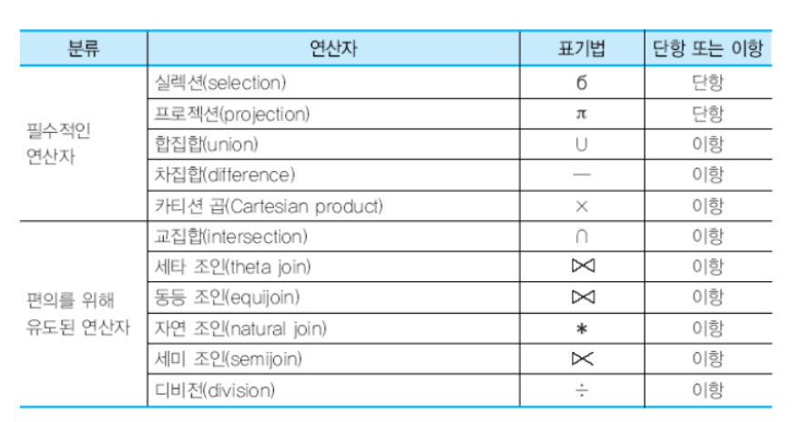
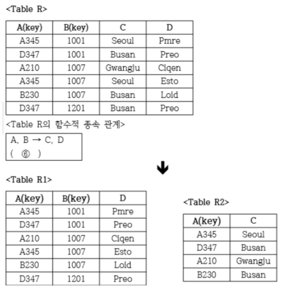

# Data

### 이민아 

---

## Index

- [DB](#db)
  - DB
  - 분산 데이터베이스
  - 고급 데이터베이스
    - 데이터 웨어하우스
    - 데이터 마트
    - 데이터 마이닝
    - OLAP
    - OLTP
    - 빅데이터
    - 메타데이터
    - 다크데이터
    - 온톨로지 / 시멘틱 웹
    - CRUD Matrix
- [ER](#er)
- [DBMS](#dbms)
- [데이터 모델](#데이터-모델)
  - 구성 요소
    - 개체
    - 속성
    - 관계
  - 절차
    - 개념적 데이터 모델
    - 논리적 데이터 모델
    - 물리적 데이터 모델
  - 요소
    - 구조
    - 연산
    - 제약 조건
- [이상 및 종속](#이상-및-종속)
- [정규화 및 반정규화](#정규화-및-반정규화)
- [데이터 관련 용어](#데이터-관련-용어)
  - 인덱스
  - 뷰
  - 트랜잭션
  - 클러스터
  - 파티션
    - 범위 분할(Range) 
    - 해시 분할(Hash) 
    - 조합 분할(Composite)
    - 리스트 분할
  - DB 보호
    - APM
    - Secure DB 
  - 데이터 흐름도 DFD
  - 데이터 자료 DD
  - ORM

---

## DB

### 1. DB

#### (1) 정의 

- 조직 업무 수행하는 데 필요한 **상호 관련 데이터 모임**

#### (2) 구성 요소 : **개체 / 속성 / 관계** ★

- **개체** (Entity) : DB에 표현하려는 것으로 개념이나 정보단위와 같은 현**실 세계의 대상체**
- **속성** (Attribute) : 데이터의 가장 **작은 논리적 단위**로서 파일 구조상의 데**이터 항목 또는 필드에 해당**
- **관계** (Relationship) : 개체 간의 관계 또는 속성 간의 **논리적** 연결 

#### (3) 특징

- **실시간 접근성**
- **계속적 변화**
- **동시 공용**
- **내용 참조**

#### (4) 유형

- **통합**된 데이터 : 중복 최소
- **저장**된 데이터 : 컴퓨터 접근 저장 매체 저장된 데이터
- **운영** 데이터 : 고유 업무 존재가치 확실 반드시 필요
- **공용** 데이터

### 2. 분산 DB

#### (1) 정의

- **논리적으로 같은** 시스템
- **물리적**으로는 컴퓨터 네트워크로 **분산**

#### (2) 목표

- **위치** 투명성 : **논리**적 명칭으로만 접근 **(실제 위치 불필요)**
- **중복** 투명성 : **중복되더라도 하나의** 데이터만 존재하는 것처럼 
- **병행** 투명성 : **다수의** 트랜잭션들이 동시에 실행되더라도 **결과 영향X**
- **장애** 투명성 : **장애**에도 불구하고 트랜잭션 **정확히 수행**

### 3. 고급 DB ★

#### (1) 데이터 웨어하우스

- 급증하는 **다량**의 데이터를 효과적으로 분석하여 정보화
- **여러 계층** 사용자들이 효율적으로 사용할 수 있도록 한 DB

#### (2) 데이터 마트

- 전사적으로 구축된 데이터 웨어하우스로부터 **특정 주제나 부서** 중심으로 구성된 **소규모 단일 주제의 데이터 웨어하우스**

#### (3) 데이터 마이닝 ★

- **대규모로** 저장된 데이터 안에서 **체계적이고 자동적**으로 **통계적 규칙이나 데이터 간의 관계, 추세, 패턴** 찾아서 **의미있는 정보로 변환**
- **웨어하우스**에 저장된 데이터 집합에서 **사용자의 요구**에 따라 **유용하고 가능성** 있는 정보를 **발견**하기 위한 기법
- **많은 데이터** 가운데 숨겨져 있는 **유용한 상관관계**를 발견하여 **미래에 실행가능한 정보를 추출하고 의사결정에 이용**
- **연관규칙** : 데이터 마이닝의 기법 중 데이터 안에 존재하는 **항목들 간의 종속 관계**를 찾아내는 기법
- **웹 마이닝** : 웹으로부터 얻어지는 방대한 양의 정보로부터 유용한 정보를 찾아내기 위하여 분석하는 기법

#### (4) 군집화 (데이터 마이닝)

- 대상 레코드들은 **유사한 특성을** 지닌 몇 개의 **소그룹으로 분할**하는 작업, **정보가 없는 상태**에서 데이터를 분류하는 기법

#### (5) OLAP (Online Analytical Processing) ★

- **다차원**으로 이루어진 데이터로부터 **통계적 요약 정보** **분석**
- 사용자가 **대용량 데이터**를 쉽고 다양한 관점에서 추출 및 분석할 수 있도록 지원하는 **비즈니스 인텔리전스(Business Intelligence) 기술**
- **대형 업무** 데이터베이스를 구성하는 한 방법론으로 **이용자가 직접** 데이터베이스를 검색, 분석해서 문제점이나 해결책을 찾는 **분석형 애플리케이션**
- **데이터 웨어하우스나 데이터 마트**와 같은 시스템과 **상호연관**되는 정보시스템
- **중간 매개체 없이** 이용자들이 **직접** 컴퓨터를 이용하여 데이터 접근하는 필수 시스템

#### (6) OLTP (Online Transaction Processing)

- 온라인업무 처리 형태의 하나로 네트워크상의 **여러 이용자가 실시간**으로 DB 데이터 **갱신 혹은 검색**

#### (7) 빅데이터 ★

- 주어진 비용과 시간을 **초과**한 페타바이트 크기의 **정형 데이터**
- 기존의 관리 방법이나 분석 체계로 처리하기 어려운 막대한 양의 **정형 또는 비정형 데이터 집합**
- 스마트 단말의 빠른 확산, 소셜 네트워크 서비스 활성화 등
- 기업이나 정보, 포털 등이 분석하여 미래를 예측해 최적 대응 방안
- 수집기술

  - 비정형 

    - **척와 (chukwa)**

    - 각 서버에서 에이전트를 실행하고
    - 컬렉터(Collector)가 에이전트로부터 데이터를 받아 HDFS에 저장

  - 정형 

    - **스쿱 (sqoop)**
    - 커넥트를 사용하여  RDBMS(관계형데이터베이스)에서 HDFS(하둡파일시스템)으로 데이터 전송
- **특징 (3V)**
  - Volume(양)
  - Variety(다양성)
  - Velocity(속도)
- **하둡** ★
  - 분산환경 **빅데이터** 저장 처리
  - **자바기반 오픈소스 프레임워크**
  - 더그 커팅과 마이크 캐퍼렐라가 개발
  - 구글 **맵 리듀스 대체**
    - 맵 리듀스
      - 구글에서 **대용량 데이터** 처리를 분산 병렬 컴퓨팅에서 처리하기 위해 제작
      - 아파치 **하둡**으로 대표되는 소프트웨어 프레임워크

#### (8) 메타데이터 ★

- **메타데이터** 
  - **데이터**에 관한 구조화된 **데이터**로, 다른 **데이터**를 설명해 주는 **데이터**. 속성정보
  - 포맷에는 MARC, ONIX, MODS
- 메타 데이터 레지스트리 (MDR)  
  - **메타데이터**의 **등록과 인증**을 통하여 **메타데이터**를 유지ㆍ관리
  -  **메타데이터**의 명세를 공유하는 **레지스트리**. **메타데이터**를 사용하여 **데이터**에 대한 접근과 사용을 촉진
  -  **메타데이터**가 설명하는 특징에 따른 **데이터**의 조작을 가능
- **시스템 카탈로그**
  - 시스템 자신이 필요로 하는 스키마 및 여러가지 객체 정보를 포함하고 있는 시스템 데이터 베이스
  - **메타 데이터(Metadata) 저장**, DBMS가 스스로 생성, 유지
  - 일반 사용자가 조회는 가능, 갱신은 불가능

#### (9) 다크데이터 ★

- 정보를 수집한 후, 저장만 하고 분석에 활용하고 있지 않는 다량의 데이터
- 다크 데이터는 처리되지 않은 채 미래에 사용할 가능성이 있다는 이유로 삭제되지 않고 방치되어 있어, 저장 공간만 차지하고 보안 위험을 초래할 수 있다.

#### (10) **온톨로지** / 시멘틱 웹★

- **온톨로지**
  - 존재하는 사물과 사물 간의 관계 및 여러 개념을 **컴퓨터가 처리할 수 있는 형태로 표현**
  - 설계 시 개념, 속성, 관계를 컴퓨터가 이해할 수 있도록 서술
  - **컴퓨터를 위한 개념화 명세서**
  - **단어와 관계**들로 구성된 일종의 사전
  - 특정 도메인 관련 단어들을 계층적 구조로 표현
  - 이를 확장할 수 있는 추론 규칙
  - **시멘틱 웹을 구현하는 도구로**
  - RDF, OWL, SWRL 등 언어 이용해 표현
- **시멘틱 웹** 
  - **온톨로지를 이용**하여 **정보와 자원의 관계와 의미** 정보를 **컴퓨터가 이해**할 수 있도록 서비스 검색, 조합 기능들 **자동화하는 지능형 웹**
  - 온톨로지를 이용하여 서비스 검색, 조합  기능들 자동화하는 웹

#### (11) CRUD Matrix ★

- **데이터와 프로세스** 사이의 **상관관계**를 **CREATE, READ, UPDATE, DELETE의 기능**으로 나누어 표현한 매트릭스

---

## ER

### 1. ER 도형

#### (1) 정의

- 피터 첸에 의해 제안
- 데이터 **모델링**

#### (2) 도형

- 다이아몬드 : **관계** 타입
- 사각형 : **객체** 타입
- 타원 : **속성**
- 선 : 속성과 개체 집합 연결, 개체 집합과 관계 연결
- 타원 + 밑줄 : 기본키

#### (3) 기본 요소 ★

> 데이터 모델의 기본 요소와 동일

- **개체 / 엔티티 : 현실 세계 사물이나 사건 (사각형)**
- **속성 : 엔티티가 가진 요소 또는 성질 (원)**
- **관계 : 두 개체 간의 관계 (마름모)**

### 2. ER 관계 및 관계 타입

#### (1) 정의

- 관계 : 2개 이상의 개체 사이에 존재하는 연관성
- 관계타입 : 같은 관계들의 집합 또는 틀

#### (2) 유형

- **차수**에 따른 관계의 종류
  - 참여하는 개체 타입의 개수에 대한 차수
  - 단항, 이항, 삼항, n항
- **대응 카디널리티**에 따른 종류
  - 참여하는 **개체 어커런스의** 개수에 대한 **대응 카디널리티**
  - **1:1, 1:N, 다대다**

#### (3) 관계형 데이터 모델로 변환 ★

- **개념적** 데이터 모델 : **ER 모델**
- **논리적** 데이터 모델 : 릴레이션 스키마

----

## DBMS

### 1. DBMS 접속 기술

> DBMS에 접근하기 위해 사용하는 **API** 또는 API 사용을 편리하게 도와주는 프레임워크(특정 기능 수행을 위해 필요한 **클래스나 인터페이스** 등을 모아둔 집합) 등을 의미

#### (1) JDBC (Java DataBase Connectivity) ★

- **Java 언어로 다양한** 종류의 DB에 접속하고 SQL문 수행할 때 **표준 API**

#### (2) ODBC (Open DataBase Connectivity)

- **표준 개방형** API로 **개발 언어에 관계없이** 사용
- Excel, Text, MS-Access 등 다양한 DB 접근
- **응용**프로그램에서 DB에 접근하여 관리하는 **표준** 인터페이스

#### (3) MyBatis (마이바티스) ★

- **JDBC (Java Data Base Connectivity) 코드 단순화**
- SQL **Mapping** 기반 **오픈소스** 접속 프레임워크
- SQL **거의 그대로** 사용할 수 있어 SQL 친화적인 국내 환경에 적합 많이 사용
- XML 서술자나 애너테이션(annotation)을 사용하여 **저장 프로시저나 SQL문으로 객체를 연결**시키는 프로그램
- 아파치 라이선스 2.0 배포
- IBATIS의 원개발자들이 포함된 팀에 의해 유지보수가 이루어짐
- **자바 퍼시스턴스 프레임워크**

### 2. DBMS ★

#### (1) 정의 ★

- 사용자와 DB 사이에서 **사용자 요구** 따라 **정보 생성 및 DB 관리(추가, 삭제, 검색, 변경, 보안, 백업, 권한 등) SW**
- 데이터 관리 복잡성 해결

#### (2) 유형 ★

- **관계형** **DBMS (RDBMS)**
  - 계층형과 망형 복잡한 **구조 단순화**
  - 테이블의 일부를 다른 **테이블과 상하관계로 표기**
  - 파일처 구조처럼 2차원적 표를 하나의 DB로 묶어서 **테이블과의 상관관계 표현**
  - 가장 **보편화** 
  - **유연성이 좋다(유지보수 용이)**
  - **속성들 간의 관계**를 설정하거나 **테이블 간의 관계**를 설정하여 이용
  - **Column Family Data store DBMS** :  KEY안에 (Column, Value) 조합으로 된 여러개의 필드를 갖는 DBMS
  
- **계층형 DBMS (HDBMS)** 
  - **트리** 구조(상위, 하위 관계) 
  - **1:N**
  - 접근 **속도 빠르다**
  - **유연성 떨어진다 (종속적 구조)**
- 망형 DBMS (NDBMS) 

  - **그래프** 구조 (상위, 하위 관계) 
  - **다대다**까지 가능 
  - 논리적으로 표현
  - 설계가 **복잡**
- **NoSQL / Not Only SQL** ★
  - **조인 연산 불가**
  - **수평적 확장** 가능
  - 전통적 RDBMS와 달리 데이터 저장 필요한 **테이블 스키마 불요**

#### (3) 필수 기능

- 정의 기능 : 데이터형과 구조 정의, 이용방식, 제약조건
- 조작 기능 : 검색, 갱신, 삽입, 삭제 (사용자와 DB 인터페이스)
- 제어 기능 : 무결성 유지 

#### (4) 특징

- 데이터 **무결성** 정확성, 일관성, 유효성
- 데이터 **일관성** : **저장 후** 데이터는 **일정**
- 데이터 **회복성 : 장애** 발생 시 **회복 가능**
- 데이터 **보안성** : **불법적 노출** 변경 손실로부터 보호
- 데이터 **효율성** : **응답시간, 저장 공간** 활용 등 **최적화**

#### (5) **구성요소** ★

- **DDL 컴파일러 / 처리기 / 번역기**
- **트랜잭션 관리자**

#### (6) 시스템 카탈로그 ★

-  데이터베이스에 저장되어 있는 **모든 데이터 개체들에 관한 정보나 명세에 대한 정보**가 수록되어 있는
-  **DBMS가 생성하고 유지**하는 데이터베이스 내의 **테이블들의 집합체**
-  **메타 데이터(Metadata)** 저장, DBMS가 스스로 생성, 유지
-  일반 사용자가 **조회는 가능, 갱신은 불가능**

#### (7) **파일 시스템** 

- **파일**에 이름을 부여하고 어디에 위치시켜야 하는지 등을 정의한 뒤 DB의 **전 단계 데이터를 관리**

#### (8) DBA

- 데이터베이스 관리자(**DBA**;DataBase Administrator)는 데이터베이스 시스템을 운영·관리

### 3. RDBMS (관계 데이터베이스) ★

#### (1) 정의 ★

- **릴레이션** : 데이터들을 **표의 형태**로 표현한 것
- **스키마** : DB **구조와 제약조건**에 대한 **명세(개체, 속성, 관계 )**를 기술한 **메타데이터의 집합**
  - **개념 스키마** 
    - **사용자나 응용 프로그래머가 각 개인** 입장에서 필요하는 DB
    - **서브**스키마
    - 전체 DB 논리적 **일부분**
    - **여러개 존재**
  - **외부 스키마** 
    - **단순** 스키마 정의 
    - 개체 간의 관계와 제약 조건
    - DB 접근 보안 정책 및 무결성 규정
    - **전체적 논리** 구조
    - 사용자나 응용 프로그래머가  필요하는 데이터 **통합한 명세로 하나**만 존재
  - **내부 스키마** 
    - DB **물리적** 구조
    - **물리적 저장장치**의 관점에서 본 전체 DB
    - 시스템 **프로그래머**나 시스템 **설계자**의 관점에서 본 전체 DB 
    - 하나만 존재
- 인스턴스 : 실제값

#### (2) 구조 : 튜플 / 컬럼 / 도메인 ★

- **튜플 (행)** : Record / **카디널리티 / 기수** / 대응수

- **속성 / 컬럼 (열)** : Field  / **디그리 / 차수**

- **도메인** : 하나의 **속성**이 취할 수 있는 **같은** **타입**의 **원자값들의 집합, 실**제 속성 값이 나타날 때 그 값의 합법 여부를 시스템이 검사하는 데도 사용

  ex : 호봉의 속성을 1에서 6으로 제한

- 인스턴스 : 개체를 구성하는 속성들에 데이터타입이 정의되어 구체적인 값을 가진 상태

### 4. 데이터 스트림 관리 시스템 DSMS (Data Stream Management System)

- **실시간**으로 발생하는 **대용량의 연속적 데이터 흐름** 관리하는 시스템
- 연속적 데이터 흐름을 **데이터 스트림**

### 5. 키 ★

#### (1) 정의

- DB 조건에 만족하는 튜플을 찾거나 순서대로 정렬하는 기준이 되는 속성

#### (2)  유형 ★

- **슈퍼키** : 한 릴레이션 내에 있는 **행**을 고유하게 식별하는 **속성들의 집합**으로 구성된 키 **(유일성O 최소성X)** ★
- **후보키** : 릴레이션 구성하는 속성들 중에서 유일하게 튜플을 식별하기 위해 **(유일성O 최소성O)**
- 기본키 : **후보키 중에서** 특별히 선정된 키로 **중복된 값과 NULL값 불가** ★
- 대체키 : **후보키 중에서** 기본키 제외한 나머지 후보키 **중복된 값과 NULL값 불가** ★
- **외래키** : 다른 릴레이션의 기본키를 참조하는 속성 또는 속성들의 집합 (릴레이션 간 관계)

### 6. 무결성 ★

#### (1) 정의

- 데이터베이스에 **저장**된 값과 그것이 표현하는 현실 세계의 **실제**값이 일치하는 정확성

#### (2) 유형 ★

- **개체 무결성(실체 무결성)** :★ 기본 테이블의 **기본키**를 구성하는 어떤 속성도 **Null값이나 중복값 불가**
- 도메인 무결성(영역 무결성) : 주어진 속성 값이 정의된 도메인에 속한 값이어야 한다는 규정
- **참조 무결성** ★: **외래키값**은 **Null값**이거나 참조 릴레이션의 **기본키 값과 동일**해야 함 (참조할 수 없는 외래키를 가질 수 없다)
- 사용자 정의 무결성 : 사용자가 정의한 제약 조건에 속성값들이 만족
- NULL 무결성 : 릴레이션 **특정 속성** 값이 NULL이 될 수 없도록 하는 규정
- **고유 무결성** : 릴레이션의 **특정 속성**에 대해 **각 튜플이 갖는 속성값들이 서로 달라야 한다**
- 키 무결성 : 하나의 릴레이션에는 **적어도 하나의 키**가 존재해야 한다는 규정
- 관계 무결성 : 릴레이션에는 어느 **한 튜플**의 **삽입 가능 여부** 또는 다른 릴레이션의 **튜플들** 사이의 **관계**에 대한 적절성 여부 지정한 규정

### 7. 관계대수

#### (1) 정의 ★

- **관계해석** 
  - 원하는 데이터만 명시하고 "어떻게 질의를 해석하는가"에 대해 언급이 없는 **선언적 언어**
- **관계대수** 

  - **관계형 데이터베이스에서 원하는 정보**와 그 정보를 어떻게 **찾는지**에 대해 기술한 **절자적 언어**
  - 하나 또는 두 개의 **릴레이션 입력**으로 받아들여 **새로운 릴레이션을 생성하는 연산들의 집합**
  - **일반 집합 연산자**
    - **카티션 프로덕트**
  - **순수 관계 연산자**
    - **디비전**

#### (2) 기호

- **나누기** : 두 개의 릴레이션 중에 하나의 릴레이션 **조건에 맞는 것들만** 다른 릴레이션에서 튜플을 분리해 **프로젝션하는 관계대수 기호**

----

## 데이터 모델

### 1. 정의

- 현실 세계 정보들을 컴퓨터에 표현하기 위해 단순화, 추상화하여 체계적으로 표현한 **개념적 모형**

### 2. 구성요소 ★

#### (1) 연산 / 구조 / 제약조건 ★

> 구조(S), 연산(O), 제약조건(C)

- **구조** 

  - 데이터의 **구조**

  - **정적** 성질, 객체 타입과 이들간의 관계를 명세함
  - **논리 데이터 모델**

- **연산** : 데이터의 **동적** 성질
  - 객체 인스턴스를 처리하는 작업에 대한 명세
  - 데이터 **조작** 기법
  -  **개체** 모델

- **제약조건** : 데이터의 **논리적인 제약**
  - 구조로부터 **파생 의미적** 제약
  - 데이터 조작의 한계를 표현하는 규정

#### (2) 무결성 모델 ★

- 기밀성 모델에서 발생하는 불법적 정보 변경을 방지하기 위해 **무결성을** 기반으로 개발된 모델 (무결성 보장 최우선)

- 접근 통제 기술

  - **임의 접근 통제 (DAC)**

    데이터 접근하는 **사용자(개인 또는 그룹의 식별자)의 신원**에 따라 접근 권한 부여

  - **강제 접근 통제 (MAC)**

    **주체와 객체의 등급을 비교**하면서 접근 권한 부여

- 접근 통제의 3요소

  - 접근통제 정책
  - 접근통제 메커니즘
  - 접근통제 보안모델

#### (3) 네트워크 데이터 모델

- CODASTL DBTG 모델이라고도 불리는 이모델은 **논리적 구조가 그래프 형태**로 구성된 모델

  

### 3. 개체 - 관계 다이어그램 (ERD) ★

- 업무 분석 결과로 도출된 **엔티티와 엔티티 간의 관계**를 모형으로 나타낸 다이어그램

- **기본 요소** 
  - 개체 : 사각형
  - 속성 : 원
  - 관계 : 마름모
  
- 참고자료 [Application_SW](https://github.com/ma0723/Min_CS/blob/master/Application_SW.md#er)

### 4. 절차 ★

> 요구사항분석 → 개념적 설계 → 논리적 설계 → 물리적 설계 → 구현

#### (1) 개념적 데이터 모델링

- 현실 세계의 인식을 추상적 개념으로 모델링
- 결과물 : **ER 다이어그램**

#### (2) 논리적 데이터 모델링 (정규화)

- 개념적 구조를 컴퓨터가 이해가능한 형태(스키마 설계, 트랜잭션 인터페이스 설계)
- 업무 영역의 엡무 데이처 및 규칙 구체적 표현
- 결과물 : **정규화**
- 속성
  - **개체 : 사각형**
  - **속성 : 원**
  - **관계 : 마름모**
- 특징
  - **정규화**
  - **완전성**
  - **독립성**
  - **포용성**

#### (3) 물리적 데이터 모델링 (반정규화)

- 논리적 데이터 모델을 **DBMS 특징 및 성능을 고려**하여 구체화시킨 모델

- 결과물 : **테이블 정의서, 명세서**

- 논리적에서 물리적 변환

  - 개체 → **테이블**
  - 속성 → **Column**
  - 관계 → **외래키**
  - UID(Unique Id Entifier/고유 식별자) → **PK(기본키)**
  - Column 길이 및 유형 정의

  

---

## 이상 및 종속

### 1. 이상 현상

#### (1) 정의 ★

- 테이블 **일부 속성**들의 **종속**으로 인해 **데이터 중복**이 발생하고 이로 인해 테이블 **조작시 문제 발생(비합리적 현상)**

#### (2) 유형 ★

- **삽입** 이상 : 정보 저장시 **불필요한 세부사항을 입력**해야 하는 경우
- **삭제** 이상 : 삭제시 **원치 않는 정보까지 삭제**
- **갱신** 이상 : 중복 데이터에서 **특정 부분만 수정**되어 **중복된 값 모순**

### 2. 종속 

#### (1) 데이터 종속성

- **관계형 모델**을 설계할 때 가장 중요한 요소

- **함수 종속**은 엔터티내에 존재하는 **속성 간의 종속성**

- 엔터티 내 A 속성의 값이 B 속성의 값을 유일하게 식별할 수 있다면 B 속성은 A 속성에 함수적으로 종속

- 유형

  - 함수 종속(Functional Dependency)

  - 다가 종속(Multivalued Dependency) : 제4정규화(4NF)
  - 조인 종속(Join Dependency) : 제5정규화(5NF)

#### (2) 결정자 / 종속자 

- 결정자 / 종속자
  - **결정자** : 속성 간의 종속성을 규명할 때 기**준이 되는 값**
  - **종속자** : 결정자의 값에 의해 **정해지는 값**
  - 속성 Y가 속성X에 의해 함수적으로 종속된다는 말은 속성 X의 값을 이용해 속성 Y의 값을 **유일하게 식별할** 수 있다는 의미

- 결정자 X의 값은 반드시 하나의 Y값과 연관됨
  - X 값에 의존하는 Y 값은 하나뿐이지 다른 Y 값이 있을 수 없음
  - 기호
    - X → Y
    - Y = F(X)
    - X : 결정자(Determinant), Y : 종속자(Dependent)

#### (3) 종속 유형

- **이행적 함수 종속 제3정규화(3NF) **
  - 릴레이션에서 X, Y, Z라는 **3 개의 속성**이 있을 때 X→Y, Y→Z 이란 종속 관계가 있을 경우, X→Z가 성립될 때 이행적 함수 종속
  - '회원번호'를 알면 '이름'을 알 수 있고, '이름'을 알면 '나이'도 알 수 있습니다. 따라서 '회원번호'를 알면 '나이'를 알 수 있으므로 **이행적 함수 종속** 관계
- **부분 함수 종속 제2정규화(2NF) **  
  - 릴레이션에서 종속자가 **기본키가 아닌 다른 속성에 종속**되거나, 기본키가 여러 속성으로 구성되어 있을경우 기본키를 구성하는 속성 중 일부만 종속
  - '고객ID'와 '상품코드' 속성으로 구성된 위의 릴리이션에서서 '주문상품'은 기본키 중 '상품코드'만 알아도 식별할 수 있습니다. 이 경우에는 '주문상품' 속성은 기본키에 **부분 함수 종속**
- **완전 함수 종속**
  - 종속자가 **기본키에만 종속되며**, 기본키가 여러 속성으로 구성되어 있을경우 기본키를 구성하는 모든 속성이 포함된 기본키의 부분집합에 종속된 경우
  -  '이름', '나이', '거주지역' 속성은 기본키인 '회원번호'을 알아야 식별 가능하다. 따라서 '이름', '나이', '거주지역'은 '회원번호'에 **완전 함수 종속**

---

## 정규화 및 반정규화

### 1. 정규화 ★

#### (1) 정의

- **관계형 데이터베이스** 설계에서 **중복 최소화**하여 데이터 **구조화**
- **이상현상 방지**
- 일관성, 정확성 유지

#### (2) 단계

- 제1정규화(1NF) : 테이블 내 속성값 **원자값**
- 제2정규화(2NF) : **부분** 함수 종속성 제거 ★

- 제3정규화(3NF) : **이행** 함수 종속성 제거
- **BCNF** : 결정자 함수 종속성 제거하고 **모든 결정자가 후보키 집합에 속한** 정규형
- 제4정규화(4NF) : **다중** 값 종속성 제거
- 제5정규화(5NF) : **조인** 종속성 제거

### 2. 반정규화 ★

#### (1) 정의

- 정규화된 **엔티티(개체), 속성, 관계**에 대해 **성능 향상과 개발 운영의 단순화**를 위해 **중복, 통합, 분리** 등을 수행하는 **데이터 모델링 기법**

#### (2) 테이블 종류

- 1:1
- 1:N
- 슈퍼 / 서브타입 관계
  - N:M (X)

---

## 데이터 관련 용어

### 1. 인덱스

#### (1) 정의 ★

- **검색 연산의 최적화 및 테이블 동작 속도 향상**을 위해 **키값과 포인터 쌍**으로 구성되는 **데이터 구조**
- DB **열에** 대한 정보를 구성해놓은 자료구조

#### (2) 특징

- 분포도가 좋은 칼럼은 단독으로 생성
- 자주 조합되어 사용되는 칼럼은 **결합 인덱스로 생성**
- 지나치게 많은 인덱스는 **오버헤드 발생 가능**

#### (3) 결합 인덱스

- 인덱스 중 **자주 조합**되어 사용되는 컬럼은 결합인덱스로 생성
- 구성되는 컬럼 순서에 유의

### 2. 뷰 

#### (1) 정의

- 사용자에게 **허용된 정보**만 보여주기 위해 하나 이상의 테이블로부터 **유도된 논리적인 가상 테이블**
- 논리적 독립성 제공
- 접근 제어를 통한 자동 보안 기능 제공

#### (2) 속성

- **REPLACE** : VIEW가 이미 존재하는 경우 **재생성** 하는 속성
- **FORCE** : 본 테이블의 존재 여부에 **관계없이 뷰 생성**
- NOFORCE

### 3. 트랜잭션 ★

#### (1) 정의 ★

- **인가받지 않은 사용자**로부터 **DB보장**하기 위해 **DBMS가 갖는 특성**
- DB 시스템에서 **하나의 논리적 기능**을 정상적으로 수행하기 위한 **작업의 기본 단위**

#### (2) 특징 ★

- **원자성 **★
  - 트랜잭션 연산은 **DB 모두 반영**되도록 완료 아니면 **전혀 반영되지 않도록**
  - **완료(Commit)**
  - **복구(Rollback)**
- **일관성**
  - 트랜잭션이 성공적으로 완료하면 언제나 **일관성있는 DB 상태**
  - **시스템 고정요소**는 트랜잭션 **수행 전과 완료 후**의 상태가 같아야 한다
- **격리성 / 독립성 / 순차성**
  - 둘 이상 트랜잭션 동시에 **병행 실행**되는 경우 하나 트랜잭션 수행 중에 **연산이 끼어들 수 없다**
- **영속성 / 지속성**
  - 성공적으로 완료된 트랜잭션 결과는 **시스템 고장이더라도 영구적 반영**

#### (3) 상태

#### (4) TCL ★

> 트랜잭션 결과를 허용하거나 취소하는 목적으로 사용 

- **Commit : 완료**
- **Rollback : 트랜잭션 실패 시 트랜잭션 시행 이전으로 되돌리는 데이터 제어어(DCL) 복구** ★
- CHECKPOINT : 트랜잭션 **저장하는 시기** 설정
- SAVEPOINT : 트랜잭션 내에서 **ROLLBACK할 위치인 저장점**을 지저하는 명령어
- **트리거** : 트랜잭션 취소하는 이외의 조치를 **명세할 필요가 있는 경우(이벤트 발생 자동)** 메시지를 보내 어떤 값을 자동으로 갱신하도록 **프로시저 가동**

#### (5) 장애 

> 트랜잭션 실행하는 도중 장애가 발생

- 실행 장애 : **사용자의** 실수, 무결성 규정 위반 등
- 트랜잭션 장애 :  **트랜잭션 수행 중 오류**가 발생하여 정상적으로 수행을 계속할 수 없는 상태
- 시스템 장애
  - **하드웨어**의 결함으로 정상적으로 수행을 계속할 수 없는 상태
  -  하드웨어 이상으로 메인 메모리에 저장된 정보가 손실되거나 교착 상태가 발생하는 경우
- 미디어 장애 : **디스크 장치의** 결함으로 디스크에 저장된 데이터베이스 일부나 전체가 손상

#### (6) 복구 / 회복 (Rollback) ★

> 회복 관리기는 **로그, 메모리, 덤프** 등을 이용하여 회복 기능 수행하는 DBMS 핵심기능

- 데이터 **복사** 방법
  - **덤프** : 데이터 베이스 전체를 다른 저장 장치에 **주기적으로 복사**
  - **로그** : 데이터베이스에서 **변경 연산이 실행될 때마다** 데이터를 변경하기 이전 값과 변경한 이후의 값을 **별도의 파일**에 기록하는 방법
- 데이터 **복구** 방법 ★
  - **redo** : 가장 **최근**에 저장한 데이터베이스 복사본을 가져온 후 로그를 이용해 복사본이 만들어진 이후에 실행된 **모든 변경 연산을 재실행하여** 장애가 발생하기 직전의 데이터베이스 상태로 복구
  - **undo** : 로그를 이용하여 **지금까지** 실행된 **모든 변경 연산을 취소**하여 데이터베이스를 **원래의 상태로 복구**
- **로그 회복 기법** ★
  - **즉시갱신기법** 
    - 트랜잭션 갱신 결과를 **DB 즉시 반영 및 로그 기록**
    - Commit **불필요**
    - **redo, undo 모두 실행**
  
  - 지연갱신기법
    - DB변경내역을 로그에만 기록
    - Commit (트랜잭션 완료시 로그 이용하여 DB에 Write 연산 수행)
- **검사점** 기법

  - **로그 전체를 대상으로 회복 기법**을 적용하면 회복에 너무 많은 시간이 걸릴 수 있다는 단점
  - **로그 회복 기법**과 같은 방법으로 로그 기록을 이용하되, 일정 시간 간격으로 **검사 시점(check point)**를 둔다
  - 장애가 발생하면, **가장 최근 검사 시점 이전의** 트랜잭션에는 회복 작업을 수행하지 않고, **이후의 트랜잭션에만** 회복 작업을 수행
- 그림자 페이지 기법

  - 갱신 이전 DB를 일정한 크기 **페이지 단위로 구성**
  - 각 페이지마다 **복사본인** 그림자 페이지로 별도 보관
  - **실제** 페이지를 대상으로 트랜잭션 **변경 수행**
- 미디어 기법

  - **디스크**에 발생할 수 있는 장애에 대비한 회복 기법은 미디어 회복 기법
  - 최근에 복사해둔 **덤프**를 이용해 장애 발생 이전의 일관된 데이터베이스 상태로 복구

#### (7) 병행제어 ★

> **다중 프로그램**의 이점을 활용하여 **동시에 여러 개의 트랜잭션을** **병행** 수행할 때 **동시에 실행**되는 트랜잭션들이 **DB 일관성** 파괴하지 않도록 **다른잭션 간 상호작용 제어**

- **로킹 기법 (Locking)** ★
  - 주요 데이터 엑세스 **상호 배타적 구성**
  - 트랜잭션들이 어떤 로킹 단위를 **액세스**하기 전에 **Lock을 요청해서 허락되어야만** 그 로킹 단위를 **액세스할 수 있도록**
  - 로킹 단위 : 데이터베이스, 테이블, 레코드, 필드
  - 로킹 **단위가 크면 잠금수가 작아 관리하기 쉽지만** **공유성 수준이 낮아진다**
  - 트랜잭션의 **순차적** 진행을 보장하는 **직렬화기법**
- **타임 스탬프 ** **(Timestamp Ordering)** ★
  - **고유 번호인 타임스탬프**를 트래잭션에 부여
  - 직렬성 순서를 결정하기 위해 **트랜잭션 간 처리 순서를** **미리** 선택
  - 트랜잭션과 트랜잭션이 읽거나 갱신한 데이터에 대해 트랜잭션을 시작하기 전에 시간표(타임 스탬프)를 부여하여 **부여된 시간 따라 작업 수행**
  - **교착 상태가 발생하지 않는다**
- **낙관적 검증(Validation)** ★
  - 낙관적 검증은 **트랜잭션을 수행하는 동안 어떠한 검사도 하지 않고**, **트랜잭션 종료 시 일괄적으로 검증**을 수행하여 데이터베이스에 반영하는 기법
- 다중버전 동시성 제어(MVCC; Multi Version Concurrency Control)
  - **트랜잭션**의 타임스탬프와 **데이터**의 타임스탬프를 비교하여 직렬가능성이 보장된 적절한 버전을 **선택**하여 접근하도록 하는 기법
- 2단계 로킹(2PL / 2Phase Locking),

### 4. 클러스터 

#### (1) 정의

- 데이터 접근 **효율**을 높이기 위해 **동일한 성격 데이터**를 **같은 데이터 블록에 저장하는 물리적** 저장 방법
- **인덱스의 단점을 해결**한 기법으로 **분포도가 넓을수록 유리한 이 기법**

#### (2) 특징

- **조회** 속도 **향상**
- **삽입, 삭제, 수정 기능 저하**

#### (3) 유형

- 단일 테이블 클러스트링
- 다중 테이블 클러스트링

### 5. 파티션 ★

#### (1) 파티셔닝 (Patition) ★

- **대용량**의 **테이블이나 인덱스**를 **작은 논리적 단위**로 나누어 **성능 향상, 가용성 향상**

#### (2) 유형 

> 방식에 따른 파티션의 종류

- **범위 분할(Range) :** 지정한 **열의 값을 기준**으로 분할
- **해시 분할(Hash) ** 
  - **해시 함수를 적용한 결과값**에 따라 분할 
  - 파티션을 위한 **범위가 없는** 데이터에 적합 
  - **균등한** 데이터 분할이 가능 
  - 질의 성능의 향상이 가능
- **조합 분할(Composite)** : **범위 분할로 분할**한 다음 **해쉬 함수를 적용하여 다시 분할**
- **리스트 파티션**  :**특정 파티션에** 저장될 데이터에 대한 **명시적 제어**가 가능한 파티셔닝 기법
- 인덱스 파티션 : 파티션된 테이블의 데이터를 관리하기 위해 인덱스를 나눈 것

### 6. DB 보호

#### (1) 애플리케이션 모니터링 툴 APM (Application Performance Monitoring)

- **안정적 시스템** 운영을 위한 **성능 모니터링 도구**

- **인터페이스의** 동작이 잘 진행되는지 **지속적으로 확인**하기 위해서 사용하는 **감시 도구**

- **데이터베이스,** 웹 애플리케이션의 **트랜잭션과** 변숫값, 호출 함수, 로그 및 시스템 부하 등 **종합적인 정보를 조회**

- **커넥션 풀(Connection Pools)** 등 지속적인 모니터링이 필요한 **자원을 효과**적으로 관리하는 도구

#### (2) Secure DB 

- 커널 암호화 방식으로 DB 파일을 직접 암호화
- 접근 제어와 보안적 요소가 추가된 DB 강화 기술

### 7. **데이터 흐름도** DFD (Data Flow Diagram) ★

- 시스템의 **분석** 과정이**나 설계** 과정에서 사용되는 그래픽을 이용한 도표로서 **시스템에서의 자료의 흐름**을 나타내기 위해 사용
- **데이터가 각 프로세스를 따라 흐르면서 변환되는 모습**을 나타낸 그림으로, **시스템 분석과 설계**에서 매우 유용하게 사용되는 다이어그램

### 8. **자료 사전** **DD** (Data Dictionary) ★

- 자료의 이름, 표현방식, 의미와 사용방식, **다른 자료와의 관계** 등을 제공하는 자료에 관련된 정보를 저장해 놓은 공간 (전자 DB 등) 
- **데이터**에 관한 정보를 **수집·보관·제공**하기 위한 장치
- **자료 요소, 자료 요소들의 집합, 자료의 흐름, 자료 저장소의 의미와 그들 간의 관계, 관계 값, 범위, 단위**들을 **구체적으로 명시**하는 사전

### 9. ORM (Object-Relational Mapping)

- ORM은 객체지향 프로그래밍의 **객체(Object)와 가상의 관계형 데이터베이스(RDB)의 데이터와 프로그래밍 코드를 연결하는 기술**을 의미한다.
- ORM으로 생성된 가상의 객체지향 데이터베이스는 프로그래밍 코드 또는 데이터베이스와 **독립적**이므로 **재사용 및 유지보수가 용이**하다.
- SQL 코드를 **직접 입력하지 않고** 선언문이나 할당 같은 부수적인 코드가 생략되기 때문에 **간단하게 데이터를 조작**할 수 있다.

