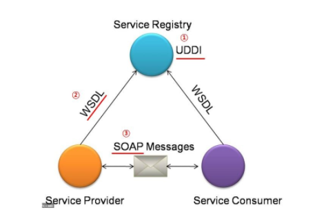
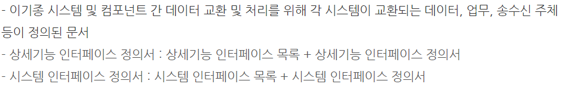

# Intergration

### 이민아 

---

## Index

- [통합구현](#통합구현)
- [연계 메커니즘](#연계-메커니즘)
  - 직접 연계 방식

    - DB Link
    - API 
    - DB Conenction
    - JDBC 
    - Hyper Link 

  - 간접 연계 방식

    - 연계 솔루션 (EAI)
    - ESB
    - Socket
    - Web Sevice
- [연계 모듈의 구현 환경](#연계-모듈의-구현-환경)
  - 연계 솔루션 (EAI)
    - Point to Point
    - Hub & Spoke
    - Message BUS 
    - Hybrid
  - ESB 
  - Web Sevice
    - 단순 객체 접근 프로토콜 SOAP
    - 전역 비즈니스 레지스트리 UDDI 
    - 웹 서비스 기술 언어 WSDL 
- [인터페이스](#인터페이스)
  - 검증 도구
    - xUnit 
    - JUnit
    - watir
    - FitNesse
    - STAF / NTAF
    - Selenium 
  - 감시 도구
    - 스카우터
    - APM

----

## 통합구현

- 사용자 요구사항 해결
- 새로운 서비스 창출을 위해 단위 기능하는 **모듈 간의 연계와 통합**
- 시스템 아키텍처 구성, 송수신 방식, 송수신 모듈 구현 방법 등에 따라 다양하므로 구축하고자 하는 환경과 사용자 요구사항에 따라 적합한 방법 찾기

----

## 연계 메커니즘

### 1. 연계 시스템 구성 ★

> **모듈 간의 데이터 연계**시 요구사항을 고려한 **연계방법과 주기** 설계를 위한 **매커니즘**

- **송신 체계** 
  - 데이터 생성 및 전송 담당 
  
  - 연계할 데이터를 데이터베이스와 애플리케이션으로부터 연계 테이블 또는 파일 형태(XML, text, csv 등) 로 생성하여 전송
  
- **수신 체계** : 데이터 수신 및 운영 DB 반영

- **중계 시스템** 
  - 연계 데이터의 송수신 현황을 모니터링 하는 시스템
  - 연계 데이터의 보안 강화 및 다중 플랫폼 지원 등이 가능

### 2. 연계 메커니즘 

#### (1) 유형 ★

- 직접 연계 방식
  - DB Link
  - API 
  - DB Conenction
  - JDBC 
  - Hyper Link 
- 간접 연계 방식
  - 연계 솔루션
  - ESB
  - Socket
  - Web Sevice

#### (2) 주행 절차

- 연계 데이터 추출 생성
- 코드 매핑 변환
- 파일 생성
- 로그 기록
- 송수신 어댑터
- 전송
- 반영

### 3. 직접 연계 방식

> **중간 매개체 없이** 송수신 시스템 연결

#### (1) DB Link ★

- DB에서 제공하는 DB Link 객체 사용 (직접 참조)

#### (2) API (Application Programming Interface) ★

- **운영체제나 프로그래밍 언어**가 제공 하는 **기능을 제어** 할 수 있게 만든 **인터페이스**
- 어떤 특정 사이트에서 **특정 데이터를 공유**할 경우 **어떠한 방식으로 정보를 요청**해야 하는지, 그리고 **어떠한 데이터를 제공 받을 수 있을지**에 대한 **규격을 정해놓은** **인터페이스**
- **응용 프로그램**에서 **데이터** 주고 받는 방법
- 데이터 **송신 시스템의 DB**에서 읽어와 **시스템 프로그램과 통신**할 때 사용되는 **언어나 메시지 형식**으로 제공하는 애플리케이션 프로그래밍 **인터페이스**
- Open API : 누구나 무료로 사용하여 프로그램 개발하거나 새로운 API 추가

#### (3) DB Conenction ★

- 수신 시스템의 **WAS(웹 애플리케이션 서버)**에서 송신 시스템의 DB로 연결
- DB 커넥션 풀을 생성하고 연계

#### (4) JDBC (Java DataBase Connectivity) ★

- Java에서 DB에 접근하여 데이터를 삽입, 삭제, 수정, 조회할 수 있도록 둘을 연결

#### (5) Hyper Link 

- Link 속성
- Hub & Spoke 
- ESB
- 병목 현상 최소화

### 4. 간접 연계 방식

>  **중간 매개체로** 송수신 시스템 연결

#### (1) 연계 솔루션 (EAI) ★

- **기업 내** 각종 애플리케이션 및 **플랫폼 간 정보 전달, 연계, 통합** 등 **이기종간** 상호 연동이 가능하게 해주는 **연계 솔루션**
- EAI 서버와 송수신 시스템에 설치되는 클라이언트를 이용
- 유지비용 높다(시스템 별로 개발)
- 단단한 집중형 결합
- **송수신 시스템**에 설치되는 **어댑터(애플리케이션 연결 핵심 장치)**를 사용
- **미들웨어 (Hub)**을 이용하여 Biz 로직을 중심으로 **기업 내 APP 통합 연계**

#### (2) ESB

- 애플리케이션 **간 연계, 데이터 변환,** 웹 **서비스** 지원 등 표준 기반의 인터페이스 제공
- EAI와 통합 측면에서 유사하지만, 애플리케이션 보다는 **서비스** 중심
- 개발자가 **서비스를 개발**하고 적절한 **API**를 통해 **서비스 간에 통신**하는 데 도움이 되는 인프라 스트럭쳐
- **SOA(서비스 지향 아키텍쳐 / 느슨하게 결합된 서비스 기반 애플리케이션 구현하기 위한 아키텍쳐 모델) 토대** 
- **미들웨어 (BUS)**를 이용하여 확장성, 유연성, 신속성
- 네트워크 의존적

#### (3) Socket

- **서버**는 통신을 위한 **소켓 생성하여 포트 할당**
- 클라이언트의 통신 요청시 클라이언트와 연결하여 통신

#### (4) 웹 서비스 Web Sevice ★

- 네트워크 정보를 **표준화된 서비스** 형태로 만들어 **공유**하는 기술
- **서비스 지향 아키텍쳐(SOA)** 개념 실현하는 대표적 기술
- **WSDL, UDDI, SOAP 프로토콜** 이용하여 연계

----

## 연계 모듈의 구현 환경

> 연계 메커니즘 간접 연계 방식

### 1. EAI (Enterprise Application Integration)★

#### (1) 정의 

- **기업 내** 각종 애플리케이션 및 **플랫폼 간 정보 전달, 연계, 통합** 등 상호 연동이 가능하게 해주는 **연계 솔루션**
- EAI 서버와 송수신 시스템에 설치되는 클라이언트를 이용
- 유지비용 높다(시스템 별로 개발)
- 단단한 집중형 결합
- **송수신 시스템**에 설치되는 **어댑터(애플리케이션 연결 핵심 장치)**를 사용
- **미들웨어 (Hub)**을 이용하여 Biz 로직을 중심으로 **기업 내 APP 통합 연계**

#### (2) 구축 유형

- **Point to Point** : 가장 기본 / 1:1 / 변경 재사용 어려움
- **Hub & Spoke** : **단일 접점인 허브** 시스템을 통해 데이터 전송 중앙 집중형 / 유지보수 용이 
- **Message BUS** (ESB 방식) : 애플리케이션 사이 **미들웨어(BUS)** 두어 처리 / 뛰어난 확장성
- Buy **Hybrid** : Hub & Spoke와 Message BUS  (ESB 방식)  혼합 병목현상 최소화 **(직접 연계 방식)**

### 2. ESB (Enterprise Service Bus)

- 애플리케이션 **간 연계, 데이터 변환,** 웹 **서비스** 지원 등 표준 기반의 인터페이스 제공
- EAI와 통합 측면에서 유사하지만, 애플리케이션 보다는 **서비스** 중심
- 개발자가 **서비스를 개발**하고 적절한 **API**를 통해 **서비스 간에 통신**하는 데 도움이 되는 인프라 스트럭쳐
- **SOA(서비스 지향 아키텍쳐 / 느슨하게 결합된 서비스 기반 애플리케이션 구현하기 위한 아키텍쳐 모델) 토대** 
- **미들웨어 (BUS)**를 이용하여 확장성, 유연성, 신속성
- 네트워크 의존적

### 3. 웹서비스 Web Sevice ★

#### (1) 정의

- 네트워크에 분산된 정보를 **표준화된 서비스** 형태로 만들어 **공유**하는 기술
- **서비스 지향 아키텍쳐(SOA / 느슨하게 결합된 서비스 기반 애플리케이션 구현하기 위한 아키텍쳐 모델)** 개념 실현하는 대표적 기술
- 서로 **다른** 컴퓨터들이 **동적으로 서로 연결**되어 소통하기 위한 **동적 환경 구현**을 위한 **소프트웨어 컴포넌트 묶음**

#### (2) 구성 ★

- **단순 객체 접근 프로토콜 SOAP** (Simple Object Access Protocol) ★
  - **HTTP, HTTPS, SMTP** 등을 활용하여 **XML 기반 메시지**를 **네트워크 상**에서 **교환(실행)**하는 프로토콜
  - **웹 서비스** 방식에서 HTTP 기반의 SOAP을 사용하여 송수신
    - **SOAP**
    - **UDDL**
    - **WSDL** 
  - Envelop, Header, Body로 구성
  - 레스트풀 프로토콜 대체 가능 **RESTful**
    - **서비스 지향 아키텍처 SOA (Service Oriented Architecture)** 
      - 프로세스 수행을 지원하는 정보시스템 구현 위해 가장 선진화된 **SW아키텍처**
      - 웹서비스나 REST 서비스로 구현된 SW모듈들을 **BPEL로 구현된 프로세스**
      - 오케스트레이션(Orchestration)함으로써, 프로세스 변경에 따른 정보시스템의 **재구성을 신속유연**하게 할 수 있는 방식
- **전역 비즈니스 레지스트리 UDDI** (Universal Description Discovery and Integration) ★
  - **WSDL을 등록**하여 
  - 서비스와 서비스 제공자를 **공개적으로 접근 및 검색 가능**
  - **레지스트리(저장소)**
- **웹 서비스 기술 언어 WSDL**  (Web Service Description Language) ★
  - **웹 서비스명, 서비스 제공 위치, 프로토콜** 등 웹 서비스에 대한 **상세 정보(설명서)**를 **XML 형태**로 구현

---

## 인터페이스

### 1. 인터페이스 

#### (1) 산출물

- 인터페이스 설계서

  

- 인터페이스 정의서 

  - 송수신 정보 구체화

  - 인터페이스 상세 정보

- 인터페이스 명세서

  - **컴포넌트 명세서 명시된** 인터페이스 클래스 세부 정보 명시

- 컴포넌트 명세서

  - 컴포넌트 개요
  - 내부 클래스 동작
  - 인터페이스를 통해 외부와 통신하는 명세 정의

#### (2) 기능 구현 

- 송신 측 필요 데이터 선택 전송
- 필요 항목 데이터 전달
- 절달 후 수신 측으로부터 전달 여부 값 반환

#### (3) 보안 취약점 및 보안 구현

- 입력 데이터 검증 및 표현
- 보안 기능
- 시간 및 상태
- 에러 처리
- 코드 오류
- 캡슐화
-  API 오용
- [Security](https://github.com/ma0723/Min_CS/blob/master/Security.md#%EB%B3%B4%EC%95%88-%EC%A0%90%EA%B2%80) 참조

### 2. 검증 도구 (테스트 프레임워크) ★

#### (1) 유형

- **xUnit** : 자바, C++, Net 등 다양한 언어 지원하는 **단위테스트 프레임워크**
- STAF : 서비스 호출 및 컴포넌트 재사용 등 다양한 환경 지원
- **FitNesse** : **웹** 기반 **테스트케이스** 설계, 실행, 결과 확인 등 지원
- NTAF : STAF의 재사용 및 확장성 FitNesse 의 협업 장점을 통합한 NHN의 테스트 프레임워크
- Selenium : 다양한 브라우저 및 개발 언어 지원
- **watir** : **Ruby**를 사용하는 애플리케이션 테스트 프레임워크

#### (2) 검증 절차

### 3. 감시 도구

#### (1) 스카우터

- 애플리케이션 및 DB 모니터링 
- 인터페이스 감시 도구

#### (2) 애플리케이션 모니터링 툴 APM (Application Performance Management) ★

- **안정적 시스템** 운영을 위한 **성능 모니터링 도구**

- **인터페이스의** 동작이 잘 진행되는지 **지속적으로 확인**하기 위해서 사용하는 **감시 도구**

- **데이터베이스,** 웹 애플리케이션의 **트랜잭션과** 변숫값, 호출 함수, 로그 및 시스템 부하 등 **종합적인 정보를 조회**

- **커넥션 풀(Connection Pools)** 등 지속적인 모니터링이 필요한 **자원을 효과**적으로 관리하는 도구

  
