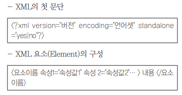

# New_Tech

### 이민아 

---

## Index

- [JAVA](#java)
- [테스트](#테스트)
- [시스템 ](#시스템)
- [기억장치](#기억장치)
- [프로세스](#프로세스)
- [신기술](#신기술)
- [사회 현상](#사회-현상)
- [코드](#코드)
- [프로토콜](#프로토콜)
- [XML](#xml)
- [가상화](#가상화)
- [클라우딩](#클라우딩)

---

## JAVA

### 1. JVM ★

- **시스템 메모리** 관리하고 **자바 기반** 애플리케이션을 위해 **실행 환경 제공**

### 2. DB 프레임워크

#### (1) **JDBC (Java DataBase Connectivity) ★**

- **Java 언어로 다양한** 종류의 DB에 접속하고 SQL문 수행할 때 **표준 API**
- DBMS
- 직접 연계 방식 (연계 매커니즘)

#### (2) DB 프레임워크 **MyBatis (마이바티스) ★**

- **JDBC (Java Data Base Connectivity) 코드 단순화**
- SQL **Mapping** 기반 **오픈소스** 접속 프레임워크
- SQL **거의 그대로** 사용할 수 있어 SQL 친화적인 국내 환경에 적합 많이 사용
- XML 서술자나 애너테이션(annotation)을 사용하여 **저장 프로시저나 SQL문으로 객체를 연결**시키는 프로그램
- 아파치 라이선스 2.0 배포
- IBATIS의 원개발자들이 포함된 팀에 의해 유지보수가 이루어짐
- **자바 퍼시스턴스 프레임워크**
- DBMS

#### (3) **하둡** ★

- 분산환경 **빅데이터** 저장 처리
- **자바기반 오픈소스 프레임워크**
- 더그 커팅과 마이크 캐퍼렐라가 개발
- 구글 **맵 리듀스 대체**

### 3. 단위테스트 

#### (1) **JUnit** 

- 자바 프로그래밍 언어용 **단위 테스트** 도구

- Assert 메소드 

  

#### (2) **xUnit** 

- 자바, C++, Net 등 다양한 언어 지원하는 **단위테스트 프레임워크**

### 4. 소프트웨어 패키지 JDK

- 썬 마이크로시스템즈에서 개발한 Java 환경에서 돌아가는 프로그램을 개발하는 데 **필요한 툴**들을 모아놓은 **소프트웨어 패키지**

### 5. 배치프로그램 (스프링)

#### (1) 쿼츠 스케줄러  (오픈소스 라이브러리)

- **스프링 프레임워크에 플러그인** 되어 수행
- 작업 스케줄 정의하는 **트리거 분리**하여 유연성 제공
- 일괄처리를 위한 다양한 기능
- 오픈소스 기반 스케줄러

#### (2) 스프링 배치 (오픈소스 프레임워크)

- Spring Source사와 Accenture사가 공동 개발한 오픈소스 프레임워크
- 로그 관리, 추적, 트랜잭션 관리, 작업처리통계 등

---

## 테스트

### 1. 공통 모듈 개발 과정

> 구현 순서는 임의로 변경 가능 (통합, 세분화)
>
> 개발 보안 가이드 참고

#### (1) DTO (Data Transfer Object) / VO (Value Object)

- **데이터 교환**을 위해 사용할 **객체** 만드는 과정
- **변수 및 객체**를 송수신할 데이터의 **자료형**에 맞게 생산
- 로직은 구현하지 **않는다**
- **변수와 데이터**를 저장하고 반환하는 메소드만 구현
- DTO : 프로세스 사이에서 데이터 전송
- VO : 고정 클래스가 가지는 객체

#### (2) SQL

- 데이터 **삽입, 변경, 삭제** 등 작업 수행할 SQL문 생성
- 소스 코드 내 **직접** 입력하거나 별도의 XML 파일로 저장하여 관리
- **XML 파일**로 관리하는 경우 **중복**되는 SQL문 **최소화**하고 **유지보수 간소화**

#### (3) DAO (Data Access Object)

- DB **접근**하고 SQL 활용하여 **실제로 데이터 조작**
- DAO : 특정 타입의 DB 추상 인터페이스 제공

#### (4) Service 

- 사용자 **요청 응답**하기 위한 **로직**을 구현

#### (5) Contoller

- 사용자의 요청에 적절한 **서비스를 호출**하여 그 **결과를 사용자에게 반환**하는 코드 구현

#### (6) View

 ### 2. 성능

#### (1) tpmC (Transaction Processing Performance Council) ★

- **특정서버**에 대하여 **자체기준**으로 **테스트**를 하여 나온 결과 중 **1분간 최대 처리 건수**를 나타낸 수치
- 가장 객관적으로 **하드웨어** 성능 나타내는 지표

#### (2) 고가용성 HA (High Availability) ★

-  서버, 네트워크 등 **정보시스템이 장애**를 맞닥드렸을 때 **긴시간 지속적**으로 **정상운영이 가능한 상태**

#### (3) 애플리케이션 모니터링 툴 APM (Application Performance Management) ★

- **안정적 시스템** 운영을 위한 **성능 모니터링 도구**
- **인터페이스의** 동작이 잘 진행되는지 **지속적으로 확인**하기 위해서 사용하는 **감시 도구**
- **데이터베이스,** 웹 애플리케이션의 **트랜잭션과** 변숫값, 호출 함수, 로그 및 시스템 부하 등 **종합적인 정보를 조회**
- **커넥션 풀(Connection Pools)** 등 지속적인 모니터링이 필요한 **자원을 효과**적으로 관리하는 도구

#### (4) OPS (Operations per Second)

- 웹 서버
- WAS 서버

#### (5) JMeter

- 서버가 제공하는 서비스에 대한 성능을 측정하고 사용자에게 보여주는 테스트 도구
-  Apache Software Foundation에서 개발된 어플리케이션

### 3. 검증 도구 (테스트 프레임워크)

#### (1) xUnit ★

- 자바, C++, Net 등 다양한 언어 지원하는 **단위테스트 프레임워크**

#### (2) JUnit ★

- 자바 프로그래밍 언어용 **단위 테스트** 도구

- Assert 메소드 

  

#### (3) watir ★

-  **Ruby**를 사용하는 애플리케이션 테스트 프레임워크

#### (4) FitNesse ★

- **웹** 기반 **테스트케이스** 설계, 실행, 결과 확인 등 지원

#### (5) STAF

- 서비스 호출 및 컴포넌트 재사용 등 **다양한 환경** 지원

#### (6) NTAF

- STAF의 재사용 및 확장성 FitNesse 의 협업 장점을 통합한 NHN의 테스트 프레임워크

#### (7) Selenium 

- **다양한** 브라우저 및 개발 **언어** 지원

### 4. 감시 도구

#### (1) 스카우터

- 애플리케이션 및 DB 모니터링 
- 인터페이스 감시 도구

#### (2) 애플리케이션 모니터링 툴 APM (Application Performance Management) ★

- **안정적 시스템** 운영을 위한 **성능 모니터링 도구**
- **인터페이스의** 동작이 잘 진행되는지 **지속적으로 확인**하기 위해서 사용하는 **감시 도구**
- **데이터베이스,** 웹 애플리케이션의 **트랜잭션과** 변숫값, 호출 함수, 로그 및 시스템 부하 등 **종합적인 정보를 조회**
- **커넥션 풀(Connection Pools)** 등 지속적인 모니터링이 필요한 **자원을 효과**적으로 관리하는 도구

#### (3) TP - Monitor (Transaction Processing Monitor) 

- 항공기나 펄도 예약 업무 등과 같은 **온라인 트랜잭션 업무**에서 트랜잭션 처리 및 감시 

---

## 시스템 

### 1. 시스템

#### (1) SSO (Single Sign On) ★ 

- **SSO**(Single Sign On)는 **가장 기본적인 인증** 시스템으로, '모든 인증을 **하나의 시스템**에서'라는 목적하에 개발 
- 시스템이 몇 대가 되어도 하나의 시스템에서 인증에 성공하면 다른 시스템에 대한 접근 권한도 모두 얻는 것

#### (2) SCM (Supply Chain Management) 

- SCP : 공급사슬관리에서 **계획**기능을 지원해주는 애플리케이션을 SCP(Planning)
- SCE(Excution) : SCP를 통해 수립된 계획에 따라 공급사슬을 구성하는 각각의 부분별 상세스케줄링 수립- 실행하여 계획 대비 실적을 다시 SCP쪽으로 피드백(Feed back)함으로써 공급사슬전체에 대한 관리를 **수행**

#### (3) GIS (Geographic Information System)

- 지역에서 수집한 각종 **지리 정보**를 수치화하여 컴퓨터에 입력 · 정보 · 처리하고, 이를 사용자의 요구에 따라 다양한 방법으로 분석 · 종합하여 제공하는 **정보 처리 시스템**

#### (4) 글로나스 GLONASS

- **러시아 우주국 무선항법 시스템**은 3축 위치, 속도결정 및 시간 스템프 까지 전 세계 기지국에 분산 보급 운영
- 미국의 GPS와 많은 점에서 닮았고 다른 점은 24개 위성이 3개 궤도에 8개씩 배치

#### (5) 인터럽트 Interrupt 

- 실행 중인 프로그램을 **일시 중단**하고 다른 프로그램을 끼워 넣어 실행시키는 것
- 예상치 못한 이벤트가 발생했다는 것을 **프로그램에 알리는 신호**
- **현재** 작업 상태 **중지 후 저장**
- 핸들러 또는 ISR 이라고 불리는 이벤트 처리 기능 실행하여 응답

### 2. 미들웨어

#### (1) DB 

- 데이터베이스 **벤더**에서 제공하는 클라이언트에서 **원격의 데이터베이스**와 연결하기 위한 미들웨어

#### (2) **RPC (Remote Procedure Call)** ★ 

- 응용 프로그램의 프로시저를 활용하여 **원격 프로시저를 마치 로컬 프로시저처럼** 호출

#### (3) MOM (Message Oriented Middleware) 

- **메시지 기반 비동기형** 메시지 전달

#### (4) TP - Monitor (Transaction Processing Monitor) 

- 항공기나 펄도 예약 업무 등과 같은 **온라인 트랜잭션 업무**에서 트랜잭션 처리 및 감시 

#### (5) ORB (Object Request Broker) 

- **객체** 지향 미들웨어로 **COBBA 코바 표준 스펙 구현**

#### (6) **웹어플리케이션 서버 (WAS) ★**

- 사용자에게 **동적 서비스** 제공하기 위해 웹서버로부터 요청받아 데이터 가공작업 수행 혹은 DB 서버와 웹 서버의 연결 호근 웹 서버와 파일 서버 사이에서 **인터페이스**

- 유형
  - **Tomcat**
    - Apache 소프트웨어 개발
    - 자바를 움직하기 위해 개발한 **WAS의 일종**
    - 서블릿, JSP, 빈즈와 같은 자바코드를 위한 **자바 이해 엔진**
    - 비용이나 성능면에서 자바 기반 웹서버를 구성할 때 아파치, 리눅스 톰캣 조합
  - JBoss
  - Jety
  - JEUS

### 3. 윈도우

#### (1) PnP (Plug and Play) 

- 컴퓨터에 주변기기를 추가할 때 별도의 물리적인 설정을 하지 않아도 설치만 하면 그대로 사용할 수 있도록 하는 기능
- **꽂아서(Plug) 바로 사용(Play) 한다는** 뜻의 플러그 앤 플레이는 윈도우즈95 운영체제가 발표되면서 부각된 컴퓨터의 중요한 기능
- **운영체제**에서 새로 설치된 **하드웨어 자동 구성 능력**

#### (2) **OLE(Object Linking and Embedding)** 

- 개체를 **현재 작성 중**인 문서에 자유롭게 **연결하거나 삽입하여** 편집할 수 있게 하는 기능

### 4. 리눅스 / 유닉스

#### (1) chmod

- 파일에 대한 액세스(읽기, 쓰기, 실행) 권한 설정하여 사용자에게 제한적인 권한
- chmod 751 (a.txt) ★
  - 사용자에게 읽기, 쓰기 실행 권한 부여
  - 그룹에게 읽기, 실행 권한 부여
  - 그 이외에게 실행 권한 부여

#### (2) 커널 (Kernel) ★

- 가장 **핵심**
- **하드웨어 보호 (캡슐화)** 
- 프로그램들과 **하드웨어** 간의 **인터페이스** 역할
- 프로세스, 기억장치, 입출력관리(인터럽트 처리기), 데이터 전송 및 변환, 관리자, 스케쥴러 등 기능
- **주기억장치**에 적재되어 상주
- 메모리나 프로세서와 같은 자원 관리 혹은 시스템 운영 제어

#### (3) 쉘 (Shell) ★

- **명령어 해석기**
- 사용자의 명령어 인식하여 프로그램 호출
- 시스템과 **사용자** 간의 **인터페이스**
- DOS의 COMMAND.COM과 같은 기능

#### (4) 안드로이드 ★

- 휴대전화를 비롯한 **휴대용 장치**를 위한 **운영체제, 미들웨어, 사용자 인터페이스** 그리고 표준 응용 프로그램을 포함
- **리눅스** 모바일 운영체제
- **자바와 코틀린 언어**로 응용프로그램 작성
- 컴파일된 **바이트코드** 구동할 수 있도록 **런타임 라**이브러리 제공

#### (5) 쿠버네티스 

- **파일럿**을 의미하는 그리스어에서 유래
- **리눅스** 재단에 의해 관리되는 컨테이너화된 애플리케이션 **자동배포, 스케일링** 등을 제공하는 오픈 **소스 기반 관리 시스템**

#### (6) MAC

- 유닉스 기반 GUI 운영체제 (Apple사)

---

## 기억장치

### 1. 메모리

#### (1) 복수 배열 독립 디스크 RAID ★

- 소용량 저장장치 여러 대를 배열로 묶어서 **대용량 저장장치**를 만드는 기술
- **여러개의** 하드디스크로 **디스크 배열** 구성
- 파일을 구성하는 데이터 블록들을 서로 다른 디스크들에 **분산 저장**
- 디스크 **속도 향상**
- 한 디스크에만 결함 발생해도 전체 손상의 문제가 발생하여 디스크 배열에 오류 검출 및 복구를 위한 **여분** 디스크 추가하여 복구 가능

#### (2) RAM (Random Access Memory)

- 기억된 정보를 읽어내기도 하고 다른 정보를 기억시킬 수도 있는 메모리
- 컴퓨터의 주기억장치, 응용 프로그램의 일시적 로딩(loading), 데이터의 일시적 저장 등에 사용
- 메모리 내부 데이터의 물리적 위치와 무관
- 거의 동일한 시간 내에 데이터 항목을 **읽거나 쓴다**
- **휘발성**으로 저장된 데이터든 전원이 내려가면 곧바로 손실

#### (3) ROM

- 데이터 **읽기만 가능**

#### (4) 옵테인 메모리 (Optane Memory)

- 인텔과 마이크론이 개발한 3D 크로스 포인트 **비활성 메모리** 프로세서의 상업용 버전
- 스토리지 **캐쉬** 기능을 담당하기 때문에 **단독 사용은 불가능하고** HDD 같이 속도가 느린 스토리지에 저장된 데이터를 미리 가져다 놓는 방식으로 **속도를 높여준다**
- **RAM과 플래시 메모리의 중간**형태에 해당

#### (5) MMU (Memory Management Unit)

- CPU가 메모리에 접근하는 것을 관리하는 하드웨어 부품
- **가상 메모리를 실제 메모리 주소로 변환**하는 장치

#### (6) 레지스터 Register 

- 컴퓨터의 중앙처리장치에 들어 있는 **소규모 데이터 기억장치**
- 비트, 바이트, 기계어와 같은 지정된 기억 용량을 가지며, 통상 특정한 목적에 쓰이는 기억 장치
- 처리도리 데이터나 연산의 **중간 결과**를 저장하는 **CPU 내부 위치 특별한 고속 저장 공간**
- 플립플롭과 래치들을 병렬로 결합한 **가장 빠른 메모리**

### 2. 가상기억장치

#### (1) **페이지 부재** 

- 참조할 페이지 주기억장치에 없는 경우로 페이지부재빈도

#### (2) **스래싱** ★

- 프로세스 **처리** 시간보다 페이지 **교체 시간이 더 많은 경우**

#### (3) **워킹세트(스레싱 방지 기법)** ★

- 실행 중인 프로세스가 **일정 시간 동안 자주 참조**할 수 있는 페이지의 집합
- 각 프로세스에 할당되는 최소한의 페이지 프레임 수를 결정함으로써 스레싱을 방지한

#### (4) **PFF(스레싱 방지 기법)** ★

- 페이지 부재율의 **상한과 하한**을 정해서 직접적으로 페이지 부재율을 조절하는 기법

#### (5) **국부성(Locality)**

- **시간** 구역성 : 하나의 페이지를 **일정 시간 동안** 집중적으로 액세스
- **공간** 구역성 : **일정 위치 페이지**를 집중적으로 액세스
- 프로세스가 실행되는 동안 주기억장치를 참조할 때 **일부 페이지만 집중적으로 참조하는 성질로 워킹셋 이론의 기반**

### 3. 페이지 교체 알고리즘 ★

#### (1) NUR (Not Used Recently)

- 최근에 사용하지 않은 페이지를 교체
- **참조비트와 변형비트** 사용

#### (2) LFU (Least Frequently Used)

- 사용**빈도가** 가장 적은 페이지 교체

#### (3) LRU (Least Recently Used)

- 최근에 **가장 오랫동안 사용하지 않은** 페이지 교체 

#### (4) SCR (Second Chance Replacement / 2차 기회 교체)

- 가장 오랫동안 주기억장치에 있던 페이지 중 **자주** 사용되는 페이지의 교페를 방지하기 위한 것으로 **FIFO 보완**

#### (5) FIFO 

- 각 페이지가 주기억장치에 적재될 때마다 그 때의 시간을 기억시켜 가장 먼저 들어와서 **가장 오래있었던** 페이지 교체

#### (6) OPT (Optimal replacement)

- **앞으로** 가장 오랫동안 사용하지 않을 페이지 교체

---

## 프로세스

### 1. 상태 전이 관련 용어 ★

#### (1) **Dispatch** 

- **준비**상태에서 대기 프로세스 중 하나가 프로세서 **할당받아** **실행상태 전이**

#### (2) **타이머 런 아웃** / 타임 아웃

- **실행** 상태에서 **준비** 상태로 전이

#### (3) Wake Up

- 입출력 작업 완료 후 프로세스가 **대기** 상태에서 **준비** 상태로 전이

#### (4) 블록

- 입출력 등 발생 으로 **실행** 상태에서 **대기** 상태로 전이

#### (5) **Spooling** 

- 입출력 장치의 공유 및 상대적으로 느린 입출력 장치의 처리 속도 보완하고 **다중 프로그래밍 시스템 성능** 향상
- 직접 입출력 장치에 보내지 않고 **나중에 한꺼번에** 입출력하기 위해 **디스크에 저장**

#### (6) Swap

- Swap-in :다시 기억장치가 할당 
- Swap-out : 기억장치를 잃은 경우

### 2. 프로세스 통신 (IPC 메소드) ★

#### (1) **공유 메모리(Shared Memory)** 

- **다수**의 프로세스가 **공유가능한 메모리**를 구성하여 프로세스 간 통신 수행

#### (2) 소켓(Socket) 

- 네트워크 소켓을 이용하여 **네트워크를 경유하는 프로세스들** 간 통신 수행

#### (3) **세마포어(Semaphores)** 

- **공유** 자원에 대한 **접근 제어를** 통해 프로세스 간 통신 수행

#### (4) Pipes & named Pipes

- Pipe라고 불리는 선입선출 형태로 구성된 메모리를 여러 프로세스가 공유하여 통신 수행

#### (5) Message Queueing

- 메시지가 발생하면 이를 전달하는 형태로 프로세스 간 통신

### 3. 스레드 **(Thread)** ★

- 프로세스에서 **실행제어만 분리**하여 **실행**단위로 **독립적 수행**하는 **흐름단위**
- **한 개의 프로세스**는 **여러개의 스레드를 가질 수 있다**

### 4. 비선점 스케줄링

#### (1) **FCFS (First Come First Service / 선입선출)**

- 프로세스가 **대기 큐에 도착한 순서**에 따라 CPU를 할당 
- FIFO 알고리즘이라고도 함

#### (2) **SJF (Shorteset Job Frist / 단기 작업 우선)** ★

- 프로세스가 도착하는 시점에 따라 그 당시 **가장 작은 서비스시간**을 갖는 프로세스가 종료 시까지 자원 점유 
- 준비 큐 작업 중 가장 짧은 작업부터 수행, **평균 대기시간 감소** 
- CPU 요구 시간이 긴 작업과 짧은 작업 간의 **불평등**이 심하여, CPU 요구 시간이 긴 프로세스는 **기아 현상 발생**

#### (3) **HRN (Highest Response Raion Next)** ★

- 대기 중인 프로세스 중 현재 **응답률**이 가장 높은 것을 선택 
- **SJF의 약점인 기아 현상을 보완**한 기법으로 긴 작업과 짧은 작업  **간의 불평등 완화** 
- HRN의 우선순위 =**(대기시간+서비스시간) / 서비스시간**

#### (4) 우선순위

- 프로세스 별로 **우선순위**가 주어지고, **준비상태 큐**에서 기다리는 각 프로세스의 우선순위에 따라 CPU를 할당
- 동일 순위는 FCFS

#### (5) 에이징 기법 

- 시스템 특정 프로세스의 우선순위가 낮아 무한정 기다리게 되는 경우 한 번야보하거나 기다린 시간에 비례하여 **일정 시간이지나면 우선순위를 한 단계씩 높여** 나가는 기법

#### (6) 기한부

- 작업들이 명시된 시간이나 **기한 내에 완료**되도록 계획

### 5. 선점 스케줄링

#### (1) **라운드 로빈 (RR)** ★

- 시분할 시스템 프로세스는 같은 크기의 **CPU시간을 할당**
- 할당 시간 내에 처리를 못하면 준비 **큐 리스트의 가장 뒤로 보내지고**
- CPU는 대기  중인 **다음 프로세스로** 넘어감
- **선점 FCFS(FIFO)**

#### (2) **SRT (Shortest Remaining Time First)** ★

- **가장 짧은 시간**이 소요되는 프로세스를 먼저 수행하고, **남은 처리 시간이 더 짧다고 판단되는 프로세스가 준비 큐에 생기면 언제라도  프로세스가 선점**
- **선점 SJF**

#### (3) 다단계 큐(MQ)

- 작업들을 **여러 종류 그룹**으로 분할, 여러 개의 큐를 이용하여 상위단계 작업에 의한 하위단계 작업이 선점 당함 
- 각 큐는 자신만의 독자적인 스케줄링을 가짐

#### (4) 다단계 피드백 큐(MFQ)

- 입출력 위주와 CPU위주인 프로세스의 특성에 따라 **큐마다 서로  다른 CPU시간 할당량**을 부여 
- **FCFS**와 **라운드 로빈** 스케줄링 기법을 혼합한 것으로, 새로운 프로세스는 높은 우선순위, 프로세스의  실행 시간이 길어질수록 점점 낮은 우선순위 큐로 이동하고 마지막  단계에는 라운드로 로빈 방식을 적용

#### (5) 선점 우선순위

- 준비상태 큐의 프로세스들 중에서 우선순위가 가장 높은 프로세스에게 먼저CPU 할당

----

## 신기술 

### 1. 기술

#### (1) 블록 체인 ★

- **온라인 금융 거래** 정보를 블록으로 연결
- 블록은 **임의조작이 불가능** 하도록 고안되어 지속적으로 성장하는 데이터 기록 리스트
- **P2P** 네트워크 **분산** 환경
- 중앙관리서버가 아닌 **참여자(Peer)**들의 개인 디지털 장비 **분산** 저장
- **공동** 관리
  - **스마트 계약(Smart Contract)**
    - 해당 조건 달성 시 **제 3자의 개입 없이** 특정 계약 **조건을 자동적으로** 실행하기 위한 기술로 블록체인 2.0에 사용되는 기술
  - **Baas(Blockchain as a Service)**
    - 블록체인 개발환경을 **클라우드로 서비스** 하는 개념
    - 블록체인 네트워크에 노드의 추가 및 제거가 용이
    - 블록체인의 기본 인프라를 추상화하여 블록체인 응용프로그램을 만들 수 있는 클라우드 컴퓨팅 플랫폼
  - 합의 알고리즘 : 거래의 안정성을 보장, 모든 참여자가 데이터의 적합성을 판단하고 동의하는 과정
    - PoW(Power of Work) : 문제를 **가장 빨리** **해결**한 사람에게 블록 만들 수 있도록 허가
    - PoS(Power of Stake) : **화폐량 많이 소유**하는 승인자가 우선하여 블록 만들 수 있음

#### (2) 지그비 Zigbee ★

- **저속, 저비용, 저전력의 무선망**을 위한 기술
- **가정·사무실** 등의 무선 네트워킹 분야에서 10∼20m 내외의 근거리 통신과 유비쿼터스 컴퓨팅을 위한 기술 **(홈오토메이션 및 데이터 네트워크**를 위한 기술)
- 휴대전화나 무선LAN의 개념으로, 기존의 기술과 다른 특징은 전력소모를 최소화하는 대신 소량의 정보를 소통

#### (3) 알파고 Alphago 

- 구글의 인공지능개발 자회사인 구글 딥마인드(Google DeepMind)가 개발한 인공지능 프로그램
- 인간의 뇌와 같이 작동하는 정책망과 가치망이라는 2가지 신경망 경합

#### (4) 커넥티드 카 

- 통신망에 연결된 자동차. 통신 수단으로 무선랜(WLAN), 엘티이(LTE) 이동 통신 등이 사용 
- 커넥티드 카는 다른 차량이나 교통 및 통신 인프라, 보행자 단말 등과 실시간으로 통신하며 운전자의 편의와 교통 안전을 돕고 인터넷의 다양한 서비스를 제공

#### (5) 포렌식  

- 포렌식(Forensic)은 고대 로마시대의 포럼(Forum)이라는 라틴어에서 유래
- 일반적으로 법정 변론을 위하여 이용되는 과학, 즉 법정과학 또는 법과학이라는 개념
- 디지털 포렌식은 디지털 환경과 장비로부터 법정 제출을 전제로 디지털 증거 자료를 수집·분석하는 기술

#### (6) 정보기술 인프라 라이브러리  ITIL (IT Infrastructure Library)

- 영국에서 태동한 정보 기술(IT) 서비스를 지원, 구축, 관리하는 프레임워크. 효과적인 IT 서비스 관리를 위한 일종의 교본
- ITIL에서 제시하는 서비스 관리 수준(SLA) 프로세스는 사전 준비, SLA 개발, 운영 및 개선 단계의 생명 주기를 거치며 반복
- IT서비스 운영 및 관리 돕기 위한 문서들 집합
- IT조직이 기술 중심적 운영에서 사용자들 요구에 초점 맞춘 고객지향적 운영방ㅎ식을 채택하면서 개별적 IT관리 관행 만드는 것을 방지
- 영국 정부가 다양한 IT 서비스들의 관리 방법들을 모아 만든 표준적 참고문헌

#### (7) AI 

- AI : 컴퓨터에서 인간과 같이 사고하고 생각하고 학습하고 판단하는 논리적인 방식을 사용하는 인간지능을 본 딴 고급 컴퓨터 프로그램

#### (8) AR / VR / 메타버스

- AR 증강현실 : 가상 현실(Virtual Reality)이 이미지, 주변 배경, 객체 **모두를** 가상의 이미지로 만들어 보여 주는 반면, **증강 현실**은 **추가되는 정보만** 가상으로 만든다
- VR 가상현실 : 컴퓨토 등일 사용한 인공적인 기술로 만들어낸 **실제와 유사하지만 실제가 아닌 환경이나 상황**
- 메타버스: 가상/초월과 세계/우주의 합성어로 **3차원 가상셰계**를 뜻하며 생활형/게임형 가성세계라는 의미

#### (9) 초소형 정밀기계 기술 MEMS (Micro Electro Mechanical System) 

- 자동차 에어백 가속도 센서, 실용화 의료기기, 정보기기 분야 개발을 활발
- 소형화된 전자 회로뿐만 아니라 소형 암, 기어, 스프링과 같은 기계 부품에 통합되는 전문화된 실리콘 칩
- **마이크로** 시스템, 마이크로 머신, 마이크로 메카트로닉스 등의 동의어로 혼용되고 있으나, 번역하면 초소형 시스템이나 **초소형 기계**
- 데이터를 처리하는 능력과 특정한 종류의 센서 형태로 데이터를 저장하는 능력

#### (10) IMT-2020

- 국제 전기 통신 연합(ITU)에서 채택한 5세대 이동 통신의 공식 명칭

#### (11) 공통평가기준 CC 

- ISO 15408 표준으로 채택된 정보 보호 제품 평가 기준
- 정보화 순기능 역할 보장하기 위해 정보화 제품의 정보보호 기능과 사용환경 등급 정한 기준

#### (12) 아이핀

- 사이버 주민등록번호
- 인터넷 웹사이트에 회원가입할 때 주민번호 대신

### 2. 서비스

#### (1) QoS (Quaility of Service) ★

- 통신서비스 품질
- 네트워크 상에서 일정 정도 이하의 지연 시간이나 데이터 손실률 등의 보장을 일컫는 말로, 사전에 합의 또는 정의된 통신 서비스 수준
- 보장하기 위해선 대역폭 및 상대적 우선순위 등 적정 네트워크 자원을 각 프로그램에 배정하는 것이 필요

#### (2) LBS (Location Based Service) 

- 이동통신망이나 위성항법장치(GPS) 등을 통해 얻은 위치정보를 바탕으로 이용자에게 여러 가지 서비스를 제공하는 서비스 시스템
- 모바일 기기의 지리적 위치에 대한 정보를 사용하여 모바일 네트워크로 통하여 모바일로 접속 가능
- 스마트폰과 태블릿 시장 확장에도 중요
- 기능을 제어하기 위해 위치 데이터를 사용하는 일반적 수준의 프로그램 단계 서비스(정보제공 서비스, 오락 서비스 등과 같은 소셜 네트워크 서비스)

#### (3) 기술 경영 MOT 

- 미국 스탠퍼드대 윌리엄 밀러 교수가 기술경영 강좌를 개설한 것이 효시
- 기술을 전략적으로 활용함으로써 새로운 사업 기회를 창출하고 혁신적 제품을 고안하는 등 공학과 경영학을 통합
- 기술투자 비용에 대해 최대 효과

#### (4) VOC (Voice of Customer)  

- 관리 시스템 콜센터에 접수되는 고객불만사항을 접수부터 처리가 완료될 때까지 처리상황을 실시간으로 관리하고 처리결과를 관서별로 지표화하여 관리·평가함으로써 고객의 체감서비스를 향상시키는 고객관리시스템

#### (5) MMS (Multimedia Message Service)

- **멀티미디어** 콘텐츠가 포함된 메시지
- 160자 이상의 **텍스트** 메시지
- **image 전용** SMS와 달리 다양한 미디어

---

## 사회 현상

### 1. 사람

#### (1) 크리슈머 Cresumer 

- 신제품개발이나 디자인, 서비스 등의 문제에 적극 개입하며 자신의 의견을 내놓는 소비자
- 크리에이티브(creative; 창조적인)와 컨슈머(consumer; 소비자)의 합성어

#### (2) 인포러스트 정보열광자 Infolust 

- 인포러스트는 정보(Information)와 열광(Lust)의 합성어
- 누구보다 빠른 정보와 상품들을 선별해 가장 최근의 신규 토픽들을 대중화시키며 정보를 제공하는 역할

#### (3) 노모포비아 Nomophobia 

- 스마트폰 등 휴대전화가 없을 때 초조해하거나 불안감을 느끼는 증상을 일컫는 말
- ‘노 모바일폰 포비아(No mobile-phone phobia)’의 줄임말

#### (4) 위키노믹스 

- 200년 역사의 브리태니커 백과사전의 정보량을 5년 역사의 온라인 백과사전 위키피디아가 넘어선 현상이다. 이로써 이코노믹스의 시대는 가고 보통 사람들의 **집단적인 능력과 집단 지성**(Collective Intelligence)이 세계를 변화시키는 위키노믹스 시대
- 컴퓨터 운영체제 리눅스

#### (5) 웨바홀리즘

- 조절되지 않는 인터넷 이용이나 지나친 인터넷 이용 때문에 일상생활에서 행동, 심리적 문제가 발생하는 질환

### 2. 기업

#### (1) EA (Enterprise Architecture)

- 기업의 목표와 요구사항을 효과적으로 지원하기 위해 IT 인프라 각 부분의 구성과 구현기술을 체계적으로 기술하는 작업
- CIO가 효율적 인프라와 전략 확보차원에서 조직 업무 활동과 IT 관계를 현재와 미래 추구할 모습으로 체계화한 청사진

#### (2) 전사적자원관리 ERP (Enterprise Resourece Planning)

- 기업 내 생산, 물류, 재무, 회계, 영업과 구매, 재고 등 경영 활동 프로세스들을 **통합**적으로 연계해 관리
- 기업에서 발생하는 정보들을 서로 **공유**하고 **새로운 정보의 생성과 빠른 의사결정을 도와**주는 **전사적자원관리시스템**

#### (3) EAI (Enterprise Application Integration) ★

- **기업 내** 각종 애플리케이션 및 **플랫폼 간 정보 전달, 연계, 통합** 등 상호 연동이 가능하게 해주는 **연계 솔루션**
- EAI 서버와 송수신 시스템에 설치되는 클라이언트를 이용
- 유지비용 높다(시스템 별로 개발)
- 단단한 집중형 결합
- **송수신 시스템**에 설치되는 **어댑터(애플리케이션 연결 핵심 장치)**를 사용
- **미들웨어 (Hub)**을 이용하여 Biz 로직을 중심으로 **기업 내 APP 통합 연계**

### 3. 재난

#### (1) 목표 복구 시간 RTO (Recover Time Objective) ★

- **비상사태 또는 업무중단시점**부터 **업무가 복구되어 다시** 정상가동될 때까지의 시간
- 정보시스템 운영 중 서버가 다운되거나 자연재해나 시스템 장애등 이유
- 대고객 서비스 불가능

#### (2) 업무 연속성 계획 BCP (Business Continuity Planning) ★

- **재해복구, 업무복구 및 재개, 비상계획** 등을 통해 **비즈니스의 연속성**을 보장
- 재난 발생시 **비지니스 연속성**을 유지하기 위한 방법론
- 재난으로 정상적인 운용이 어려운 **데이터 백업과 같은 단순복구** 뿐 아니라 **고객 서비스 지속성** 보장, **핵심 업무기능을 지속**하는 환경을 조성해 기업가치를 최대화
- 재해 백업 시스템 운용 체계를 마련하여 재해로 인한 업무 손실 최소화하는 컨설팅 기능 포함
- 컨설팅 → 시스템 구축 → 시스템 관리

#### (3) RPO (Recovery Point Objective) ★

- 업무 **중단 시점**부터 데이터가 **복구**되어 정상 가동될 때 **데이터의 손실 허용 시점**

#### (4) BIA (Business Impact Analysis) ★

- **시간 흐름**에 따른 **영향도 및 손실** 평가를 조사하는, **BCP(업무 연속성 계획)**를 구축하기 위한 **비즈니스 영향 분석**

#### (5) DRS (Disaster Recovery System) ★

- **재해복구계획**의 원활한 수행을 지원하기 위해 **지속적인 관리 체계**가 **통합**된 **재해복구센터**
- 유형
  - mirror site
    - 주 센터와 데이터복구센터 **모두 운영 상태**
    - 실시간 동시 서비스 가능 재해복구센터 / RTO 즉시
  - Hot site
    - 주 센터와 동일한 수준 자원을 대기 상태로 **원격지에 보유**
    - 동기, 비동기 방식의 미러링을 통해 데이터 최신 상태를 유지하는 재해복구센터 
    - RTO 4시간 이내
  - **Warm site**
    - **중요성이 높은** 자원만 **부분적**으로 재해복구센터에 보유 
    - RTO 수일~수주
  - Cold site
    - **데이터만** 원격지에 보관
    - 재해 시 데이터를 근간으로 필요 자원 조달하여 복구 
    - RTO 수주~수개월

#### (6) 애드혹 ad-hoc 

- PC와 PC끼리 **다른 연결 장비 없이** **무선랜**을 이용하여 **소규모 무선 네트워크**를 구성
- 재난 현장과 같이 별도의 고정된 **유선망 구축할 수 없는 장소**에서 모바일 호스트만을 이용하여 구성한 네트워크
- 망을 구성한 후 **단기간 사용되는 경우나 유선망** 구하기 어려운 경우
- 유선망과 기지국이 필요없고 호스트의 이동제약이 없어 빠른 망 구성과 저렴한 비용

----

## 코드

### 1. 리팩토링 ★

- SW 보다 이해하기 쉽고 수정하기 쉽도록 만드는 것
- 결과의 변경없이 **코드 구조 재조정**
- **가독성 높인다**
- **유지보수 쉽게**
- 코드 외부행위는 바꾸지 않고 **내부구조 개선**

### 2. 나쁜 코드

#### (1) 외계인 코드 (**Alien Code**)

- **베드 코드**의 유형
- **아주 오래**되거나 **참고문서 또는 개발자가 없어**서 유지보수 작업이 아주 어려운 **응용프로그램의 소스코드

#### (2) 스파게티 코드

- 복잡하게 얽힌 소스코드

### 3. 코드보안

#### (1) **코드 난독화** ★

- **역공학을** 통한 보안 취약점 공격에 대한 방지 기술
- 원래 코드를 변화시켜 **읽기 어렵게** 하는 기술
- 저작권 크랙방지 기술

#### (2) Secure 코딩 

- 설계 및 구현 단계에서 해킹 등 공격을 유발하는 가능성이 있는 보안 취약점을 **사전에 제거**하고 안전한 SW 만드는 코딩 기법

-----------

## 프로토콜

### 1. 데이터 교환 방식

#### (1) ATM

- **비동기** 전송모드인 **광대역** 전송에 사용되는 스위칭 기법

#### (2) 회선 교환 방식

- 공간 분할 교환 방식 : 기계식 접점과 전자식 접점 등을 이용하여 교환 수행 (음성 전화용 교환기)
- 시분할 교환 방식 : 전자 부품이 갖는 고속성과 디지털 교환 기술 이용하여 다수의 디지털 신호를 시분할적으로 동작시켜 다중화

#### (3) 패킷 교환 방식

- **가상 회선 방식**
  -  TCP/IP **전송계층의 TCP**
  -  단말 장치 상호간에 **논리적인 가상 통신 회선**을 미리 설정하여 송수신자 간의 **연결**을 확립한 후에 경로를 따라 패킷들을 **순서적으로 운반**
- 데**이터그램 방식**
  -  TCP/IP **인터넷계층의 IP** /  **전송계층의 UDP**
  -  **연결 경로를 설정하지 않고** 인접한 노드들의 트래픽(전송량)을 감안하여 각각의 패킷들을 **순서에 상관없이 독립적**으로 운반

#### (4) 서킷 스위칭

- 네트워크 리소스를 특정 사용계층이 **독점**하여 통신

### 2. 네트워크

#### (1) SAN (Storage area Network)★

- 네트워크상에 **광채널 스위치** 및 **멀티 프로토콜 기능**을 활용
- 각기 다른 운영체제를 가진 **여러**기종들이 네트워크 상에**서 동일 저장장치의 데이터를 공유**하게 함으로써, 여러개의 저장장치나 백업 장비를 **단일화**
- 서로 **다른 종류의 데이터 저장장치**를 한 **데이터 서버**에 연결하여, **총괄적으로 관리**해주는 네트워크
- 대용량 데이터 저장하기에는 역부족이어서 등장한 저장 장치

#### (2) 애드혹 ad-hoc 

- PC와 PC끼리 **다른 연결 장비 없이** **무선랜**을 이용하여 **소규모 무선 네트워크**를 구성
- 재난 현장과 같이 별도의 고정된 **유선망 구축할 수 없는 장소**에서 모바일 호스트만을 이용하여 구성한 네트워크
- 망을 구성한 후 **단기간 사용되는 경우나 유선망** 구하기 어려운 경우
- 유선망과 기지국이 필요없고 호스트의 이동제약이 없어 빠른 망 구성과 저렴한 비용

#### (3) VPN (Virtual Private Network) ★

- **터널링(IPSec, SSL)을** 사용해서 **인터넷망과 같은 공중망**을 **사설망**처럼 이용해 **회선비용을 크게 절감**할 수 있는 **가상의 네트워크**
- **VPN**(Virtual Private Network)은 방화벽, 침입 탐지 시스템과 함께 현재 사용되는 가장 일반적인 보안 솔루션 중 하나
- 인증된 사용자만이 네트워크 접속할 수 있도록 하고 데이터 도용될 수 없도록 암호화 기타 보안 매커니즘

#### (4) SDN (Software Defined Networking) ★

- **오픈 API(오픈플로우) 기반**으로 네트워크 장비의 트래픽 경로를 지정하는 **컨트롤 플레인(Control Plane)**과 트래픽 전송을 수행하는 **데이터 플레인(Data Plane)을 분리**하여 
- 네트워크 트래픽을 **중앙 집중**적으로 관리하는 **소프트웨어 기반의 네트워크 기술**
- 5G 네트워크의 핵심기술이자 **Network Slicing 기술의 기반 기술**
- 네트워크를 컴퓨터처럼 모델링하여 여러 사용자가 각각 SW 프로그램들로 네트워킹을 가상화하여 제어하고 관리하는 네트워크
- 네트워크 비용 및 복잡성 해결하는 기술로 간주
- 기존 네트워킹 기술의 폐쇄행 하드웨어 및 SW기술을 개방형으로 변화시키는 미래 인터넷 기술

#### (5) NFV (Network Function Virtualization)★

- 네트워크 **기능** 가상화(Network function virtualization) 
- **물리적인 네트워크**를 논리적으로 분할하는 네트워크 가상화(network virtualization)와는 달리, 네트워크 **장비의 기능**을 가상화
- **범용 하드웨어(서버/스토리지/스위치)에 가상화 기술을 적용**하여 **네트워크 기능을 가상 기능(Function)으로 모듈화**
- **필요한 곳에 기능을 제공**(스위치, 라우터 등)하는 **네트워크 가상화 기**술
- 5G 네트워크의 핵심기술이자 **Network Slicing 기술의 기반 기술**

### 3. 프로토콜

#### (1) DHCP (Dynamic Host Configuration Protocol) ★

- IP 주소와 같은 **TCP/IP 통신**을 수행하기 위한  **DHCP 서버를 사용**하여 **IP 주소 및 설정 정보**를 클라이언트에게 **동적으로 할당**
- TCP/IP 통신망에서 일률적인 관리 서비스 제공
- UDP 67 (목적지 포트), 68 (출발지 포트)를 사용

#### (2) SOAP (Simple Object Access Protocol) ★

-  HTTP, HTTPS, SMTP를 통해 **XML 기반**의 데이터 주고받는 **프로토콜**
-  **웹 서비스** 방식에서 HTTP 기반의 SOAP을 사용하여 송수신
   - **SOAP**
   - **UDDL**
   - **WSDL** 
-  Envelop, Header, Body로 구성
-  레스트풀 프로토콜 대체 가능 **RESTful**
   - **서비스 지향 아키텍처 SOA (Service Oriented Architecture)** 
     - 프로세스 수행을 지원하는 정보시스템 구현 위해 가장 선진화된 **SW아키텍처**
     - 웹서비스나 REST 서비스로 구현된 SW모듈들을 **BPEL로 구현된 프로세스**
     - 오케스트레이션(Orchestration)함으로써, 프로세스 변경에 따른 정보시스템의 **재구성을 신속유연**하게 할 수 있는 방식

#### (3) URI

- 인터넷에 있는 **자원**을 나타내는 **유일한 주소**

#### (4) MQTT

- **사물 인터넷** 등 **경량** 메시지 전송 프로토콜

- 대역폭이 **제한된 환경**에 최적화된 **푸시**기술 기반

- 저전력 센서, 스위치, 밸브 등의 기기에 대한 표준적 인터넷환경 지원

- 프로토콜 리소스 점유 최소화

- 한정된 자원 시스템 지원

- Topic 기반 MQ 매커니즘 수용

- 오버헤드 최소화

### 4. 네트워크 액세스 계층 / 1-2계층 프로토콜 

#### (1) **X.25**

- **패킷 교환망**을 통한 **DTE와 DCE 간의 인터페이스(두 단말장치가 원환할 패킷 전송)**를 제공하는 프로토콜

#### (2) 이더넷 Ethernet(IEEE802.3)

- CSMA / **CD (유선랜)** 방식의 LAN
- CSMA/**CD** : **유**선랜에서 채널이 사용 중인지 체크하여 **사용중이지 않을 때** 전송하는 방식
- CSMA/**CA :** **무**선랜에서 **사전**에 충돌 탐지 **가능성이 있으면 회피, 널널**할 때 보내는 방식

#### (3) IEEE 802

-  **LAN을 위한** 표준 프로토콜

#### (4) HDLC 

- 비트 위주의 데이터 링크 제어 프로토콜

#### (5) RS-232C

- 공중 전화 교환망(PSTN)을 통한 DTE와 DCE 간의 인터페이스를 제공하는 프로토콜

### 5. 인터넷 계층 / 네트워크 3 계층 프로토콜 

#### (1) NAT (Network Address Translation) ★

- **사설**네트워크에 속한 **IP를 공인 IP주소**로 바꿔주는 네트워크 **주소 변환**기술
- **IP 패킷의 TCP / UDP** 포트 숫자와 소스 및 목적지 IP주소 등을 **라우터**를 통해 네트워크 **트래픽**을 주고 받는 기술로 **네트워크 주소 변환**

#### (2) **RARP** (Reverse Address Resolution Protocol) ★

- **물리**적 주소를 **IP 주소로 변환**

#### (3) **ARP** (Address Resolution Protocol) ★

- 호스트의 **IP 주소**를 호스트와 연결된 네트워크 접속 장치의 **물리적 주소(Mac Address)** 로 바꿈

#### (4) **ICMP** (Internet **Control** Message Protocol) ★

- IP와 조합하여 통신중에 발생하는 **오류**의 처리와 전송 경로 변경 등을 위한 **제어** **메시지**를 관리하는 역할
- **신뢰성 없는 IP를 대신**하여 **송신측**으로 **IP상태 및 에러메시지** 전달

- 헤더는 8Byte
- **IP 패킷을 처리**할 때 발생되는 **문제** 알려준다
- **수신지 도달 불가 메시지**를 통해 수신지 또는 서비스에 도달할 수 없는 호스트를 통지

#### (5) **IGMP** (Internet **Group** Management Protocol) ★

- 멀티캐스트(단일 송신자와 **다중** 수신자 간 (1:N) IPv6)
- **호스트나 라우터** 사이에서 **멀티캐스트 그룹** 유지하는 **통신 프로토콜**
- 화상회의, IPTV 사용
- 그룹 가입, 맴버십 감시, 응답 및 탈퇴

#### (6) **IP** (Internet Protocol) ★

- 전송할 데이터에 주소 지정 및 경로 설정 등의 기능을 하며 
- **비연결형**인 **데이터그램 방식**(**패킷** 교환 방식)을 사용하므로 **신뢰성이 보장되지 않음**

#### (7) **IPSec** ★

- **IP 계층(네트워크 계층)**에서 무결성과 인증을 보장하는 **인증헤더(AH)**와 기밀성을 보장하는 **암호화 (ESP)**를 이용한 프로토콜
  - **AH** : AH(Authentication Header)
  - **ESP** : (Encapsulating Security Payload)
  - **IKE(키교환)**
- **망/네트워크 계층 (3계층)**에서 **보안성**을 제공해주는 표준화된 기술
- **연계 데이터**의 보안 강화를 위하여 IPSec(IP Security)을 활용
- 동작 모드: **전송 모드 및 터널모드**
- 정책: SPD, SAD

### 6. 전송 계층 / 전송 4계층 프로토콜 

#### (1) **TCP** (Transmission Control Protocol) ★

- 전이중(Full Duplex) 방식의 **양방향** **연결형** 서비스 (**신뢰성** 및 메세지 전송 감독) 
- **가상 회선** **연결** 형태 (**패킷** 교환 방식) 
- 스트림 위주 전달 (**패킷** 단위)
- **순서대로 에러없이**
- **흐름제어(Flow Control)**의 기능
- **전송데이터와 응답데이터**를 함께 전송할수 있다.

#### (2) **UDP** (User Diagram Protocol) ★

- 데티어 전송 전에 연결 설정하지 않는 **비연결형** (신뢰성 < **속도**)
- **순서화되지 않은** **데이터그램**
- TCP에 비해 상대적으로 **단순한 헤더** 구조(오버헤드가 적다)
- **고속**의 안전성
- **동시에** 여러 사용자에게 데이터 전달
- 정기적으로 반복해서 전송할 경우
- **실시간** 전송

#### (3) **RTCP (Real Time Control Protocol)** 

- RTP(Real Time Transport Protocol) 패킷의 **전송 품질**을 제어하기 위한 제어 프로토콜
- 세션에 참여한 각 참여자들에게 **주기적으로 제어 정보** 전송
- 하위 프로토콜은 **데이터 패킷과 제어 패킷의 다중화**를 제공

#### (4) **보안 소켓 계층 SSL (Secure Socket Layer) / 전송 계층 보안 TLS (Transport Layer Security)** ★

- **전송계층(4계층)과 응용계층(7계층)** 사이
- **클라이언트**와 **서버** 간의 **웹 데이터 암호화(기밀성)**, **상호 인증** 및 전송 시 데이터 **무결성**을 보장하는 **보안 프로토콜**
- 애플리케이션과 **TCP / IP 계층 사이**에서 **웹 데이터**를 **암호화**하고 **전송**시 **기밀성** 보장하는 **공개키** 기반 보안 프로토콜
- IPsec 하고는 다르게 Client와 Server 간에 **상호인증**, **암호 방식에 대해 협상**을 거치는 특징
- 특정 암호 기술에 의존하지 않고 **다양한 암호 기술이 적용** (대칭키 암호화, 공개키 암호화, 일방향 해시함수, 메시지 인증코드 등)
- **https://~ 형태, 443포트** 사용 특징

#### (5) 레드섹 RadSec

- 네트워크 이용자의 인증을 위해 **전송 제어 프로토콜(TCP: Transmission Control Protocol)**과 전송 계층 보안(TLS: Transport Layer Security)을 통해 레이디어스(RADIUS) 데이터)를 전송하기 위한 프로토콜

- **신뢰성이 보장된** TCP 전송, TLS 암호화 통신 사용, 그리고 통신 주체 간 인증서 교환을 통한 상호 인증

- **RADIUS**

  - 원격지 이용자의 접속 요구 시 이용자 아이디 등의 정보를 인증 서버에 보내어 인증, 권한 부여, 과금 등을 수행 
  - 신뢰성이 담보되지 않은 **사용자 데이터그램 프로토콜(UDP: User Datagram Protocol) 전송으로 보안에 취약**
  - RADIUS 문제점을 보완한 프로토콜이 래드섹(RadSec)

  

### 7. 응용 계층 / 5-7계층 프로토콜 

#### (1) **FTP** (File Transfer Protocol) ★

-  **원격 파일** 전송 프로토콜

#### (2) DNS (Domain Name System) ★

- **도메인 네임(문자)**을 **IP 주소(숫자)로 매핑**하는 시스템

#### (3) **HTTP** (HyperText Transfer Protocol) ★

-  **월드와이드엡(WWW)에서 HTML 문서**를 송수신하기 위한 표준프로토콜

#### (4) SNMP (Simple Network Management Protocol) 

-  **TCP / IP 네트워크 관리** 프로토콜, **라우터나 허브** 등 네트워크 기기의 **네트워크 정보**를 네트워크 관리 시스템에 보내는 데 사용되는 표준 통신 규약

#### (5) SMTP (Simple Mail Transfer Protocol) 

- **전자 우편** 교환 서비스

### 8. 라우팅 프로토콜

#### (1) **RIP** (Routing Information Protocol) ★

#### (2) IGRP (Interior Gateway Routing Protocol) 

- RIP 개선 
- **중**규모 네트워크 
- **거리백터알고리즘** (경로의 지연, 회성의 대역폭, 신뢰성 및 부하 고려 결정)

#### (3) **OSPF** (Open Shortest Path First Protocol) ★

- **링크 상태 알고리즘** 사용 

- **대**규모 네트워크 
- 라우팅 정보에 변화가 생길 경우 **변화된 정보만** 네트워크 내의 모든 라우터에 알린다 
- 홉수 제한 없음

#### (4) **BGP (Boeder Gateway Protocol)** 

- **대형** 사업자 간 라우팅  
- 자율 시스템(AS) **간(외부)**의 라우팅 프로토콜로 EGP의 단점 보완
- 가장 짧은 경로를 **거리백터알고리즘** 
- TCP port 179 번을 통해 자치시스템(AS)로 라우팅 정보를 신뢰성있게 전달

### 9. 기술

#### (1) 블루투스 Bluetooth ★

- Bluetooth 

  - 휴대폰, 노트북, 이어폰/헤드폰 등의 휴대기기를 서로 연결해 정보를 교환하는  **근거리 무선전송기술**
  - **무선 개인 영역 네트워크 기술**
  - **데이터나 디지털 음성의 단거리** 전송을 위한 공개된 표준

- 저전력 블루투스 BLE (Bluetootk Low Energy) 

  -  2.4GHz 주파수 대역에서 저전력 저용량 데이터 송수신이 가능한 블루투스 기술
  -  전력 소비를 급격하게 줄일 수 있기 때문에 스포츠 · 헬스케어 · 센서 · 기기제어 등에 사용 가능한 싱글모드 제품(블루투스 스마트)과, 기존 블루투스와 **BLE**를 기술이 동시에 존재하는 듀얼모드 제품(블루투스 스마트 레디)이 가능

#### (2) 인터넷 전화 VoIP (Vocie over Internet Protocol) ★

- **IP 주소를 사용하는 네트워크**를 통해 음성을 디지털 **패킷(데이터 전송의 최소 단위)**으로 변환하고 전송하는 기술
- 일반 전화 교환망(PSTN) 네트워크를 통해 이루어졌던 **음성** 서비스를 인터넷 **프로토콜(IP)** 기술을 사용하여 제공
- 인터넷 접속비로 지불하는 비용 외에 전화 통화 추가 비용 발생하지 않는다

------

## XML

### 1. XML ★

#### (1) 정의 ★

- **웹 브라우저 간 HTML** 문법이 **호환되지 않는 문제**
- **SGML의 복잡함을 해결**하기 위해 개발된 **다목적 마크업 언어**
- 유**니코드**를 기반으로 **다국어 지원(모든 문자 처리)**
- 사용자가 **직접** 문서 태그 및 속성 정의 가능
- 다른 사용자가 정의한 태그도 사용 가능
- 웹 상 구조화된 문서를 상호교환 가능하도록 설계된 웹 표준 문서 포맷으로 메타 데이터 정의가 명확
- W3C에서 개발

#### (2) 구성

#### (3) XrML

- 디지털 콘텐츠, 웹 서비스 **권리 조건**을 표현한 **XML 기반 마크업 언어**

#### (4) SOAP (Simple Object Access Protocol) ★

-  HTTP, HTTPS, SMTP를 통해 **XML 기반**의 데이터 주고받는 **프로토콜**
-  **웹 서비스** 방식에서 HTTP 기반의 SOAP을 사용하여 송수신
   - **SOAP**
   - **UDDL**
   - **WSDL** 
-  Envelop, Header, Body로 구성
-  레스트풀 프로토콜 대체 가능 **RESTful**

### 2. JSON ★

- **속성 값 쌍**으로 이루어진 데이터 객체를 전달하기 위함
- 중괄호(`{}`)와 같은 형식으로 하고 콤마(`,`)로 나열하여 표현 간단
- **사람이** 읽을 수 있는 텍스트를 사용하는 개방형 표준 포맷
- **비동기 처리에 사용되는 AJAX**에서 **XML을 대체**하여 사용
- 데이터를 저장하거나 전송할 때 많이 사용되는 경량의  DATA 교환 형식
- 표현식은 사람과 기계 모두 이해하기 쉬움
- 소용량

### 3. AJAX ★

- 브라우저가 가지고 있는 **XMLHttpRequest 객체**를 이용해어 전체 페이지를 **새로 고치지 않고도 페이지 일부분만을** 위한 데이터를 로드

- **하이퍼텍스트 표기언어(HTML)만으로 어려운** 다양한 작업을 웹 페이지에서 구현해 이용자가 웹 페이지와 자유롭게 상호 작용할 수 있도록 하는 기술명

- **송신 측**에서 **JSON으로 작성된 인터페이스 객체**를 **자바스크립트**를 사용하는 비동기 통신기술이자, 클라이언트와 서버 간에 **XML 데이터**를 주고받는 AJAX 기술을 이용하여 **수신 측에 송신**한다.

- 수신 측에서는 **JSON 인터페이스 객체**를 수신받고 이를 **파싱 후 처리**한다.

- 수신 측의 처리 결괏값은 송신 측에 **True / False 값을 전달하여 인터페이스 성공 여부**를 알 수 있게 한다.

  

### 4. REST ★

- **URL을 통해 자원**을 **명시**
- **HTTP 메소드**(POST, GET, PUT, DELETE)를 통해 **해당 자원**에 대한 생성, 조회, 갱신, 삭제 등의 **명령**을 통해 해당 자원 **조작**
- **분산 하이퍼미디어 시스템을 위한** **소프트웨어 / 웹 아키텍처**

### 5. 직렬화

- 데이터 **구조나 오브젝트 상태**를 **다른 컴퓨터 환경**에서 **저장하고 재구성**할 수 있는 포맷으로 **변환**하는 과정

---

## 가상화

### 1. 정의 

- 물리적인 리소스들을 사용자에게 하나로 보이게 하거나 하나의 물리적 리소스를 여러 개로 보이게 하는 기술

### 2. 유형

#### (1) 플랫폼 가상화 

- 플랫폼 위에 독립된 환경

#### (2) 리소스 가상화 

- 독립된 하드웨어에서 SW가 실행되는 것처럼 활용하는 기법

#### (3) 컴퓨터 가상화 

- 물리적인 리소스를 논리적 리소스로 이용 (Hyper V)

#### (4) 분산 처리 기술

- 여러 대 컴퓨터 이용하여 대용량 처리

---

## 클라우딩

### 1. 정의

- 인터넷을 통해 **클라우드 서버를 접속**하여 리소스를 제공하고
- **자원들을** 네트워크를 통해서 **어디서든** 접속

### 2. 유형 ★

#### (1) 인프라형 (IasS)

- **서버, 스토리지** 같은 시스템 자원 클라우드 제공

#### (2) 플랫폼형 (PaaS)

- 인프라 생성 및 관리하는 **복잡함을 없애고** 애플리케이션 개발과 실행시 사용

#### (3) 소프트웨어형 (SaaS)

- 데이터는 **중앙에 호스팅**
- 사용자는 **웹 브라우저** 등의 **클라이언트를** 통해 접속하여 SW 서비스 형태 이용
- SW 유통방식의 근본적 변화 설명하는 개념
- 기존의 라이선스 모델과 다르게 SW를 제품 취급하는 것이 아니라 서비스로 유통
- SW 여러 기능 중에서 사용자가 필요로 하는 서비스만 이용 가능하도록
- 사용자는 이용한만큼 공급업체에게 돈을 지불하며 제품 소유 여부가 다랄진 점이다

#### (4) 블록체인 Baas (Blockchain as a Service)

- 블록체인 개발환경을 클라우드로 서비스 하는 개념
- 블록체인 네트워크에 노드의 추가 및 제거가 용이
- 블록체인의 기본 인프라를 추상화하여 블록체인 응용프로그램을 만들 수 있는 클라우드 컴퓨팅 플랫폼

### 3. 클라우드 기술

#### (1) 오픈스택

- 오픈스택은 오픈소스 클라우드 기술
- 특히 **IaaS(Infrastructure as a Service, 인프라 서비스)** 기술에 초점

#### (2) 클라우드 소싱 

- **군중**과 아웃소싱 합성어
- 컴퓨팅이 실용화되면서 가능하게 된 **정보 기술 아웃소싱 전략의 하나**
- **대규모 인프라**를 가진 정보 기술 서비스 업체나 통신 사업자들이 서비스 제공 

