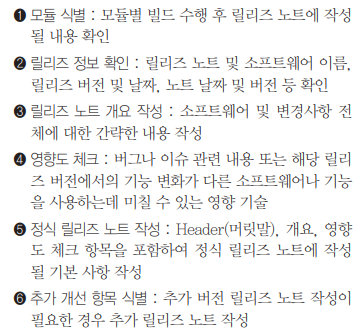
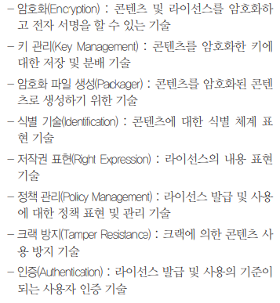

# Packaging

### 이민아 

---

## Index

- [SW 패키징](#sw-패키징)
  - 작업 순서
  - 형상 관리 (SCM)
- [SW 매뉴얼](#sw-매뉴얼)
  - 사용자 매뉴얼
  - 설치 매뉴얼
- [릴리즈 노트](#릴리즈-노트)
- [디지털 저작권 관리 (DRM)](#디지털-저작권-관리)
- [SW 버전 관리 도구](#sw-버전-관리-도구)
- [빌드 자동화 도구](#빌드-자동화-도구)

----

## SW 패키징

### 1. 작업 순서

- 

### 2. 형상 관리 (SCM) ★

- 정의

  SW 개발 과정에서 **변경 사항을 관리**하는 기법

  CVS, SVN, Git 등 도구 활용

- 형상 관리 **절차**

  - 형상 식별
  - 형상 통제
  - 형상 감사
  - 형상 기록

- **리포지토리(repository) ★**
  - 형상 관리 사용하는 용어
  - 관리 대상을 형상 관리 시스템으로 일괄 전송하여 압축, 암호화한 후에 
  - 파일의 현재 버전과 변경 이력정보를 저장하는 **저장소**

----

## SW 매뉴얼

### 1. 설치 매뉴얼

### 2. 사용자 매뉴얼 

#### (1) 작성 순서

- 기능 식별
- 사용자 화면 분류
- 상요자 환경 파일 확인
- 초기화 절차 확인
- 이상 Case 확인
- 최종 메뉴얼 적용

#### (2) 작성 항목 (문서 이력 정보) ★

-  버전, 작성자, 작성일, 검톶나, 일시, 검수인 등 일자별 기록

---

## 릴리즈 노트

### 1. 정의

#### (1) 릴리즈

- 개발이 완성된 소프트웨어 출시 및 배초

#### (2) 릴리즈 노트

- 정의
  - 개발자가 개발 과정에서 정리된 릴리즈 정보를 **최종 사용자**인 **고객과 공유**하기 위해 작성한 문서
- 항목
  - 테스트를 거친 기능 및 서비스, 개선 사항
- 고려사항
  - **개발팀에서 직접** 작성
  - **현재** 시제로 작성
  - 중대한 오류가 발생하여 긴급하게 수정하는 경우 릴리즈 **버전을 출시**하고 버그 번호를 포함한 **모든 수정된** 내용을 담아야 한다
  - SW 기능 업그레이드를 완료한 경우 릴리즈 **버전을 출시**하고 릴리즈 노트를 작성
  - **사용자**로부터 접수된 요구사항에 의해 수정된 경우 **자체 기능 향상과는 다른 별도의** 릴리즈 버전으로 릴리즈 노트 작성

### 2. 작성순서 ★

### 3. 작성항목 (헤더) ★

- 릴리즈 노트 이름, SW이름, 릴리즈 버전, 릴리즈 날짜, 릴리즈 노트 날짜, 릴리즈 노트 버전 등 표시

---

## 디지털 저작권 관리

### 1. DRM

#### (1) 정의 

- 콘텐츠 불법복제 방지를 위한 디지털 저작권 관리 기술

#### (2) 구성 요소

- **패키저** : 콘텐츠를 **메타** 데이터와 함께 **배포 가능한 단위**로 묶는 기능
- 콘텐츠 제공자 : 콘텐츠를 제공
- 콘텐츠 분배자 : 쇼핑몰 등을 통해 **암호화된 콘텐츠**를 제공
- **DRM 컨트롤러** : 배포된 콘텐츠의 **이용 권한** 통제
- **클리어링 하우스** : **키 관리 및 라이선스** 발급 관리
- 보안 컨테이너 : **원본**을 안전하게 유통하기 위한 **전자적 보안** 장치

#### (3) 기술 요소

---

## SW 버전 관리 도구

### 1. 정의

- 

---

## 빌드 자동화 도구

### 1. Jenkins

- 

### 2. Gradle

- 
