# Request

### 이민아 

---

## Index

- [럼바우](#럼바우)
  - 객체 모델링 (객체 다이어그램)
  - 동적 모델링 (상태 다이어그램)
  - 기능 모델링
- [SW 개발 방법](#sw-개발-방법)
  - 애자일 방법론
  - 테일러링
  - 구조적 방법론 / 구조적 개발 방법론
  - 컴포넌트 기반 방법론
  - 제품 계열 방법론
  - 정보공학 방법론
  - 객체지향 방법론
  - 데브옵스
  - 스프린트
  - 하이포 HIPO
- [SW 개발 비용 산정 기법](#sw-개발-비용-산정-기법)
  - 하향식 비용 산정 기법
  - 상향식 비용 산정 기법
- [현행 시스템 파악 절차](#현행-시스템-파악-절차)
  - SW 아키텍쳐
- [요구사항](#요구사항)
  
  - 유형
    - 기능적 요구사항 (화이트박스 테스트)
    - 비기능적 요구사항 (블랙박스 테스트)
  - 개발 프로세스 
    
    - 도출
    
    - 분석 (분류 / 모델링 / 할당 / 협상  / 정형분석 / DFD)
    - 명세
    - 확인 (검토 / 프로토타이핑 / 모델 검증 / 인수테스트)
- [UML](#uml)

  - 사물
  - 관계
  - 다이어그램
    - 정적 모델링 (구조적 다이어그램) 
      - 클래스 다어어그램
      - 객체 다이어그램
      - 컴포넌트 다이어그램
      - 배치 다이어그램
      - 복합체 구조 다이어그램
      - 패키지 다이어그램
    - 동적 모델링 (행위 다이어그램) 
      - 시퀀스 다이어그램
      - 커뮤니케이션 다이어그램
      - 상태 다이어그램
      - 유스케이스 다이어그램 (사용자 관점)
      - 활동 다이어그램 (사용자 관점)
      - 상호작용 개요 다이어그램
      - 타이밍 다이얼그램
- [디자인 패턴](#디자인-패턴)
  - 생성 패턴
    - 추상 팩토리
    - 팩토리 메소드
    - 싱글톤
    - 프로토타입
  - 구조 패턴
    - 컴포지트
    - 퍼싸드 (Facade)
    - 프록시
    - 어댑터
    - 데코레이터
    - 브릿지
  - 행위 패턴
    - 커맨드
    - 옵서버
    - 탬플릿 메소드
    - 메멘토

---

## 럼바우

### 1. 정의 

- 모든 소프트웨어 **구성 요소**를 **그래픽 표기법**을 이용하여 모델링하는 **객체 모델링 기법(OMT)**
- 럼바우(Rumbaugh)의 분석 기법

### 2. 유형

#### (1) 객체 모델링 ( Object Modeling )

- **객체** 다이어그램 **(UML 정적 모델링 / 구조적 다이어그램)**
- 정보 모델링, 시스템의 **정적 구조** 표현. 시스템에서 요구되는 **객체**를 찾아내어 속성과 연산 식별, 객체들 간의 **관계를 규정**

#### (2) 동적 모델링 ( Dynamic Modeling )

- **상태** 다이어그램  **(UML 동적 모델링)**
- 시간의 흐름에 따른 객체들 간의 **제어 흐름, 상호 작용, 동작 순서** 등의 **동적인 행위를 표현**

#### (3) 기능 모델링 ( Function Modeling )

- **자료 흐름도 (DFD)**
- 데이터 값의 **변화** 과정 표현

-----

## SW 개발 방법

> **SDLC(소프트웨어 개발 생명주기)** 

### 1. 애자일 방법론 (Agile) ★

#### (1) 정의

- **고객 요구사항 변화**에 **유연하게 대응**하기 위해 **(사람 중심)**
- **일정한 주기 반복**하면서 **반복적으로 진행**되는 **신속 적응적** 경량 개발 방법론
- 워터폴(폭포수)에 대비하는 방법론으로 회사에서 각광받는 방법론

#### (2) 유형

- XP

- 린(Lean)

- 스크럼
  - 스크럼미팅 : 매일 15분 정도의 미팅으로 To-Do List 계획을 수립
  - 스크럼 마스터 : 프로젝트 리더, 스크럼 수행 시 문제를 인지 및 해결하는 사람

### 2. 테일러링 (Tailoring) ★

- 테일러링은 **프로젝트의 특성과 필요**에 따라 소프트웨어 개발 **프로세스, 기법, 산출물** 등을 비즈니스적으로 또는 기술적인 **요구에 맞도록 최적화**하는 **과정** 및 방법론

### 3. 구조적 방법론 / 구조적 개발 방법론

#### (1) 구조적 방법론 ★

- 전체 시스템을 기능에 따라 나누어 **개발**
- 이를 통합하는 **분할과 정복 접근 방식의 방법론**
- **프로세스** 중심의 **하향식 방법론**
- **나씨-슈나이더만 차트** 사용

#### (2) 구조적 개발 방법론 ★

- 정형화된 분석 절차에 따라 사용자 요구사항을 파악, 문서화하는 체계적 **분석방법**

- 분석도구

  - 자료흐름도 DFD

  - 자료사전 DD

  - **소단위 명세서(Mini-Spec)**

    데이터 흐름도에 나타나 있는 처리 항목을 1~2페이지 정도의 **소규모 분량으로 요약**하여 작성하는 **논리적 명세서**

### 4. 컴포넌트 기반 방법론(CBD) 

- 소프트웨어를 구성하는 **컴포넌트를 조립해서** 하나의 새로운 응용프로그램을 작성하는 방법론이다.

### 5. 제품 계열 방법론 

- 특정 제품에 적용하고 잎은 **공통된 기능을 정의하**여 개발하는 방법론으로, **임베디드 소프트웨어**를 작성하는데 유용한 방법론이다.

### 6. 정보공학 방법론 information engineering 

- 정보**시스템 개발**에 필요한 **관리 절차, 작업 기반**을 체계화 함

### 7. 객체지향 방법론 object oriented 

- 객체를 기본 단위로 시스템 분석, 설계 **(객체,클래스, 메세지)**

### 8. 데브옵스 (Devops)

- 소프트웨어의 **개발**(Development)과 **운영**(Operations)의 합성어
- 소프트웨어 **개발자**와 정보기술 **전문가** 간의 **소통, 협업 및 통합**을 강조하는 개발 환경이나 문화를 말하는 용어

### 9. 스프린트

- 2~4주의 짧은 개발 기간으로 반복적 수행으로 개발품질 향상
- 스프린트 **회고**는 스프린트 **주기를 되돌아보며** 정해놓은 규칙 준수 여부, 개선점 등을 확인 및 기록

### 10. 하이포 HIPO (Hierarchy Input Process Output) ★

- **소프트웨어의 도큐멘테이션(문서화)** 기법의 하나로, **시스템 혹은 프로그램의 기능**을 다음 2종의 도큐먼트에 의해 **도식 표현**으로 기술한 것
- **시스템의 분석 및 설계나 문서화**할 때 사용되며 **하향식 소프트웨어 개발**을 위한 **문서화 도구**
- 유형
  - 가시적 도표(Visual Table of Contents) : 전체적인 흐름과 기능 계층구조도
  - 세부적 도표(Detail Diagram) : 상세히
  - 총체적 도표(Overview Diagram) : 프로그램 구성하는 기능 입력 처리 출력 기능

----

## SW 개발 비용 산정 기법

### 1. 정의

### 2. 유형

- 하향식 비용 산정 기법
- 상향식 비용 산정 기법

### 3. 하향식 비용 산정 기법 ★

#### (1) **델파이 기법**  ★

- **각 분야 전문가**로부터 연계 데이터 및 사용자 요구사항 식별
- **전문가**의 **경험적** 지식을통한 **문제해결및 미래예측**을 위한 방법

### 4. 상향식 비용 산정 기법 ★

#### (1) **LOC** ★

- 소프트웨어 각 기능의 **원시 코드 라인 수**의 **낙관치, 중간치, 비관치를** 측정하여 **예측치**를 구하고 이를 이용하여 **비용을 산정**하는 비용산정 모델

#### (2) M/M (Man / Month) ★

- LoC(Line of Code)가 30,000라인이고, 개발자가 5명 이며, 개발자가 월평균 300라인을 개발한다. 이때 프 로젝트 개발기간과 계산식을 쓰시오

- 개발 기간 계산식

  총라인 30000 / 개발자 5명 / 월평균 300라인

  프로젝트 인원과 관련 없이 한 사람이 프로젝 트를 할 때 걸리는 시간 

  **Man Month** = **LOC ÷ 프로그래머 의 월간 생산성** = 30000 / 300 = 100 

  프로젝트 기간 = Man Month ÷ **프로젝트 인력** = 100 / 5 = 20개월

#### (3) Putnam 

- 개발 **주기**의 단계별 요구, 인원 분포도 가정

#### (4) COCOMO 

- 보헴이 정의, 프로그램 **규모**에 따라 비용 산정

### 5. 비용 산정 모형 

#### (1) 기능 점수 (FP) ★

- **요구사항을 증가**시키는 **인자별 가중치를 부여**하고, 그 가중치를 **합산**하여 비용을 산정하는 방식

----

## 현행 시스템 파악 절차

### 1. 정의

- 현재 개발하고자 하는 **시스템의 개발 범위** 설정
- 구성, 기능, 연계정보, 소프트웨어, 하드웨어, 네트워크 구성 파악

### 2. 현행 시스템 파악 절차

- 현행 시스템 **구성** 파악
- 현행 시스템 **기능** 파악
- **인터페이스** 현황 평가 (**데이터 종류 / 통신규약 / 연계유형**)
- **아키텍쳐** 구성 파악
- SW 구성 파악 (**라이선스 수**)
- 하드웨어 구성 파악
- 네트워크 구성 파악

### 3. SW 아키텍처 

#### (1) 정의 ★

- SW 아키텍처 
  - 여러가지 SW 구성요소와 **외부**특성과 **구성요소 간의 관계 표현한 시스템** **구조**
  - 구성요소 간의 관계를 표현하는 시스템의 구조나 구조체
  - SW **설계하고 전개**하기 위한 **지침과 원칙**
- SW 아키텍처 프레임워크
  - SW 집약적 시스템에서 아키텍처가 표현해 야하는 내용 및 이들 간의 관계를 제공하는 **아키텍처 표준 기술**
  - 기본 구조
  - 소프트웨어 베이스(개발 기반)
  - 역할
    - 품질 유지
    - 원칙 
    - 지침

#### (2) 프레임워크 ★

> SW 특정 부분 설계 및 구현 시 **재사용** 가능하도록 **클래스** 제공

- **모듈화** : **캡슐화**를 통해 **모듈화 강화하여 품질 향상**하고 설계 및 구현 변경 **영향 최소화**
- **재사용성** : **개발자** **생산성** 향상 (인터페이스 **반복적 사용 가능한 컴포넌트 정의)**
- **확장성** : **다형성**을 통한 **인터페이스** **확장**하여 다양한 형태와 기능을 수행하고 애플리케이션 **가변성으로부터 분리함으로 재사용성의 이점**
- **제어의 역흐름** : **개발자**가 관리하고 통제해야 하는 객체들의 **제어 권한**을 프레임워크에 넘겨 **생산성 향상**하며 특정한 **이벤트**가 발생할 때 **다형성을** 통해 확장한 메소드를 호출함으로써 제어가 프레임워크로부터 애플리케이션으로 **반대로 흐르게** 만든다

#### (3) SW 아키텍처 4+1 뷰 ★

- **유스케이스** 뷰 : **아키텍쳐 도출 및 설계 주도**
- 논리 뷰 : 설계 모델의 추상화 및 클래스 식별 / **클래스** 다이어그램(정적/구조적)
- 프로세스 뷰 : 런타임(프로그램 실행되는 동안 동작 상태)시 **스레드(프로세스 실행 담당하는 실행 기본단위)** 와 프로세스 상호 작용
- 배포 뷰 : 물리적 노드 구성 / **배포** 다이어그램
- 구현 뷰 : 정적 SW 구현 / **컴포넌트** 다이어그램(정적/구조적)

#### (4) SW 아키텍처 패턴

- **파이프 필터** 패턴
  - **서브시스템이** 입력 데이터를 받아처리
  - 결과를 다음 서브시스템에 넘겨줌. 반복하는 패턴
- **브로커**
  - **분리된 컴포넌트**들로 이루어진 **분산** 시스템에서 사용
  - **컴포넌트**들은 **원격** 서비스를 통해 상호작용 가능
  - 컴포넌트간 통신 조정하는 역할 수행하는 아키텍쳐 패턴

#### (5) 서비스 지향 아키텍처 SOA (Service Oriented Architecture) ★

- 프로세스 수행을 지원하는 정보시스템 구현 위해 가장 선진화된 **SW아키텍처**
- 웹서비스나 REST 서비스로 구현된 SW모듈들을 **BPEL로 구현된 프로세스**
- 오케스트레이션(Orchestration)함으로써, 프로세스 변경에 따른 정보시스템의 **재구성을 신속유연**하게 할 수 있는 방식

### 4. 백로그

- 제품과 프로젝트에 대한 **요구사항**

---

## 요구사항

### 1. 유형 ★

#### (1) 기능 요구사항 (화이트박스 테스트)

- 시스템이 갖춰야 할 **필수적 기능** (기능성, 완전성, 일관성)

#### (2) 비기능 요구사항 (블랙박스 테스트)

- 필수 기능 외의 **품질, 보안이나 제약 사항**에 관한 요구사항

#### (3) 사용자 요구사항

- **사용자** 관점에서 본 시스템이 제공해야 할 요구사항
- 사용자를 위해 **친숙한 표현**

#### (4) 시스템 요구사항

- **개발자** 관점에서 본 시스템 전체가 사용자와 다른 시스템에 제공해야 할 요구사항
- 사용자 요구사항에 비해 **전문적, 기술적 용어**

### 2. 개발 프로세스 (도분명확) ★

#### (1) 요구사항 도출 ★

- 요구사항 수집 단계
- 이해관계자 간의 의사소통 중요
- 인터뷰, **체크리스트** (기준 점검), **델파이 기법(각 분야 전문가**로부터 연계 데이터 및 사용자 요구사항 식별), **브레인스토밍(소속된 인원들**이 자연스럽게 제시된 아이디어 목록 분석)

#### (2) 요구사항 분석 (분개할협정)★

- 도출된 요구사항의 타당성 조사 및 내용 정리

- **유형 ★**
  - **분류** : **기능과 비기능 우선순위 특정** 기준으로 분류
  
  - **개념 모델링** ★
    - 분류된 요구사항을 단순화하여 **개념적 표현** 
    
    - **개체(엔티티)** 간의 **관계와 종속성** 분석
    - **다양한** 관점으로 표현
    - **UML 사용** 
      - **유스케이**스 다이어그램 **(동적 / 행위 다이어그램)**
        - **사용자(액터)와 시스템** 간의 관계를 표현
        - **기능적** 요구사항을 유스케이스 단위로 표현
    
  - **할당** : 요구사항을 만족시키기 위한 **요소 할당 (아키텍처 구성요소** 식별)

  - 협상  : 충돌되는 요구사항 해결

  - **정형분석** : **구문과 의미**를 갖는 언어 이용(수학적 기호)

  - **DFD (자료 흐름도) ★**

    - 요구사항 **분석**에서 자료의 흐름 및 변화과정과 기능을 도형 중심으로 기술
    - 자료흐름그래프, 버블차트
    - 구성요소
      - **프로세스** : 자료를 변환시키는 시스템의 한 부분(처리 과정) 원이나 둥근 사각형으로표시하고 그 안에 프로세스 이름
      - **자료 흐름** : 자료의 이동이나 연관관계를 나타냄 (화살표 위에 자료의 이름 기입)
      - **자료 저장소** : 시스템에서의 자료 저장소(파일, DB)
      - **단말** : 시스템과 교신하는 외부 개체 (입력 데이터가 만들어지고 출력 데이터를 받음) 도형 안에 이름을 기입

#### (3) 요구사항 명세

- 승인을 위해 문서화 진행
- 빠짐없이 명확하고 이해하기 쉽게 기록

#### (4) 요구사항 확인 ★

- 명세서 검토
- **형상 관리** 수행 
- **프로토타이핑** : 초기 도출된 요구사항을 토대로 **프로토타입(상품이나 서비스가 출시되기 전에 개발 대상 시스템 또는 그 일부분을 개략적으로 만든 원형)**을 만든 후 대상 시스템의 개발이 진행되는 동안 도출되는 요구사항을 반영하면서 **지속적으로 재작성**
- **모델 검증** : **분석 단계**에서 개발된 **개념적 모델**이 요구사항 충족하는지 **검증(정적 분석)**
- **인수테스트** : **사용자**가 실제로 사용될 환경에서 요구사항 모두 충족되는지 사용자 입장에서 확인
  - **알파테스트** : 선별된 사용자와 **개발자가 함께 (통제된 환경)**
  - **베타테스트** : 선별된 사용자가 **여러 사용자를 통해 검사 (통제되지 않은 환경)**

---

## UML

### 1. Unified Modeling Language ★

#### (1) Modeling

- 요구사항 **분석**단계 ★
  - 요구사항 **분**류
  - **개**념 모델링 ★
  - 요구사항 **할**당
  - 요구사항 **협**상
  - **정**형분석
- **개념 모델링** 
  - 분류된 요구사항을 단순화하여 **개념적 표현** 

  - **개체(엔티티)** 간의 **관계와 종속성** 분석
  - **다양한** 관점으로 표현
  - **UML 사용** 
    - 유스케이스 다이어그램 (동적 / 행위 다이어그램)
      - 사용자(액터)와 시스템 간의 관계를 표현
      - 기능적 요구사항을 유스케이스 단위로 표현)

#### (2) Unified Modeling Language  ★

- **객체지향** 소프트웨어 개발과정에서 산출물을 **명세회, 시간화, 문서화**되는 모델링 방법론과 기술을 통합
- **표준화된** 대표적인 **객체지향 모델링 언어**
- 시스템 분석, 설계, 구현 등 개발 과정
- **개발자와 고객** 또는 개발자 **상호 간의 의사소통**이 원활하게 이루어지도록 

#### (3) 구성 요소 (사물 / 관계 / 다이어그램) ★

- **사물** : 모델을 구성하는 가장 중요한 기본요소로 다이어그램 안에서 관계가 형성될 수 있는 대상들

  - 구조 사물
  - 행동 사물
  - 그룹 사물
  - 주해 사물

- **관계** : 사물과 사물 사이의 연관성 표현 

  - **연관** 관계 : 2개 이상 사물 연관

  - 의존 관계 : **연관** 관계와 같이 서로 연관은 있으나 필요에 의해 서로에세 영향을 주는 **짧은 시간** 동안만 연관 유지 

  - **집합** 관계 : 하나의 사물이 다른 사물에 포함

    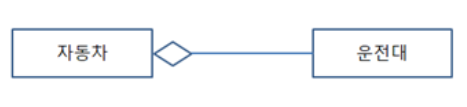

  - 포함 관계 : 집합관계 **특수**형태로 사물의 **변화**가 포함되는 사물에게 영향

  - **일반화 관계** 

    

  - **실체화 관계** : 사물이 **할 수 있거나 해야 하는 기능(행위, 인터페이스)**으로 서로를 **그룹화**할 수 있는 관계

    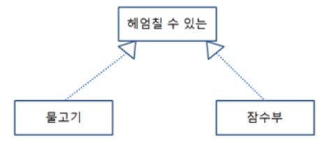

- **다이어그램** : 사물과 관계를 도형으로 표현한 것

  - 정적 모델링 (구조적 다이어그램) : 사용자가 요구한 기능을 구현하는데 필요한 자료들의 **논리**적 구조를 표현
    - 클래스 다어어그램
    - 객체 다이어그램
    - 컴포넌트 다이어그램
    - 배치 다이어그램
    - 복합체 구조 다이어그램
    - 패키지 다이어그램
    
  - 동적 모델링 (행위 다이어그램) : 시스템의 내부 구성 요소들의 **상태가 시간의 흐름**에 따라 변화하는 과정과 그 과정에서 발생하는 **상호작용** 표현
    - 시퀀스 다이어그램
    - 커뮤니케이션 다이어그램
    - 상태 다이어그램
    - 유스케이스 다이어그램 (사용자 관점)

    - 활동 다이어그램 (사용자 관점)
    - 상호작용 개요 다이어그램
    - 타이밍 다이얼그램

    ----

    

### 2. 구조적 다이어그램 (정적 모델링)

#### (1) 클래스 다어어그램 ★

- **구조**
- 자기만의 **속성**과 일정한 **행동**으로 구성하며 이러한 행동은 **오퍼레이션**의 집합

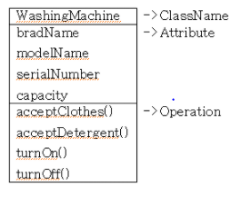

#### (2) 객체 다이어그램 

- 관계 (**속성과 행동**을 가진 **개별적** 클래스의 **인스턴스)**

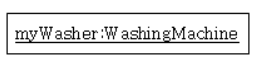

#### (3) 컴포넌트 다이어그램 

- 구현, 인터페이스 (시스템 **기능** 정의)

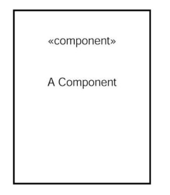

#### (4) 배치 다이어그램 

- 구현, 위치 (시스템 **물리적** 구조)

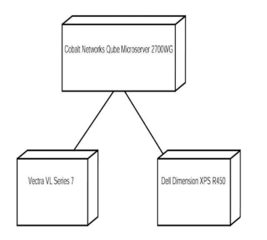

#### (5) 복합체 구조 다이어그램 

- 클래스 **내부** 구조 (**각 컴포넌트** 클래스를 **전체 클래스 안**의 위치)

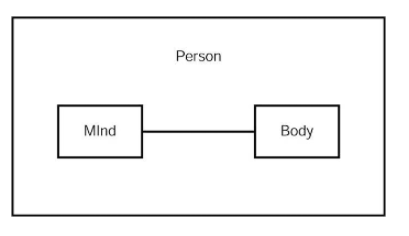

#### (6) **패키지 다이어그램 **★

- **그룹 (다이어그램 요소 조직화하여 패키지형)** ★

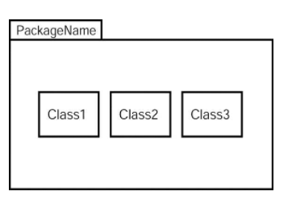

### 3. 행위 다이어그램 (동적 모델링)

#### (1) 시퀀스 다이어그램 ★

- 객체 간 주고받은 **메시지 순서** **시간의 흐름**

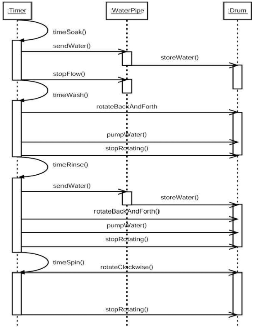

#### (2) 커뮤니케이션 다이어그램 

- 메시지 
- 연관**관계**
- 하나의 시스템 구성하는 요소들은 다른 요소들과 손발을 맞추며 시스템 전체 목적 이루어나가는 것을 표현

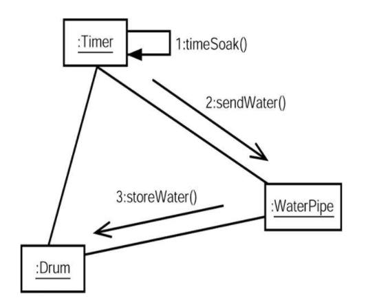

#### (3) 상태 다이어그램 ★

- 시간에 따른 객체의 **상태 변화**

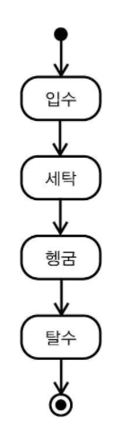

#### (4) 유스케이스 다이어그램 ★

- 모델링 **(액터 / 유스케이스** / 시스템 / 관계)
- **사용자 관점**
- **사용자(액터/사람모양)와 시스템(유스케이스/타원)** 간의 **관계**를 표현
- 액터에게 제공하는 서비스 등의 **기능적** 요구사항(시스템 행동)와 **외부 요소**을 **유스케이스** 단위로 표현

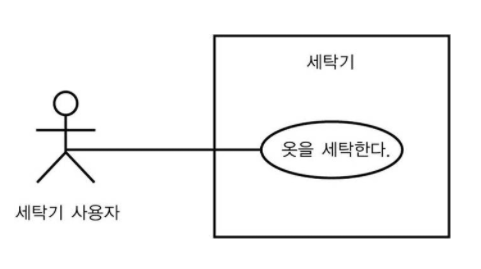

#### (5) 활동 다이어그램

- **로직** 흐름
- 사용자 관점
- 유스 케이스 내부 혹은 객체의 동작중에 발생하는 **활동**

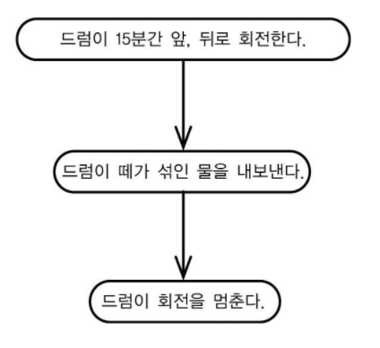

#### (6) 상호작용 개요 (교류 개요)

- **제어 흐름**
- 객체 사이에서 **시간의 흐름을 갖는 메시지** 존재
- 몇몇 활동 부분 **시퀀스(메시지 시간 흐름)나 커뮤니케이션(관계) 두 다이어그램 조합**

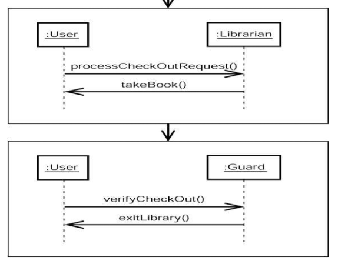

#### (7) 타이밍

- **시간 제약**
- UML 2.0에서 시간 다루기 위해
- 한 상태에서 객체가 얼마나 오래 지체

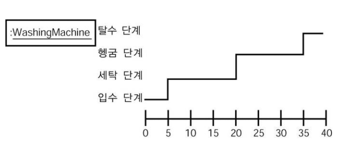

---

## 디자인 패턴

### 1. MVC 패턴 ★

#### (1) 생성 패턴 ★

> 객체 **생성** 관련

- **추상 팩토리** : 동일한 주제의 다른 팩토리를 묶어줌 **(구체적 클래스에 의존하지 않고** 서로 연관되거나 의존적 객체 조합만드는 **인터페이스 제공)**
- **팩토리 메소드** (행위패턴 템플릿메소드와 비교) ★ 
  - 생성할 객체의 클래스를 **국한하지 않고 객체를 생성** (객체 생성 처리를 서브 클래스로 분리해 처리하도록 캡슐화)
  - **상위** 클래스에서 객체를 생성하는 **인터페이스를 정의**
  - 상위 클래스에서는 인스턴스를 **만드는** **방법만 결정**
  - **하위 클래스(서브 클래스)**에서 **인스턴스를 생성**
  - 하위 클래스에서 함수들을 오버로딩하여 인터페이스와 실제 객체를 생성하는 클래스를 분리
- **싱글톤** ★ : **한 클래스에 한 객체만 존재**하도록 제한 (**전역변수를 사용하지 않고** 객체를 하나만 생성하도록하고 생성된 객체를 **어디에서든지 참조** 가능하도록)
- **프로토타입** : 기존 객체 **복제**하여 객체 생성
- 빌더 : 생성과 표기를 분리해 복잡한 객체 생성

#### (2) 구조 패턴

> 클래스나 객체를 **조합**하여 더 큰 구조로 만드는 패턴

- **컴포지트** : 0 혹은 1개 그 이상의 **개체를 묶어 하나의 객체**
- **퍼싸드 (Facade)** : **많은 분량**의 코드에 접근할 수 있는 단순한 인터페이스 제공
- **프록시** : 접근 조절, 비용 절감, 복잡도 감소를 위해 **접근이 힘든 객체**에 대한 대역 제공
- **데코레이터** : 기존 객체의 **매소드에 새로운 행동을 추가**하거나 **오버라이드**
- **어댑터** : 인터페이스가 **호환되지 않는** 클래스들을 함께 이용할 수 있도록 타 클래스의 인터페이스를  기존 인터페이스에 덧씌움
- 브릿지 : 추상화와 구현을 분리해 둘을 따로 발전
- 플라이웨이트 : 다수의 유사한 객체 생성, 조작 비용 절감

#### (3) 행위 패턴 ★

> 클래스나 객체들이 **상호 작용하**는 방법이나 책임 분배 방법

- **커맨드** 
  - 하나의 **추상 클래스**에서 **메서드를 하나** 만들고 **각 명령어**가 들어오면 그에 맞는 **서브 클래스가 선택되어 실행** 
  - 실행될 기능을 **캡슐화**하여 주어진 **여러 기능을 실행할 수 있는 재사용** 높은 클래스 설계
- **옵서버 (Observer)** ★ 
  - 어떤 **변화가** 일어날 때 이를 감지하여 다른 클래스에 통보 (다른 객체에게 연락이 가고 자동으로 **내용이 갱신)**
  - **일대다** 의존성, 자동 내용**갱신** 어떤 객체의 상태가 **변할 때** 그와 연**관된 객체들에게 알림을** 보내는 디자인 패턴
- **템플릿 메소드** 
  - 상위 클래스에는 추상적으로 표현하고 
  - **구체적 내용은 하위 클래스에서 결정** 
  - 일부분을 서브 클래스로 캡슐화해 전체 일 수행구조는 바꾸지 않으면서 특정 단계 수행 내역 변경
- **메멘토 (Memento)** ★ : 객체의 상태를 **이전 상태로 복원하려는 위치를 줄이기 위해** 사용
- 상태
- 전략
- 방문자
- 책임연쇄
- 인터프리터
- 반복자
- 중재자

---

## References

- 시나공 정보처리기사 실기 대비용 핵심요약

---

