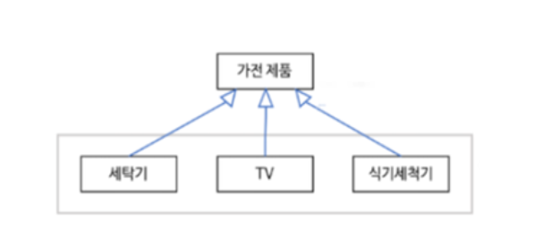

# Request

### 이민아 

---

## Index

- [현행 시스템 파악 절차](#현행-시스템-파악-절차)

- [개발 기술 환경](#개발-기술-환경)

  - 서버 하드웨어 개발 환경
    - 클라이언트
    - 웹 서버
    - 웹 애플리케이션 서버 (WAS)
    - DB
  - 소프트웨어 개발 환경
    - 운영체제
    - DBMS
    - 미들웨어
      - 웹 애플리케이션 서버 (WAS)
      - DB
      - RPC
      - MOM
      - TP-Monitor
      - ORB
    - 오픈 소스

- [요구사항](#요구사항)
  
  - 유형
  
  - 개발 프로세스 
    
    - 도출
    
    - 분석 (분류 / 모델링 / 할당 / 협상  / 정형분석 / DFD)
    - 명세
    - 확인 (검토 / 프로토타이핑 / 모델 검증 / 인수테스트)
  
- [UML](#uml)

  - 사물
  - 관계
  - 다이어그램
    - 정적 모델링 (구조적 다이어그램) 
      - 클래스 다어어그램
      - 객체 다이어그램
      - 컴포넌트 다이어그램
      - 배치 다이어그램
      - 복합체 구조 다이어그램
      - 패키지 다이어그램
    - 동적 모델링 (행위 다이어그램) 
      - 시퀀스 다이어그램
      - 커뮤니케이션 다이어그램
      - 상태 다이어그램
      - 유스케이스 다이어그램 (사용자 관점)
      - 활동 다이어그램 (사용자 관점)
      - 상호작용 개요 다이어그램
      - 타이밍 다이얼그램
      

----

## 현행 시스템 파악 절차

### 1. 정의

- 현재 개발하고자 하는 **시스템의 개발 범위** 설정
- 구성, 기능, 연계정보, 소프트웨어, 하드웨어, 네트워크 구성 파악

### 2. 현행 시스템 파악 절차

- 현행 시스템 **구성** 파악
- 현행 시스템 **기능** 파악
- **인터페이스** 현황 평가 (**데이터 종류 / 통신규약 / 연계유형**)
- 아키텍쳐 구성 파악
- SW 구성 파악 (**라이선스 수**)
- 하드웨어 구성 파악
- 네트워크 구성 파악

### 3. SW 아키텍처 

#### (1) 정의 ★

- SW 아키텍처 
  - 여러가지 SW 구성요소와 외부특성과 **구성요소 간의 관계 표현한 시스템** 구조
  - 구성요소 간의 관계를 표현하는 시스템의 구조나 구조체
- SW 아키텍처 프레임워크
  - SW 집약적 시스템에서 아키텍처가 표현해 야하는 내용 및 이들 간의 관계를 제공하는 **아키텍처 표준 기술**
  - 기본 구조
  - 소프트웨어 베이스(개발 기반)
  - 역할
    - 품질 유지
    - 원칙 
    - 지침

#### (2) 프레임워크 ★

> SW 특정 부분 설계 및 구현 시 **재사용** 가능하도록 **클래스** 제공

- **모듈화** : **캡슐화**를 통해 **모듈화 강화하여 품질 향상**하고 설계 및 구현 변경 **영향 최소화**
- **재사용성** : **개발자** **생산성** 향상 (인터페이스 **반복적 사용 가능한 컴포넌트 정의)**
- **확장성** : **다형성**을 통한 **인터페이스** **확장**하여 다양한 형태와 기능을 수행하고 애플리케이션 **가변성으로부터 분리함으로 재사용성의 이점**
- **제어의 역흐름** : **개발자**가 관리하고 통제해야 하는 객체들의 **제어 권한**을 프레임워크에 넘겨 **생산성 향상**하며 특정한 **이벤트**가 발생할 때 **다형성을** 통해 확장한 메소드를 호출함으로써 제어가 프레임워크로부터 애플리케이션으로 **반대로 흐르게** 만든다

#### (3) SW 아키텍처 4+1 뷰

- 유스케이스 뷰 : 아키텍쳐 도출 및 설계 주도
- 논리 뷰 : 설계 모델의 추상화 및 클래스 식별 / **클래스** 다이어그램(정적/구조적)
- 프로세스 뷰 : 런타임(프로그램 실행되는 동안 동작 상태)시 스레드(프로세스 실행 담당하는 실행 기본단위) 와 프로세스 상호 작용
- 배포 뷰 : 물리적 노드 구성 / **배포** 다이어그램
- 구현 뷰 : 정적 SW 구현 / **컴포넌트** 다이어그램(정적/구조적)

---

## 개발 기술 환경

### 1. 서버 하드웨어 개발 환경

#### (1) 클라이언트 

- 클라이언트 : 사용자와의 인터페이스
- 서버 : 클라이언트와 통신하여 서비스 제공
  - 웹 서버
  - 웹어플리케이션 서버 (WAS)
  - 데이터베이스 서버
  - 파일 서버

#### (2) 웹 서버

> 클라이언트로부터 **직접** 요청을 받아 처리하는 서버로 **저용량 정적** 파일

#### (3) 웹어플리케이션 서버 (WAS) ★

> 사용자에게 **동적 서비스** 제공하기 위해 웹서버로부터 요청받아 데이터 가공작업 수행 혹은 DB 서버와 웹 서버의 연결 호근 웹 서버와 파일 서버 사이에서 **인터페이스**

- **Tomcat**
  - Apache 소프트웨어 개발
  - 자바를 움직하기 위해 개발한 **WAS의 일종**
  - 서블릿, JSP, 빈즈와 같은 자바코드를 위한 **자바 이해 엔진**
  - 비용이나 성능면에서 자바 기반 웹서버를 구성할 때 아파치, 리눅스 톰캣 조합
- JBoss
- Jety
- JEUS

#### (4) 데이터베이스 서버(DB Server)

> DBMS 관리 서버

#### (5) 파일 서버

> 데이터 베이스 저장하기에는 비효율적이거나 서비스 제공 목적을 유지하는 파일들을 저장하는 서버

### 2. 소프트웨어 개발 환경

#### (1) 정의 

- **시스템** 소프트웨어 : 운영체제, 웹 서버, WAS 운용을 위한 서버프로그램, DBMS

- **개발** 소프트웨어 

  - 요구사항 관리도구

  - 설계/모델링 도구

  - 구현 도구

  - 빌드 도구

  - 테스트 도구

  - **형상 관리 도구 **(**GIT**, CVS, Subversion, Mercurial)

    산출물들을 **버전별로 관리**하여 **품질 향상**을 지원하는 SW

#### (2) 운영체제

- **사용자와 하드웨어** 인터페이스 역할
- 컴퓨터 시스템 **자원 관리**하는 SW
- 신뢰성 / 성능 / 기술지원 / 주변 기기 / 구축 비용

#### (3) DBMS ★

- **사용자와 DB**사이에서 사용자의 요구에 따라 정보 **생성 및 DB 관리**하는 SW
- 데이터 **중복성과 종속성 해결**
- 가용성 / 성능 / 기술지원 / 상호호환성 / 구축비용
- 유형
  - **JDBC (Java DataBase Connectivity) ★**
    - **Java 언어로 다양한** 종류의 DB에 접속하고 SQL문 수행할 때 **표준 API**
  - ODBC (Open DataBase Connectivity)
    - **표준 개방형** API로 **개발 언어에 관계없이** 사용
    - Excel, Text, MS-Access 등 다양한 DB 접근
    - **응용**프로그램에서 DB에 접근하여 관리하는 **표준** 인터페이스
  - **MyBatis (마이바티스) ★**
    - **JDBC (Java Data Base Connectivity) 코드 단순화**
    - SQL **Mapping** 기반 **오픈소스** 접속 프레임워크
    - SQL **거의 그대로** 사용할 수 있어 SQL 친화적인 국내 환경에 적합 많이 사용
    - XML 서술자나 애너테이션(annotation)을 사용하여 **저장 프로시저나 SQL문으로 객체를 연결**시키는 프로그램
    - 아파치 라이선스 2.0 배포
    - IBATIS의 원개발자들이 포함된 팀에 의해 유지보수가 이루어짐
    - **자바 퍼시스턴스 프레임워크**

#### (4) 미들웨어 ★

> 운영체제와 소프트웨어 애플리케이션 사이에 원만한 통신을 위해 중개 및 제어 역할 하는 SW

- DB : 데이터베이스 **벤더**에서 제공하는 클라이언트에서 **원격의 데이터베이스**와 연결하기 위한 미들웨어

- RPC (Remote Procedure Call) : 응용 프로그램의 프로시저를 활용하여 **원격 프로시저를 마치 로컬 프로시저처럼** 호출

- MOM (Message Oriented Middleware) **: 메시지 기반 비동기형** 메시지 전달

- TP - Monitor (Transaction Processing Monitor) : 항공기나 펄도 예약 업무 등과 같은 **온라인 트랜잭션 업무**에서 트랜잭션 처리 및 감시 

- ORB (Object Request Broker) : **객체** 지향 미들웨어로 **COBBA 코바 표준 스펙 구현**

- 웹어플리케이션 서버 (WAS) ★

  사용자에게 **동적 서비스** 제공하기 위해 웹서버로부터 요청받아 데이터 가공작업 수행 혹은 DB 서버와 웹 서버의 연결 호근 웹 서버와 파일 서버 사이에서 **인터페이스**

  - **Tomcat**
    - Apache 소프트웨어 개발
    - 자바를 움직하기 위해 개발한 **WAS의 일종**
    - 서블릿, JSP, 빈즈와 같은 자바코드를 위한 **자바 이해 엔진**
    - 비용이나 성능면에서 자바 기반 웹서버를 구성할 때 아파치, 리눅스 톰캣 조합
  - JBoss
  - Jety
  - JEUS

#### (5) 오픈 소스

- 누구나 제한 없이 사용할 수 있는 소스코드를 공개한 라이선스를 만족하는 SW

  

### 3. 성능 지표

- tpmC : 1분당 최대 처리 건수(하드웨어)
  - OLTP(Online transaction Processing)
  - 배치 
  - DB 서버
- OPS (Operations per Second)
  - 웹 서버
  - WAS 서버

---

## 요구사항

### 1. 유형 ★

#### (1) 기능 요구사항

- 시스템이 갖춰야 할 **필수적 기능** (기능성, 완전성, 일관성)

#### (2) 비기능 요구사항

- 필수 기능 외의 **품질, 보안이나 제약 사항**에 관한 요구사항

#### (3) 사용자 요구사항

- **사용자** 관점에서 본 시스템이 제공해야 할 요구사항

#### (4) 시스템 요구사항

- **개발자** 관점에서 본 시스템 전체가 사용자와 다른 시스템에 제공해야 할 요구사항

### 2. 개발 프로세스 ★

#### (1) 요구사항 도출 ★

- 요구사항 수집 단계
- 이해관계자 간의 의사소통 중요
- 인터뷰, 체크리스트 (기준 점검), **델파이 기법(각 분야 전문가**로부터 연계 데이터 및 사용자 요구사항 식별), **브레인스토밍(소속된 인원들**이 자연스럽게 제시된 아이디어 목록 분석)

#### (2) 요구사항 분석 ★

- 됴출된 요구사항의 타당성 조사 및 내용 정리

- 유형

  - 분류 : 기능과 비기능 우선순위 특정 기준으로 분류

  - **개념 모델링** 

    - 분류된 요구사항을 단순화하여 **개념적 표현** 

    - 객체 간의 **관계와 종속성** 분석
    - **다양한** 관점으로 표현
    - **UML 사용** 
      - 유스케이스 다이어그램 (동적 / 행위 다이어그램)
        - 사용자(액터)와 시스템 간의 관계를 표현
        - 기능적 요구사항을 유스케이스 단위로 표현)

  - **할당** : 요구사항을 만족시키기 위한 요소 할당 (아키텍처 구성요소 식별)

  - 협상  : 충돌되는 요구사항 해결

  - **정형분석** : 구문과 의미를 갖는 언어 이용(수학적 기호)

  - **DFD (자료 흐름도) ★**

    - 요구사항 분석에서 자료의 흐름 및 변화과정과 기능을 도형 중심으로 기술
    - 자료흐름그래프, 버블차트
    - 구성요소
      - **프로세스** : 자료를 변환시키는 시스템의 한 부분(처리 과정) 원이나 둥근 사각형으로표시하고 그 안에 프로세스 이름
      - **자료 흐름** : 자료의 이동이나 연관관계를 나타냄 (화살표 위에 자료의 이름 기입)
      - **자료 저장소** : 시스템에서의 자료 저장소(파일, DB)
      - **단말** : 시스템과 교신하는 외부 개체 (입력 데이터가 만들어지고 출력 데이터를 받음) 도형 안에 이름을 기입

#### (3) 요구사항 명세

- 승인을 위해 문서화 진행
- 빠짐없이 명확하고 이해하기 쉽게 기록

#### (4) 요구사항 확인 ★

- 명세서 검토
- **형상 관리** 수행 
- **프로토타이핑** : 초기 도출된 요구사항을 토대로 **프로토타입(상품이나 서비스가 출시되기 전에 개발 대상 시스템 또는 그 일부분을 개략적으로 만든 원형)**을 만든 후 대상 시스템의 개발이 진행되는 동안 도출되는 요구사항을 반영하면서 **지속적으로 재작성**
- **모델 검증** : **분석 단계**에서 개발된 **개념적 모델**이 요구사항 충족하는지 **검증(정적 분석)**
- **인수테스트** : **사용자**가 실제로 사용될 환경에서 요구사항 모두 충족되는지 사용자 입장에서 확인
  - 알파테스트
  - 베타테스트

---

## UML

### 1. Unified Modeling Language

#### (1) 정의 ★

- 시스템 분석, 설계, 구현 등 개발 과정
- **개발자와 고객** 또는 개발자 **상호 간의 의사소통**이 원활하게 이루어지도록 
- **표준화된** 대표적인 **객체지향 모델링 언어**

#### (2) 구성 요소 ★

- **사물** : 모델을 구성하는 가장 중요한 기본요소로 다이어그램 안에서 관계가 형성될 수 있는 대상들

  - 구조 사물
  - 행동 사물
  - 그룹 사물
  - 주해 사물

- **관계** : 사물과 사물 사이의 연관성 표현 

  - 연관 관계 : 2개 이상 사물 연관

  - 집합 관계 : 하나의 사물이 다른 사물에 포함

  - 포함 관계 : 집합관계 **특수**형태로 사물의 **변화**가 포함되는 사물에게 영향

  - **일반화 관계** 

    

  - 의존 관계 : 연관 관계와 같이 서로 연관은 있으나 필요에 의해 서로에세 영향을 주는 **짧은 시간** 동안만 연관 유지 

  - **실체화 관계** : 사물이 **할 수 있거나 해야 하는 기능(행위, 인터페이스)**으로 서로를 **그룹화**할 수 있는 관계

- **다이어그램** : 사물과 관계를 도형으로 표현한 것

  - 정적 모델링 (구조적 다이어그램) : 사용자가 요구한 기능을 구현하는데 필요한 자료들의 **논리**적 구조를 표현
    - 클래스 다어어그램
    - 객체 다이어그램
    - 컴포넌트 다이어그램
    - 배치 다이어그램
    - 복합체 구조 다이어그램
    - 패키지 다이어그램
    
  - 동적 모델링 (행위 다이어그램) : 시스템의 내부 구성 요소들의 **상태가 시간의 흐름**에 따라 변화하는 과정과 그 과정에서 발생하는 **상호작용** 표현
    - 시퀀스 다이어그램
    - 커뮤니케이션 다이어그램
    - 상태 다이어그램
    - 유스케이스 다이어그램 (사용자 관점)

    - 활동 다이어그램 (사용자 관점)
    - 상호작용 개요 다이어그램
    - 타이밍 다이얼그램

    ----

    ## 

### 2. 구조적 다이어그램 (정적 모델링)

#### (1) 클래스 다어어그램

- 구조

#### (2) 기타 구조적 다이어그램 

- 객체 다이어그램 : 관계
- 컴포넌트 다이어그램 : 구현, 인터페이스
- 배치 다이어그램 : 구현, 위치
- 복합체 구조 다이어그램 : 내부 구조
- 패키지 다이어그램 : 그룹

### 3. 행위 다이어그램 (동적 모델링)

#### (1) 시퀀스 다이어그램

- 메시지

#### (2) 커뮤니케이션 다이어그램 

- 메시지 
- 연관관계

#### (3) 상태 다이어그램

- 상태 변화

#### (4) 유스케이스 다이어그램 

- 모델링 (액터 / 유스케이스 / 시스템 / 관계)
- **사용자(액터)와 시스템** 간의 **관계**를 표현
- 액터에게 제공하는 서비스 등의 **기능적** 요구사항을 **유스케이스** 단위로 표현

#### (5) 활동 다이어그램

- 로직 흐름
- 사용자 관점

#### (6) 상호작용 개요

- 제어 흐름

#### (7) 타이밍

- 시간 제약

#### 
