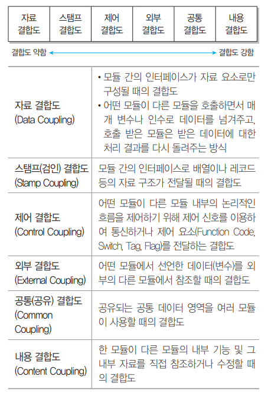
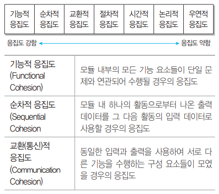
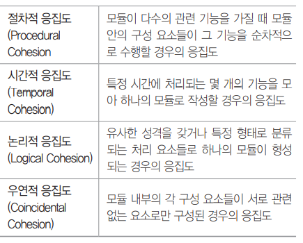
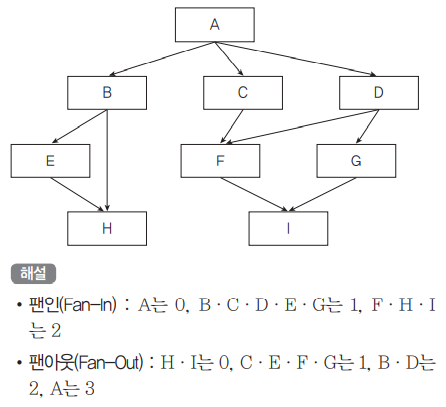
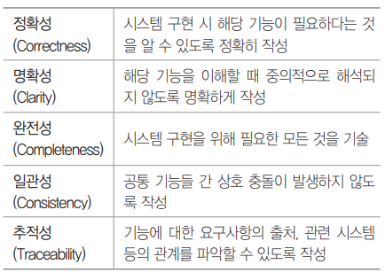
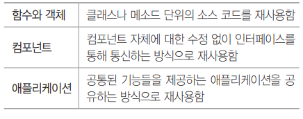
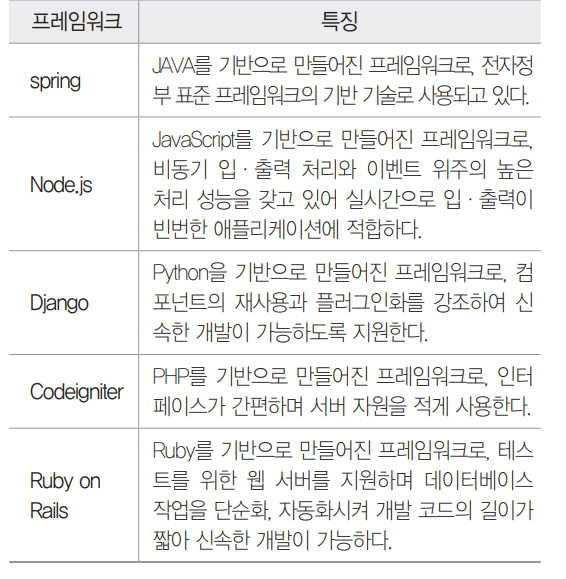
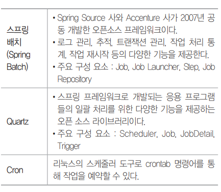

# Server_Program

### 이민아 

---

## Index

- [디자인 패턴](#디자인-패턴)

  - 생성 패턴
  - 구조 패턴
  - 행위 패턴

- [개발 환경 구축](#개발-환경-구축)

  - 서버 하드웨어 개발 환경
    - 클라이언트
    - 웹 서버
    - 웹 애플리케이션 서버 (WAS)
    - DB
  - 소프트웨어 개발 환경
    - 운영체제
    - DBMS
    - 미들웨어
      - 웹 애플리케이션 서버 (WAS)
      - DB
      - RPC
      - MOM
      - TP-Monitor
      - ORB
    - 오픈 소스

- [모듈](#모듈)

  - 모듈화
  - 독립성
    - 응집도
    
      내용 
    
      공통 
    
      외부 
    
      제어
    
      스탬프 
    
      자료 
    
    - 결합도
    
      기능
    
      순차
    
      통신
    
      절차 
    
      시간
    
      논리
    
      우연
  - 팬인 및 팬아웃

- [DBMS](#dbms)

- [서버 개발](#서버-개발)

- [배치 프로그램](#배치-프로그램)

---

## 디자인 패턴

### 1. MVC 패턴 ★

#### (1) 생성 패턴

> 객체 생성 관련

- **추상팩토리** : 동일한 주제의 다른 팩토리를 묶어줌 (구체적 클래스에 의존하지 않고 서로 연관되거나 의존적 객체 조합만드는 인터페이스 제공)
- **팩토리메소드** : 생성할 객체의 클래스를 국한하지 않고 객체를 생성 (객체 생성 처리를 서브 클래스로 분리해 처리하도록 캡슐화)
- **싱글톤** : **한 클래스에 한 객체만 존재**하도록 제한 (**전역변수를 사용하지 않고** 객체를 하나만 생성하도록하고 생성된 객체를 **어디에서든지 참조** 가능하도록)
- **프로토타입** : 기존 객체 복제하여 객체 생성
- 빌더

#### (2) 구조 패턴

> 클래스나 객체를 조합하여 더 큰 구조로 만드는 패턴

- **컴포지트** : 0 혹은 1개 그 이상의 개체를 묶어 하나의 객체
- **퍼싸드 (Facade)** : 많은 분량의 코드에 접근할 수 있는 단순한 인터페이스 제공
- **프록시** : 접근 조절, 비용 절감, 복잡도 감소를 위해 접근이 힘든 객체에 대한 대역 제공
- 데코레이터
- 어댑터
- 브릿지
- 플라이웨이트

#### (3) 행위 패턴

> 클래스나 객체들이 상호 작용하는 방법이나 책임 분배 방법

- **커맨드** : 하나의 추상 클래스에서 메서드를 하나 만들고 각 명령어가 들어오면 그에 맞는 서브 클래스가 선택되어 실행 (실행될 기능을 캡슐화하여 주어진 여러 기능을 실행할 수 있는 재사용 높은 클래스 설계)
- **옵서버 (Observer)** : 어떤 변화가 일어날 때 이를 감지하여 다른 클래스에 통보 (다른 객체에게 연락이 가고 자동으로 내용이 갱신)
- **템플릿 메소드** : 상위 클래스에는 추상적으로 표현하고 구체적 내용은 하위 클래스에서 결정 (일부분을 서브 클래스로 캡슐화해 전체 일 수행구조는 바꾸지 않으면서 특정 단계 수행 내역 변경)
- **메멘토 (Memento)**
- 상태
- 전략
- 방문자
- 책임연쇄
- 인터프리터
- 반복자
- 중재자

----

## 개발 환경 구축

### 1. 하드웨어 환경 

#### (1) 클라이언트 

- 클라이언트 : 사용자와의 인터페이스
- 서버 : 클라이언트와 통신하여 서비스 제공
  - 웹 서버
  - 웹어플리케이션 서버 (WAS)
  - 데이터베이스 서버
  - 파일 서버

#### (2) 웹 서버

> 클라이언트로부터 **직접** 요청을 받아 처리하는 서버로 **저용량 정적** 파일
>
> 웹상의 **정적** 콘텐츠 **HTTP** 이용한 요청 응답

#### (3) 웹 애플리케이션 서버 (WAS) ★

> 사용자에게 **동적 서비스** 제공하기 위해 웹서버로부터 요청받아 데이터 가공작업 수행 혹은 DB 서버와 웹 서버의 연결 호근 웹 서버와 파일 서버 사이에서 **인터페이스**

- **Tomcat**
  - Apache 소프트웨어 개발
  - 자바를 움직하기 위해 개발한 **WAS의 일종**
  - 서블릿, JSP, 빈즈와 같은 자바코드를 위한 **자바 이해 엔진**
  - 비용이나 성능면에서 자바 기반 웹서버를 구성할 때 아파치, 리눅스 톰캣 조합
- JBoss
- Jety
- JEUS

#### (4) 데이터베이스 서버(DB Server)

> DBMS 관리 서버

#### (5) 파일 서버

> 데이터 베이스 저장하기에는 비효율적이거나 서비스 제공 목적을 유지하는 파일들을 저장하는 서버

### 2. 소프트웨어 환경

#### (1) 정의 

- **시스템** 소프트웨어 : **운영체제, DBMS, 미들웨어**
- **개발** 소프트웨어 
  - 요구사항 관리도구
  - 설계/모델링 도구
  - 구현 도구 : 코드 작성과 디버깅 및 수정
  - **빌드 도구** : 코드 빌드와 배포 수행 (**Gradle**, Maven, Ant)
    - 빌드 자동화 도구
      - [Packaging](https://github.com/ma0723/Min_CS/blob/master/Packaging.md#%EB%B9%8C%EB%93%9C-%EC%9E%90%EB%8F%99%ED%99%94-%EB%8F%84%EA%B5%AC) 참조
  - **테스트 도구** : 코드 기능과 품질 향상 (**xUnit**, PMD, Fingbugs, Cppcheck, Sonar)
    - 인터페이스 테스트 프레임워크
      - [Integration](https://github.com/ma0723/Min_CS/blob/master/Integration.md#2-%EB%8F%84%EA%B5%AC) 참조
  - **형상 관리 도구 ** : 산출물들을 **버전별로 관리**하여 **품질 향상**을 지원하는 SW (**GIT**, CVS, Subversion, Mercurial)
    - 형상관리 (SCM) 
      - **SW 변경 사항을 관리**하기 위해 개발된 일련의 활동
      - 개발의 **전 단계**에 적용되는 형상 관리 **(유지보수단계)**
      - 개발의 전체 비용을 줄이고 여러 방해 요인 최소화
      - [Packaging](https://github.com/ma0723/Min_CS/blob/master/Packaging.md#sw-%EB%B2%84%EC%A0%84-%EA%B4%80%EB%A6%AC-%EB%8F%84%EA%B5%AC) 참조

#### (2) 운영체제

- **사용자와 하드웨어** 인터페이스 역할

- 컴퓨터 시스템 **자원 관리**하는 SW

- 신뢰성 / 성능 / 기술지원 / 주변 기기 / 구축 비용

- **JVM** ★

  **시스템 메모리** 관리하고 **자바 기반** 애플리케이션을 위해 **실행 환경 제공**

#### (3) DBMS ★

- **사용자와 DB**사이에서 사용자의 요구에 따라 정보 **생성 및 DB 관리**하는 SW
- 데이터 **중복성과 종속성 해결**
- 가용성 / 성능 / 기술지원 / 상호호환성 / 구축비용
- 유형
  - **JDBC (Java DataBase Connectivity) ★**
    - **Java 언어로 다양한** 종류의 DB에 접속하고 SQL문 수행할 때 **표준 API**
  - ODBC (Open DataBase Connectivity)
    - **표준 개방형** API로 **개발 언어에 관계없이** 사용
    - Excel, Text, MS-Access 등 다양한 DB 접근
    - **응용**프로그램에서 DB에 접근하여 관리하는 **표준** 인터페이스
  - **MyBatis (마이바티스) ★**
    - **JDBC (Java Data Base Connectivity) 코드 단순화**
    - SQL **Mapping** 기반 **오픈소스** 접속 프레임워크
    - SQL **거의 그대로** 사용할 수 있어 SQL 친화적인 국내 환경에 적합 많이 사용
    - XML 서술자나 애너테이션(annotation)을 사용하여 **저장 프로시저나 SQL문으로 객체를 연결**시키는 프로그램
    - 아파치 라이선스 2.0 배포
    - IBATIS의 원개발자들이 포함된 팀에 의해 유지보수가 이루어짐
    - **자바 퍼시스턴스 프레임워크**

#### (4) 미들웨어 ★

> 운영체제와 소프트웨어 애플리케이션 사이에 원만한 통신을 위해 **중개 및 제어 역할 하는 SW**

- DB : 데이터베이스 **벤더**에서 제공하는 클라이언트에서 **원격의 데이터베이스**와 연결하기 위한 미들웨어

- RPC (Remote Procedure Call) : 응용 프로그램의 프로시저를 활용하여 **원격 프로시저를 마치 로컬 프로시저처럼** 호출

- MOM (Message Oriented Middleware) **: 메시지 기반 비동기형** 메시지 전달

- TP - Monitor (Transaction Processing Monitor) : 항공기나 펄도 예약 업무 등과 같은 **온라인 트랜잭션 업무**에서 트랜잭션 처리 및 감시 

- ORB (Object Request Broker) : **객체** 지향 미들웨어로 **COBBA 코바 표준 스펙 구현**

- **웹어플리케이션 서버 (WAS) ★**

  사용자에게 **동적 서비스** 제공하기 위해 웹서버로부터 요청받아 데이터 가공작업 수행 혹은 DB 서버와 웹 서버의 연결 호근 웹 서버와 파일 서버 사이에서 **인터페이스**

  - **Tomcat**
    - Apache 소프트웨어 개발
    - 자바를 움직하기 위해 개발한 **WAS의 일종**
    - 서블릿, JSP, 빈즈와 같은 자바코드를 위한 **자바 이해 엔진**
    - 비용이나 성능면에서 자바 기반 웹서버를 구성할 때 아파치, 리눅스 톰캣 조합
  - JBoss
  - Jety
  - JEUS

#### (5) 오픈 소스

- 누구나 제한 없이 사용할 수 있는 소스코드를 공개한 라이선스를 만족하는 SW

---

## 모듈

### 1. 정의

#### (1) 모듈  ★

> 모듈화를 통해 분리된 시스템 각 기능 등으로 **작업단위** 등과 같은 의미

#### (2) 모듈화 ★

> 소프트웨어 **성능 향상** 혹은 시스템 **수정 및 재사용 유지** 관리 등이 용이하도록 시스템의 **기능**들을 **모듈 단위로 분해**하는 것

- 루틴 (SW 특정 동작 수행 코드)
- 메인 루틴
- 서브 루틴

### 2. 독립성

#### (1) 기능적 독립성

> SW 모듈이 하나의 기능만을 수행하고 다른 모듈과의 과도한 상호작용 배제

#### (2) 조건

- 결합도 약하게

- 응집도 강하게

- 크기 작게

#### (3) 결합도 ★

> **외부** 모듈과의 상호 의존하는 정도로 **약할수록 품질이 높다**(구현 및 유지보수 용이)

- 내공외제스자
  - 내용 (직접 참조 수정)
  - 공통 (공유되는 공통 데이터 영역)
  - 외부 (외부 다른 모듈 참조)
  - 제어 (다른 모듈 흐름 제어)
  - 스탬프 (두 모듈 동일한 자료 구조)
  - 자료 (데이터)

#### (4) 응집도 ★

> 정보 은닉 개념 확장으로 명령어나 호출문 등 모듈 **내부** 요소들이 서로 관련되어 있는 정도 **강할수록 품질이 높다**

- 기순통절시논우
  - 기능 (단일)
  - 순차 (출력을 입력)
  - 통신 (동일 입출력 서로 다른 기능)
  - 절차 (다수 관련 기능 순차 수행)
  - 시간 (특정 시간 처리 기능 모아서 모듈)
  - 논리 (유사한 성격)
  - 우연 (서로 무관)

### 3. 팬인 및 팬아웃 ★

#### (1) 팬인

> 모듈을 제어 혹은 호출**하는** 모듈의 수 (선이 **들어오는** 개수)

- 팬인이 높은 것은 재사용 측면에서 설계가 잘 되어 있다
- 단일 장애점이 발생할 수 있어 중점적 관리 및 테스트

#### (2) 팬아웃

> 어떤 모듈에 의해 제어 혹은 **호출되는** 모듈의 수 (선이 **나가는** 개수)

#### (3) 예제

### 4. 공통모듈

#### (1) 정의

> 자주 사용되는 **계산식**이나 매번 필요한 **사용자 인증**과 같은 기능이 **공통 모듈**
>
> 기능을 **분할하고 추상화**하여 성능 **향상 및 유지 보수** 효과적으로 하기 위한 공통 컴포넌트 기법

#### (2) 명세 기법

#### (3) 구현 비용

- 모듈 개수가 높아질수록 통합비용 높아진다
- 모듈 개수가 적어질수록 통합비용 낮아진다

#### (4) 구현 절차

DTO / VO → SQL → DAO → Service → Controller → View

#### (5) 공통 모듈 테스트

- 화이트 박스 검사
- 블랙 박스 검사 
- **JUnit** : 자바 프로그래밍 언어용 **단위 테스트** 도구
- 어노테이션 : 주석을 달아 특별한 의미 부여하는 메타데이터

- [Application_Test](https://github.com/ma0723/Min_CS/blob/master/Application_Test.md#%ED%99%94%EC%9D%B4%ED%8A%B8%EB%B0%95%EC%8A%A4-%ED%85%8C%EC%8A%A4%ED%8A%B8) 참조

### 5. 재사용 (Reuse)

#### (1) 정의

> 비용 및 시간 절약을 위해 최적화

- 외부 모듈과 결합도 낮고
- 응집도 높아야 한다

#### (2) 분류

----

## DBMS

### 1. DBMS 접속 기술

> DBMS에 접근하기 위해 사용하는 API 또는 API 사용을 편리하게 도와주는 프레임워크(특정 기능 수행을 위해 필요한 **클래스나 인터페이스** 등을 모아둔 집합) 등을 의미

#### (1) JDBC (Java DataBase Connectivity) ★

- **Java 언어로 다양한** 종류의 DB에 접속하고 SQL문 수행할 때 **표준 API**

#### (2) ODBC (Open DataBase Connectivity)

- **표준 개방형** API로 **개발 언어에 관계없이** 사용
- Excel, Text, MS-Access 등 다양한 DB 접근
- **응용**프로그램에서 DB에 접근하여 관리하는 **표준** 인터페이스

#### (3) MyBatis (마이바티스) ★

- **JDBC (Java Data Base Connectivity) 코드 단순화**
- SQL **Mapping** 기반 **오픈소스** 접속 프레임워크
- SQL **거의 그대로** 사용할 수 있어 SQL 친화적인 국내 환경에 적합 많이 사용
- XML 서술자나 애너테이션(annotation)을 사용하여 **저장 프로시저나 SQL문으로 객체를 연결**시키는 프로그램
- 아파치 라이선스 2.0 배포
- IBATIS의 원개발자들이 포함된 팀에 의해 유지보수가 이루어짐
- **자바 퍼시스턴스 프레임워크**

### 2. DBMS유형 ★

#### (1) HDBMS (계층형)

#### (2) RDBMS (관계형)

#### (3) NDBMS (망형) 

#### (4) NoSQL / non relational

- 전통적인 RDBMS와는 다른 것 지칭 
- 데이터 저장에 고정된 테이블 스키마 불요
- 조인 연산 불가
- 수평적 확장 가능

### 3. SQL 유형

#### (1) 동적 SQL 

- 다양한 조건에 따라 **동적으로** 구문 변경하여 처리
- 사용자로부터 SQL문 **일부 또는 전부** 입력받아 실행
- 정적에 비해 속도가 느리지만 상황에 따른 **다양한 조건** 첨가 등 유연한 개발

#### (2) 정적 SQL

- SQL 코드를 **변수에 담지 않고** 코드 사이에 **직접** 기술

----

## 서버 개발

### 1. 프레임워크 ★

#### (1) 서버 개발

> 웹 애플리케이션 로직 구현할 서버프로그램 제작

- 웹 애플리케이션 서버(WAS) 탑재
- 서버 프로그램은 웹 서버로부터 받은 요청을 처리하여 반환하는 역할
- 언어는 Java, Python, JS, PHP, Ruby 등

#### (2) 프레임워크 ★

> 해당 언어로 서버프로그램 개발하도록 지원하는 뼈대, 골대

- 종류

  - **맵 리듀스** 
    - 구글에서 **대용량 데이터** 처리를 분산 병렬 컴퓨팅에서 처리하기 위해 제작
    - 아파치 **하둡**으로 대표되는 소프트웨어 프레임워크

  - **Node.js** 
    - V8 (자바스크립트 엔진)으로 빌드된 **이벤트 기반** 자바스크립트 **런타임**
    - 웹 서버와 같이 확장성이 있는 네트워크 애플리케이션 개발에 사용
    - 자바스크립트를 활용하며 Non blocking I/O와 **단일 스레드 이벤트 루프를** 통한 높은 처리 성능을 가진다
    - 자바스크립트가 웹 브라우저에서 실행되는 것과 달리 **서버 측에서 실행**

  

- 특징 ★

  - **모듈화** : **캡슐화**를 통해 **모듈화 강화하여 품질 향상**하고 설계 및 구현 변경 **영향 최소화**
  - **재사용성** : **개발자** **생산성** 향상 (인터페이스 **반복적 사용 가능한 컴포넌트 정의)**
  - **확장성** : **다형성**을 통한 **인터페이스** **확장**하여 다양한 형태와 기능을 수행하고 애플리케이션 **가변성으로부터 분리함으로 재사용성의 이점**
  - **제어의 역흐름** : **개발자**가 관리하고 통제해야 하는 객체들의 **제어 권한**을 프레임워크에 넘겨 **생산성 향상**하며 특정한 **이벤트**가 발생할 때 **다형성을** 통해 확장한 메소드를 호출함으로써 제어가 프레임워크로부터 애플리케이션으로 **반대로 흐르게** 만든다
  
  

### 2. 공통 모듈 개발 과정

> 구현 순서는 임의로 변경 가능 (통합, 세분화)
>
> 개발 보안 가이드 참고

#### (1) DTO (Data Transfer Object) / VO (Value Object)

- **데이터 교환**을 위해 사용할 **객체** 만드는 과정
- **변수 및 객체**를 송수신할 데이터의 **자료형**에 맞게 생산
- 로직은 구현하지 **않는다**
- **변수와 데이터**를 저장하고 반환하는 메소드만 구현
- DTO : 프로세스 사이에서 데이터 전송
- VO : 고정 클래스가 가지는 객체

#### (2) SQL

- 데이터 **삽입, 변경, 삭제** 등 작업 수행할 SQL문 생성
- 소스 코드 내 **직접** 입력하거나 별도의 XML 파일로 저장하여 관리
- **XML 파일**로 관리하는 경우 **중복**되는 SQL문 **최소화**하고 **유지보수 간소화**

#### (3) DAO (Data Access Object)

- DB **접근**하고 SQL 활용하여 **실제로 데이터 조작**
- DAO : 특정 타입의 DB 추상 인터페이스 제공

#### (4) Service 

- 사용자 **요청 응답**하기 위한 **로직**을 구현

#### (5) Contoller

- 사용자의 요청에 적절한 **서비스를 호출**하여 그 **결과를 사용자에게 반환**하는 코드 구현

#### (6) View

----

## 배치 프로그램

### 1. 정의

#### (1) Batch Program

> 사용자와의 **상호 작용없이** 여러 작업들을 **미리 정해진 일련의 순서(정기적으로)**에 따라 **일괄적으로 처리**

- **자동으로 수행되는 주기**에 따라 수행하며 **한꺼번에 대용량 일괄 처리**
- 개별적 요청에 따른 실시간 통신이 아니다
- 업무 효율성과 비효율적 시스템 과부하 줄이기 위함
- **정기배치, 이벤트성 배치, On-Demand 배치**

#### (2) 필수 요소

- 대용량 데이터
- 자동화 (심각한 오류 상황 외 사용자 개입없이 작동)
- 견고성 (유효하지 않은 데이터도 처리하여 동작 중단 방지)
- 안전성 (신뢰성 / 언제 어떤 문제가 발생한지 추적)
- 성능 (주어진 시간 내 처리 완료하고 다른 동시 동작 애플리케이션 방해 금지)

### 2. 배치 유형 ★

#### (1) 이벤트 배치

- **사전에 정의**해 둔 **조건** 충족시 **자동**으로 실행

#### (2) 온디맨드 배치

- **사용자의 명시적 요구**가 있을 때마다 실행

#### (3) 정기 배치

- **정해진 시점에 정기적(주로 야간)**으로 실행되는 배치 유형

### 3. 배치 스케줄러 ★

> **일괄 처리(Batch Processing)** 작업이 설정된 **주기**에 맞춰 자동으로 수행되도록 지원 도구

- **쿼츠 스케줄러**
  - **스프링 프레임워크에 플러그인** 되어 수행
  - 작업 스케줄 정의하는 **트리거 분리**하여 유연성 제공
  - 오픈소스 기반 스케줄러

---

## References

- 시나공 정보처리기사 실기 대비용 핵심요약

---

