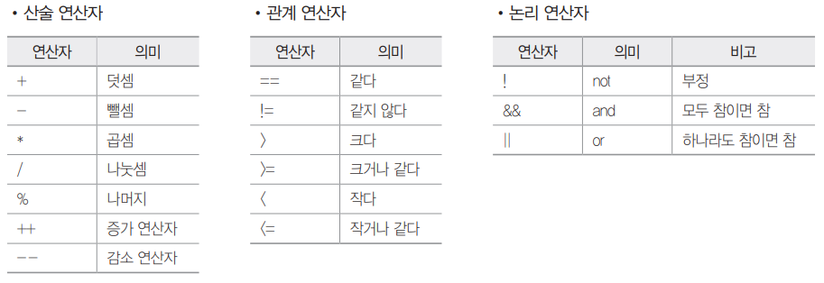
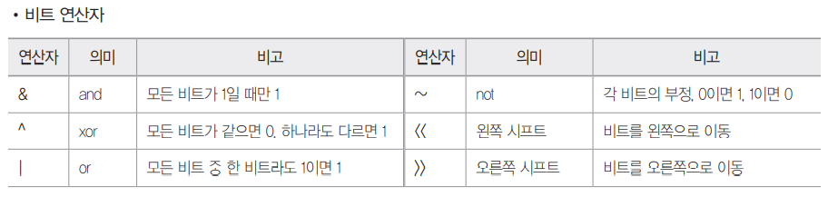
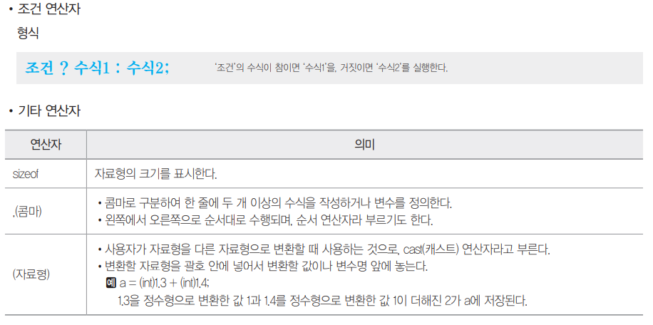
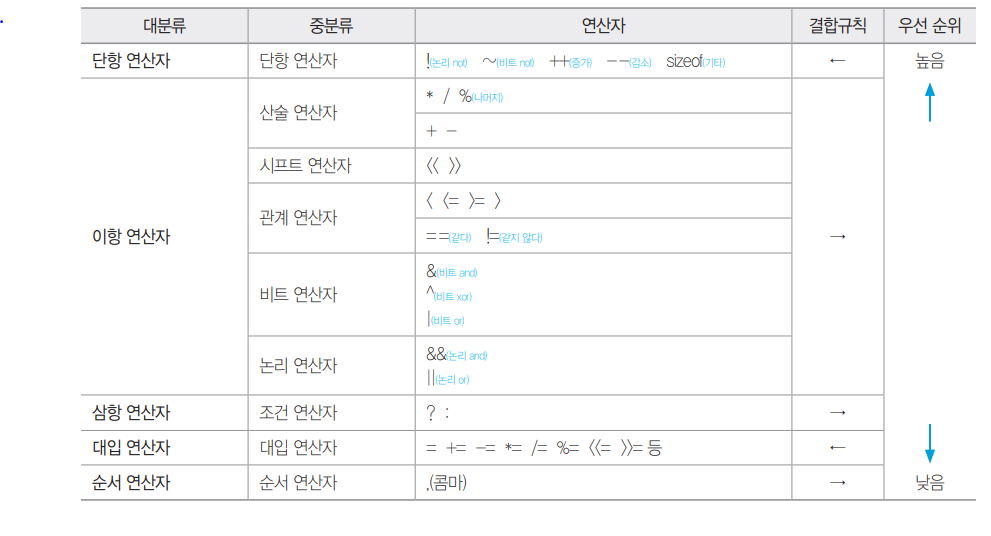
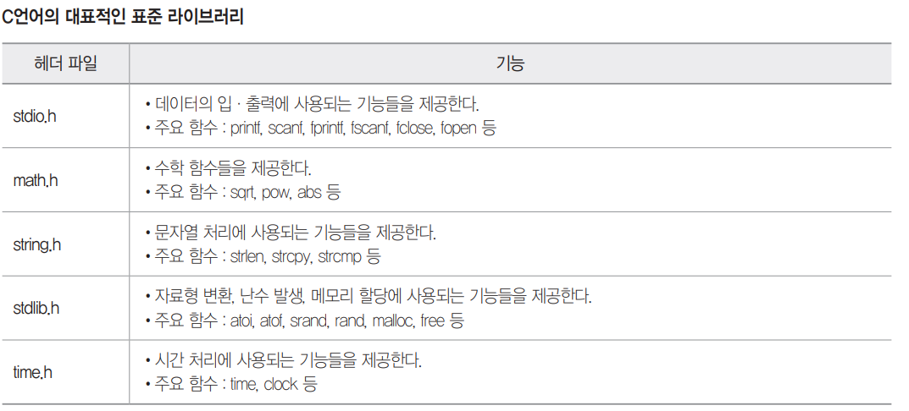

# Syntax_C

### 이민아 


---

## Index


- [개념](#개념)

- [저장 및 출력](#저장및출력)

- [연산자](#연산자)

- [조건문](#조건문)

- [반복문](#반복문)

- [배열 및 문자열](#배열및문자열)

- [포인터](#포인터)

- [함수](#함수)

- [라이브러리](#라이브러리)

  

----

## 개념


### 1. 데이터 타입 유형

- 정수
- 부동소수점
- 문자 : 작은 따옴표 (`''`)
- 문자열 : 큰 따옴표 (`""`)
- 불린
- **배열** : 중괄호 (`{}` 안에 `,`로 구분 후 나열)


### 2. 기억 클래스 유형

> 변수 선언 시 **메모리 내**의 변수의 값을 저장하기 위한 기억영역이 할당된다

- 자동변수 : 함수나 코드 범위 한정하는 블록 내에서 선언되는 변수
- 외부변수 : 현재 파일이나 다른 파일에서 선언된 변수나 함수를 참조하기 위한 변수
- 정적변수 
  - 함수나 블록 내에서 선언하는 **내부 정적 변수**와 외부에서 선언하는 **외부 정적 변수**
  - 함수나 블록이 종료된 뒤에도 값이 소멸되지 않는다
  - 초기화는 변수 선언 시 한 번만 가능, 초기화를 생략하면 자동으로 0으로 초기화
- 레지스터 변수 : 메모리가 **아닌** CPU 내부의 레지스터에 기억 영역을 할당받는 변수


---

## 저장 및 출력


### 1. scanf () (저장)

#### (1) 정의

>  scanf(서식문자열, 변수의 **주소**)

- 서식 문자열

  | 서식문자열 | 의미                    |
  | ---------- | ----------------------- |
  | **%d**     | **10진수 정수**         |
  | %u         | 10진수 부호없는 정수    |
  | **%o**     | **8진수**               |
  | **%x**     | **16진수**              |
  | **%c**     | **문자(character)**     |
  | **%s**     | **문자열(string)**      |
  | %f         | 소수점 포함 실수(float) |
  | %e         | 지수형 실수             |
  | %ld        | long형 10진수           |
  | %lo        | long형 8진수            |
  | %lx        | long형 16진수           |
  | %p         | 주소를 16진수           |

- 변수의 주소 :  `&` 필수

#### (2) 예제

- [input]

```c
scanf("%3d", &a);
```

- [input]

```c
321
// a 변수 주소
// 3 3자리수
// %d 10진수 정수
```


### 2. printf () (출력)

#### (1) 정의

>  printf(서식문자열, 변수)

- 서식문자열
- 변수 : `&` 불요 scanf()에서만 사용

#### (2) 제어문자

| 문자 | 의미                       | 문자 | 의미                   |
| ---- | -------------------------- | ---- | ---------------------- |
| `\n` | 커서 다음 줄(new line)     | `\'` | 작은따옴표             |
| `\b` | 커서 왼쪽 한 칸(backspace) | `\"` | 큰따옴표               |
| `\t` | 커서 tab                   | `\a` | 스피커로 벨소리(alert) |
| `\r` | 커서 현재 줄 처음(return)  | `\\` | 역슬래시               |
| `\0` | NULL 문자                  | `\f` | 한 페이지 넘김         |

#### (3) 예제

- [input]

```c
printf("%-8.2f", 200.2);
```

- [output]

```c
200.20__
// - 왼쪽부터 출력
// 8 8자리수
// %f 실수형
// .2f 소수점 이하를 2자리로 지정
```


### 3. 문제

- [input]

```c
// Sinagong
#include <studio.h>
main() {
    char input_Value[50];
    // char 문자배열 input_value 변수 선언
    // [50] 50자리 크기
    scanf("%s", input_Value);
    // %s 문자배열
    // input_value에 저장(scanf)
    printf("%.5s", input_Value);
    // .5s 5글자수 문자배열 출력(printf)
    printf("%5.3s", input_Value);
    // 5.3s 5글자수 확보한 후 앞 3글자만 오른쪽부터 출력
    // - 왼쪽부터 출력(기본은 오른쪽 출력)
}
```

- [output]

```c
Sinag
Sinag Sin
```

- [input]

```c
//20@20
#include <studio.h>
main() {
    int i, j;
    // 정수형 변수 i, j 선언
    scanf("%o@x", &i, &j);
    // 정수형 변수 주소 & 저장(scanf)
    // %o 8진수 정수
    // %x 16진수 정수
    // @ @를 기준으로 입력값 구분
    printf("%d %d", i, j);
    // %d 10진수 정수 출력(printf)
	// 공백 한 칸 띄우기
}
```

- [output]

```c
16 32
```


---

## 연산자

### 1. 연산자 유형

#### (1) 전치 및 후치

- 전치 : ++a --a

  변수 전에 증감연산자

  변수값 증감 후 

  변수 연산에 사용

- 후치 : a++ a--

  변수 뒤에 증감연산자

  먼저 변수 연산 사용 후

  변수값 증감

#### (2) 연산자







#### (3) 우선순위



### 2. 문제

- [input]

```c
#include <studio.h>
main() {
    int a=4, b=3, c=5, d=7;
    int r1, r2, r3, r4;
    r1 = 10 % a++;
    // a++ 후치 증가 연산자 a=4
    // %(나눗셈 나머지) 10%4 2
    r2 = b > 3 && b > 2;
    // false(0) && true(1)
    // && and 논리연산자 0
    r3 = c & d;
    // c 101
    // d 111
    // & and 비트연산자 101 
    // %d 10진수 변환하면 101은 5
    r4 = d << 3;
    // d 111
    // << 왼쪽 시프트 연산자 비트연산자
    // 111000
    // %d 10진수 변환하면 101은 32+16+8=56
    printf("%d, %d, %d, %d", r1, r2, r3, r4);
    // %d 10진수 변환
}
```

- [output]

```c
2, 0, 5, 56
```

- [input]

```c
#include <studio.h>
main() {
    int a=2, b=5, p=10, q=7;
    // 정수형 변수 선언
    b -= a--;
    // a-- 후치 감소 연산자 연산(a=2) 최종(a=1)
    // -= (b = b-a = 5-2 = 3) b=3
    p %= a < b ? a++ : b++;
    // 조건 ? 참 : 거짓 ;
    // 조건 a < b 1 < 3 true 
    // 계속 변하는 a, b 값 유의
    // 참 a++ 후치 증가 연산자 연산(a=1) 최종(a=2)
    // %= (p = p % a = 10 % 1 = 0) 나머지 연산자(%)
    q /= b % 3 ? a * b : b % a;
    // 조건 ? 참 : 거짓 ;
    // 조건 b % 3 (3 % 3 = 0) 나머지 연산자(%)
    // 거짓 b % a (3 % 2 = 1) 나머지 연산자(%)
    // 계속 변하는 a, b 값 유의
    // /= (q = q / 1 = 7) 몫 연산자(/)
    printf("%d %d", p, q);
    // %d 10진수 변환 출력printf
    // 공백 한 칸 유의
}
```

- [output]

```c
0 7
```

- [input]

```c
// 단항(++, !, ~) > 산술 > 시프트(<<) > 관계(<, !=, ==) > 비트(&) > 논리(&&) > 조건(?) > 대입(+=, =) > 순서(.)
#include <studio.h>
main() {
    int c=3, d=6,e=3, x, y;
    x = c>1 || d!=0;
    // true or true
    // x = true = 1
    y = d<=4 && e>1;
    // false && true
    // y = false = 0
    printf("%d, %d", x, y);
}
```

- [output]

```c
1, 0
```

- [input]

```c
#include <studio.h>
main() {
    int a=3, b=4, c=5, d=6, p, q;
    p = a*b+c >= d && d/a-b != 0;
    // 산술 
    // 관계 (>=, !=)
    // 논리 (&&) 1 and 1
    // 대입 (=, +=)
    q = d%b + ++a * c-- || c - --a >= 10;
    // 단항(++a, --a, c--)
    // 산술
    // c-- 후치연산자
    // ++a * c-- = 3*5 = 15
    // --a ++a 전치연산자 --a로 인해 2가 된 이후 ++a로 인해 다시 연산에 사용될 때 a=3(덧셈에서 연산이 이루어져 곱셈 이후 연산으로 인해 a값 변화)
    // c - --a = 5 - 3 = 2
    // 관계 (>=, !=)
    // 논리 (||) 1 or 0
    // 대입 (=, +=)
    // q = 1
    printf("%d", p && q);
    // 논리 (&&) 1 and 1
    // 10진수 변환 출력
}
```

- [output]

```c
1
```


---

## 조건문

### 1. 정의

#### (1) if문

- if
- else if
- else

#### (2) switch문

- switch
  - 예약어 그대로 입력
  - **레이블 중 하나**를 도출하는 변수나 수식 입력
  - `{}`로 시작해서 끝나야 한다
- case
  - break 생략되면 실행할 문장부터 break문 또는 switch문이 종료될 때까지 **모든 문장 실행**
  - case문의 레이블에는 한 개의 상수만 지정 int, char, enum형 상수만 가능
  - 변수 지정 불가
- default

### 2. 문제

- [input]

```c
#include <stdio.h> 

main() { 
    int a = 15, b = 22; 
    if (a % 2 == 0) 
        if (b % 2 == 0)
            printf("A"); 
    	else 
            printf("B"); 
    else if (b % 2 == 0) 
        printf("C"); 
    else 
        printf("D"); 
}
```

- 

```c
C
```

- [input]

```c
#include <studio.h>
main() {
    int c=1;
    // c = 1
    switch(3){
    // case label 값과 일치하는 곳으로 이동
        case 1: c += 3;
        case 2: c++;
        case 3: c = 0;
        // switch의 값에 해당하는 label = 3
        // c = 0 초기화
        case 4: c += 3;
        // c = 0 + 3 = 3
        case 5: c -= 10;
        // c = 3 - 10 = -7
        default: c--;
        // c = -7 - 1 = -8
        // break문 모두 생략이므로 case 3부터 모두 실행 default까지
    }
    printf("%d", c);
}
```

- [output]

```c
-8
```


---

## 반복문

### 1. for문 

#### (1) 정의

> for(초기값; 종료값; 증가량)
>
> ​	실행할 문장;

- 종료값에 대한 조건식을 만족하지 못하면 한 번도 수행하지 않는다
- 초기, 종료, 증가값 중 하나 이상 생략 가능
- 증가량으로 인해 증가한 값이 종료값과 거짓상태가 되면 종료하므로 종료값이 `i<=4`인 경우` i++`증가량일 때 `i=5`에서 종료

### 2. while문 

#### (1) while문 

> while(조건);

- 종료값에 대한 조건식을 만족하지 못하면 한 번도 수행하지 않는다
- 조건이 참일 동안 실행할 문장을 입력하되 두 문장 이상인 경우 `{}`

#### (2) do while문 

> do
>
> ​	실행할 문장;
>
> while(조건);

- 무조건 1번 실행 후 다음 조건 판단하여 탈출 여부 결정

#### (3) break continue

- switch나 반복문 실행 제어 
- break : switch나 반복문 안에서 블록 벗어난다
- continue : **이후 문장 실행하지 않고** 반복문 처음으로 옮기며 반복문에서만 사용된다


### 3. 문제

- [input]

```c
#include <studio.h>
main() {
    int i, j;
    for (i=2; i<=4; i++){
        for (j=5; j<=7; j++){
        }
    }
    printf("%d x %d = %d", j, i, i*j);
    // for문 밖에 출력
}
```

- [output]

```c
40
// i = 8 j = 5
// printf()가 for문 밖에 있으므로 i와 j의 최종값
```

- [input]

```c
#include <studio.h>
main() {
    int x = 100, y = 10;
    do {
        x -= y;
        printf("%d, %d\n", x, y++);
    }
    // printf 실행 이후 y값 증가
    // 100 10 
    // 90(100-10) 11
    // 79(90-11) 12
    // 67(79-12) 13
    // 54(67-13) 14
    // 40(54-14) 15
    // 25(40-15) 16
    while (x>30);
}
```

- [output]

```c
25, 15
// 최종적으로 출력되는 결과
// 한 번 수행할 때마다 마지막은 개행(\n)
// 출력 이후 y++ 16이 되므로 출력할 때에는 25 15
```


---

## 배열 및 문자열

### 1. 1차원 배열 

#### (1) 정의 

> 자료형 변수명 [개수];

- [input]

```c
int a[5]
// 5개의 요소를 갖는 정수형 배열 변수 a
```

#### (2) 저장

- [input]

```c
a[3] = 4
// 배열 a의 네 번째 자리에 4의 값을 저장
```


### 2. 2차원 배열 

#### (1) 정의 

> 자료형 변수명 [행개수] [열개수]

- [input]

```c
int a[3][3]
// 3행 3열 정수형 배열 변수 a
```

#### (2) 저장

- [input]

```c
a[0][2] = 4
// 배열 a의 1행 3열에 4의 값을 저장
```


### 3. 문자열 변수 배열

#### (1) 정의 

> char 배열이름[크기] = "문자열"

- 큰 따옴표(`""`)로 묶인 글자는 글자 수에 관계없이 **문자열**로 처리

- 문자열을 저장하는 자료형이 없기 때문에 **배열 또는 포인터** 처리

- 배열 선언 시 초기값으로 지정 이미 선언된 배열에는 문자열 지정 불가
- 문자열 끝에 자동으로 **널 문자**(`\0`)이 삽입되므로 널 문자까지 고려하여 매열 크기


#### (2) 입력

- [input]

```c
char a[5] = "love"
//  널 문자(\0) 포함하여 love까지 총 5글자 입력 가능
```


### 4. 문제

- [input]

```c
#include <studio.h>
main() {
    int exint[] = {4, 9, 3, 7, 6, 4, 24, 4, 8, 4, 10};
    // 자료형 변수명[크기] 크기를 생략하면 지정된 값의 수와 같은 크기 배열 선언
    // int exint[11]
    int len = sizeof(exint) / sizeof(int);
    // int 자료형의 크기 4Byte
    // exint int 자료형 11개 44byte
    // 요소 개수인 11을 len에 저장
    int value = 0;
    for (int i=0; i<len; i++){
        if (exint[i]==4){
        // exint[0] == 4, exint[5] == 4, exint[7] == 4, exint[9] == 4
            value++;
            // 0에서 4번 value++
        }
    }
    printf("%d", value)
}
```

- [output]

```c
4
```


---

## 포인터

### 1. 포인터 변수 

#### (1) 정의

> 자료형 *변수; (포인터 변수 정의)
>
> *변수; (포인터 변수가 가리키는 곳의 값)

- 포인터 : 변수의 주소
- 포인터 변수 : 변수의 주소를 저장할 때 사용하는 변수
- [input]

```c
int *a;
// 자료형 *변수명
// 포인터 변수 선언
// 간접연산자(*)
```

#### (2) 저장

> 변수 = &변수;

- [input]

```c
int *a;
// 자료형 *변수명
// 포인터 변수 선언
// 간접연산자(*)
a = &b;
// 포인터 변수 저장
// b의 변수의 '주소'
// 번지연산자(&)
c = *a;
// 포인터 변수 가리키는 '값'을 c의 변수에 저장
```

#### 

### 2. 포인터와 배열

#### (1) 정의

> 

- [input]

```c
int a[5], *b;
// 크기 5인 배열 변수 a선언
// 포인터 변수 b선언
// 간접연산자(*)
b = a
// 배열의 대표명 a를 적어서 a배열 시작 '주소'인 a[0]이 b에 저장
b = &a[0]
// 포인터 변수 b에 a[0] 저장
// a[0]의 변수의 '주소'
// 번지연산자(&)
```


### 3. 문제

- [input]

```c
#include <studio.h>
main() {
    int a = 50;
    // 정수형 a 변수 50 정의
    int *b;
    // b 포인터변수 정의
    b = &a;
    // a의 '주소' b 포인터변수 저장
    // 번지연산자(&)
    *b = *b + 20;
    // b 포인터변수가 가리키는 값(*b)는 a의 값을 의미 a의 값 변동
    printf("%d, %d", a, *b);
    
    // 70, 70
}
```

- [output]

```c
70, 70
```

- [input]

```c
#include <studio.h>
main() {
    int a[5], b = 1, sum = 0;
    for (int i=4; i > -1; i--) {
    // i는 4부터 0까지 순회하는 반복문
        a[i] = b;
        // a[4] = 1
        // a[3] = 3**1 = 3
        // a[2] = 9
        // a[1] = 27
        // a[0] = 81
        b *= 3;
    }
    for (int i=4; i > -1; i-=2)
    // i는 4부터 2씩 감소하며 0까지 순회하는 반복문
        sum += *(a+i);
    	// a[4] + a[2] + a[0] = 1 + 9 + 81 = 91
    printf("%d", sum);
}
```

- [output]

```c
91
```


---

## 함수

### 1. 사용자 정의 함수 

#### (1) 함수 정의

> void func(자료형 변수명, 자료형 변수명);

#### (2) 함수 호출

> func(변수명, 변수명);

- 함수 호출하는 곳에서 보내준 인수의 '순서'와 '자료형' 일치
- 함수 **인수 변수 자료형 정의**

- [input]

```c
#include <studio.h>
void func(int i, int j);
// 함수 정의 
// void 함수 리턴값이 없음
// func 함수명 정의
// () 함수인수 정의 자료형 변수명

main() {
    int a = 3, b = 12;
    // 정수형 a, b 변수 정의
    func(a, b);    
    // 함수 호출
    printf("%d, %d\n", a, b)
    // 3, 12 개행
    // return값이 없는 void이므로 printf 원래 a, b값 출력
    // 함수호출한 경우의 printf 실행 이후 출력
}

void func(int i, int j);
// 함수 호출하는 곳에서 보내준 인수의 '순서'와 '자료형' 일치
// i는 a의 값인 3, j는 b의 값인 12(순서)

int i, j;
// 인수 정수형 변수 정의(자료형)
// 반드시 필수 과정

{
    i *= 3;
    j /= 3;
    printf("%d, %d\n", i, j);
    // 9, 4 개행
    // 함수 호출한 후의 과정이므로 9, 4가 먼저 출력
    // 이후에 3, 12 출력
}
```


### 2. 재귀 함수 

- [input]

```c
#include <studio.h>
main() {
    printf("%d", factorial(5));
    // 함수호출
}

factorial(int n){
// return값이 없는 경우에만 void 사용
// 함수명(함수인자 자료형 변수명)
    if (n <= 1)
        return 1;
    else
        return n*factorial(n-1);
}
```

- [output]

```c
120
```


### 3. 문제

- [input]

```c
#include <studio.h>
void align(int a[]){
    int temp;
    for (int i=0; i<4; i++)
        for (int j=0; j<4-i; j++)
            if (a[j] > a[j+1]){
                temp = a[j];
                a[j] = a[j+1];
                a[j+1] = temp;
            }
}
main() {
    int a[] = {85, 75, 50, 100, 95};
    // int a[5] 개수에 맞춰서 정의
    align(a);
    // 버블 정렬 함수 호출
    for (int i=0; i<5; i++)
        printf("%d ", a[i])
        // a[0]부터 a[4]까지 순서대로 한 칸 공백 후 출력
}
```

- [output]

```c
50 75 85 95 100
```

- [input]

```c
#include <studio.h>
hrd(num){
    if (num <= 0)
     // hrd(0)이 호출되는 경우
        return;
    	// 함수실행 종료 후 반환값없이 제어를 hrd(1)로 회귀 
    	// 지속적으로 회귀하여 hrd(5)로 복귀
    	// return 0으로 프로그램 종료 main에서 명령
    printf("%d ", num);
    // 5 출력 ... 1출력
    hrd(num-1);
    // hrd(4) 호출 ... hrd(0) 호출
}
main() {
    hrd(5);
    // 함수호출
    return 0;
    // 함수종료 0
}
```

- [output]

```c
5 4 3 2 1
```


---

## 라이브러리



