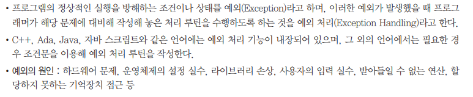
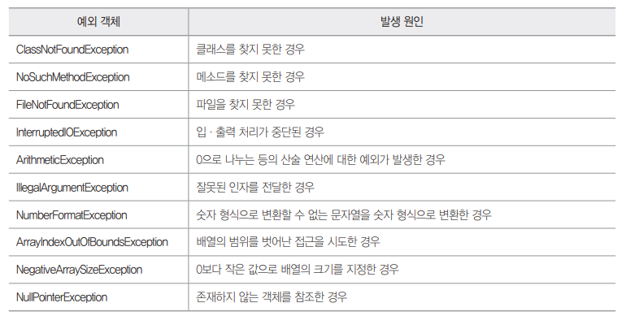
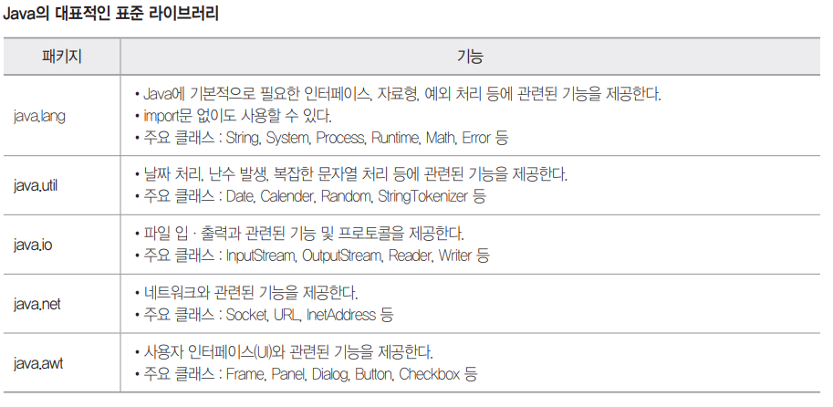

# Syntax_Java

### 이민아 


---

## Index


- [개념](#개념)

- [입력 및 출력](#입력-및-출력)

- [조건문](#조건문)

- [반복문](#반복문)

- [배열 및 문자열](#배열-및-문자열)

- [클래스 및 매소드](#클래스-및-매소드)

- [상속](#상속)

- [예외 처리](#예외-처리)

- [라이브러리](#라이브러리)

  

----

## 개념


### 1. 데이터 타입 유형

- 정수
- 부동소수점
- 문자 : 작은 따옴표 (`''`)
- 문자열 : 큰 따옴표 (`""`)
- 불린
- **배열** : 중괄호 (`{}` 안에 `,`로 구분 후 나열)


### 2. 서식 문자열 

| 서식문자열 | 의미                    |
| ---------- | ----------------------- |
| **%d**     | **10진수 정수**         |
| %u         | 10진수 부호없는 정수    |
| **%o**     | **8진수**               |
| **%x**     | **16진수**              |
| **%c**     | **문자(character)**     |
| **%s**     | **문자열(string)**      |
| %f         | 소수점 포함 실수(float) |
| %e         | 지수형 실수             |
| %ld        | long형 10진수           |
| %lo        | long형 8진수            |
| %lx        | long형 16진수           |
| %p         | 주소를 16진수           |


### 3. 제어문자

| 문자 | 의미                       | 문자 | 의미                   |
| ---- | -------------------------- | ---- | ---------------------- |
| `\n` | 커서 다음 줄(new line)     | `\'` | 작은따옴표             |
| `\b` | 커서 왼쪽 한 칸(backspace) | `\"` | 큰따옴표               |
| `\t` | 커서 tab                   | `\a` | 스피커로 벨소리(alert) |
| `\r` | 커서 현재 줄 처음(return)  | `\\` | 역슬래시               |
| `\0` | NULL 문자                  | `\f` | 한 페이지 넘김         |


---

## 입력 및 출력


### 1. 입력 ★

#### (1) 정의

- 객체 변수 **생성** ★
  - `Scanner` : **클래스 이름 (객체 변수 생성)**

  - scan01 : 객체 변수명

  - `new` : 객체 **생성 예약어** ★

    - C++ 생성자 new

      객체 **생성**시 **초기화 작**업을 위한 함수

      객체 생성시 **반드시 호출되고 가장 먼저 실행**

      **new 연산 메소드**

  - `Scanner()` : 클래스 이름 **()를 붙여** 그대로 적기

  - `System.in` : 표준 입력장치(키보드) 그대로 적기

- 클래스 입력 **메소드**
  - `next()` : 문자열 반환
  - `nextLine()` : 입력받은 라인 전체를 문자열로 반환
  - `nextInt()` : 정수형 반환
  - `nextFloat()` : 실수형 반환

#### (2) 예제

- inNum : 입력받은 값을 저장할 변수 (미리 선언되어 있어야 한다)

- [input]

```java
import java.util.Scanner
// Scanner 객체 변수 생성시 import
scan01.nextInt()
// 객체 변수명(scan01)
// 입력값 정수형 변환(nextInt())
```


### 2. 출력

#### (1) 정의 ★

>  System.out.printf(문자열, 변수)

- `System.in` : 표준 입력장치(키보드) 그대로 적기

- `System.out` : 표준 출력장치(키보드) 그대로 적기

  System 클래스의 서브 클래스인 out

  out 클래스의 메소드 printf()
  
  - `System.out.printf()`
  - `System.out.printIn()` **개행 전제 **★

#### (2) 예제

- [input]

```java
System.out.printf("%-8.2f, 200.2");
```

- [output]

```java
200.20__
// %f 실수형
// - 왼쪽부터 출력
// 8자리로 출력 자릿수 지정
// 2자리 소수점 이하의 자릿수 지정
```


### 3. 문제

- [input]

```java
import java.util.Scanner
// Scanner 객체 생성 import
public class Test{
    public static void main(String args[]){
        Scanner scan = new Scanner(System.in);
        // Scanner 변수명 = Scanner(System.in);
        // 입력 Scanner(System.in)
        int a = scan.nextInt();
        int b = scan.nextInt();
        // 정수형 변환 변수.nextInt()
        System.out.printf("%d", a+b);
        // 출력 System.out.printf()
        // 출력 System.out.printIn() 개행 전제
    }
}
```

- [input]

```java
public class Sujebi{   
    public int add(int a, int b){   
    // 정수의 합계 계산
        return a+b;
    }
    public double add(double a, double b){   
    // 소수점 합계 계산
    // double은 float과는 다르에 f를 붙여주지 않아도 소수점을 표현
        return a+b;
    }   
    public static void main(String []args){       
        Sujebi s = new Sujebi();       
        System.out.print(s.add(5,4) + " ");  
        // 정수의 합 출력
        // print 괄호안 내용을 단순히 출력
        // + " " 한 칸 공백 추가
        System.out.println(s.add(5.0,4.0));     
        // 소수점 합 출력  
        // println 괄호안 내용을 출력한 후 마지막에 개행문자가 포함되어 있어 출력후 한 줄 띄워짐
        // 자바는 소숫점 .0 프린트
    }
}
```

- [output]

```java
9 9.0
```

- [input]

```java
public static void main(String[] args){
   int a = 20;
   int b = 30;
   System.out.println(++a); 
   // 플마가 앞에 있으면 먼저 1증가 또는 1감소한 후 출력
   // println 개행
   System.out.println(b--);
   // 플마가 뒤에 있으면 먼저 출력한 후 1증가 또는 1감소
   // println 개행
}
```

- [output]

```java
21
30
```

- [input]

```java
class Parent {
 void show() {
 System.out.println("Parent");
 }
}
class Child extends Parent {
// 메소드 오버라이딩
// 상속 extends
 void show(){
 System.out.println("Child");
 }
}
public void Main() {
 Parent pa = new Child();
 // Child 클래스의 객체 생성
 pa.show();
 // show 메소드 실행
}
}
```


---

## 조건문

### 1. switch

- [input]

```java
public static void main(String[] args){
    int i = 3;
    int k = 1;
    switch(i){
        case 0:
        case 1:
        case 2:
        case 3: k=0;
        // switch(3)
        case 4: k+=3;
        case 5: k-=10;
        default: k--;
        // break문이 없어서 끝까지 실행
        // -8
    }
    System.out.print(k);
}
```

- [output]

```java
-8
```

- [input]

```java
nt n = 2; 
switch(n) {
    case 1 : System.out.println("Java"); 
    case 2 : System.out.println("Programming");
    // switch(2)
    case 3 : System.out.println("Easy"); 
    default : System.out.println("Done"); 
    // break문 없어서 default까지 실행
    // 개행
}
```

- [output]

```java
Programming 
Easy 
Done
```


---

## 반복문


### 1. for

- [input]

```java
public class Soojebi{
     public static void main(String []args){
        int i, j;
        for(j=0, i=0;i<=5;i++){   
        // j=0, i=0 i, j를 0으로 초기화
        // i<=5 i가 5보다 작거나 같을때까지 
        // i++ 1씩 증가하면서 반복
            j += i;      
            // j와i를 더한 값을 j에 대입
            System.out.print(i);    
            // i 값 출력
            if(i == 5){          
             // i가 5일때
                System.out.print("=");   
                // "="를 출력
                System.out.print(j);     
                // j 값 출력
            } else {
                System.out.print("+");    
                // "+"를 출력
            }
        }
     }
}
```

- [output]

```java
0+1+2+3+4+5=15
```

- [input]

```java
public static void main(String[] args) {
    int a = 10;
    int i;
    for(i=1; i<=a; i++) {
        if(a % i == 0) {
        // 나머지가 0인 경우 (약수)
            System.out.println(i);
            // 개행
        }
    }
}
```

- [output]

```java
1
2
5
10
```


---

## 배열 및 문자열


### 1. 배열 (향상된 for문) ★

> **향상된 for문**은 객체를 대상으로만 사용하며, 배열은 객체 취급

- [input]

```java
public class Example {
    public static void main(String[] args){
        int[] a = {90 100, 80, 70, 60, 50, 30};
        // 배열 변수 a 선언 
        // int[7] a 개수를 지정하지 않으면 자동으로 개수
        int hap = 0;
        // 정수형 변수 hap 선언
        float avg;
        // 실수형 변수 avg 선언
        for (int i : a)
        // a 배열의 요소들을 모두 순회하는 향상된 반복문
        // a 배열의 요소의 자료형과 일치(int)
        // 임시 변수 i : a의 배열의 요소 (int i : a)
            hap = hap + i;
        	// 임시 변수 i 합계 누적
        avg = (float)hap / a.length'
        // 총합 hap 실수형 변환 ((float))
        // 배열 a의 길이 length 메소드 (.length)
        System.out.printf("%d, %.2f", hap, avg);
        // 출력 System.out.printf()
        // 10진수(%d), 소수점 2자리수까지 실수(%.2f)
    }
}
```

- [output]

```java
480 68.57
```


### 2. 문자열

- [input]

```java
public class Example {
    public static void main(String[] args){
		String str = "Information!";
        // 문자열 선언
        // new없이도 문자열 변수는 바로 생성 가능
        int n = str.length();
        // 문자열 길이 메소드(.length())
        char[] st = new char [n];
        // 문자배열 선언
        // chat st[] 입력 가능
        // new 객체 생성 예약
        // char[n] 문자배열 크기 지정
        n--;
        // 12개 길이 배열이지만 인덱스는 -1이므로 n--
        for (int k = n; k>=0; k--){
        // k는 11부터 0까지 순회하는 for문
            st[n-k] = str.charAt(k);
            // st[0]부터 st[11]까지 순회하는 for문
            // 해당 문자열에서 인수에 해당하는 위치 문자열 반환하는 메소드(.charAt())
            // st[11-11] = st[0] = str[11]
        }
        for (char k : st):{
        // 임시변수 문자 k
        // 배열 st의 모든 요소 순회하는 향상된 for문
            System.out.printf("%c", k);
            // 출력 System.out.printf()
            // 문자(%c)
        }
    }
}
```

- [output]

```java
!noitamrofnI
// 거꾸로 출력하는 str for문
```


### 3. 문제

- [input]

```java
public class Test {
    static int[] arr() {
        int a[] = new int[4];
        // 정수형 4개 배열 a 
        int b = a.length;
        // 배열 길이 메소드(.length)
        for (int i = 0; i < b; i++)
            a[i] = i;
        	// 인덱스의 숫자에 값을 대입
        	// a[0] = 0 ... a[3] = 3
        return a
        // 배열 a 반환
    }
    public static void main(String[] args){
        int a[] = arr();
        // arr() 메소드로부터 반환받은 값 return a
        // 정수형 배열 a에 저장 
        for (int i = 0; i< a.length; i++)
        // a.length-1 마지막 인덱스
            System.out.print(a[i] + " ");
        	// 공백 한 칸 띄우고 a[0]부터 a[3]까지 출력
        	// System.out.print()
    }
}
```

- [output]

```java
0 1 2 3 
```

- [input]

```java
public class Sujebi { 
  public static void main (String[] args){ 
    int[] arr = {1,2,3,4,5}; 
    int sum = 0; 

    for (int num : arr) { 
    // arr 배열의 각 값들을 순회하는 for문
    // type var : array (향상된 for문)
    // int i=0; i<array.length; i++ (인덱스 for문)
      sum += num; 
    } 
    System.out.print(sum); 
  } 
}
```

- [output]

```java
15
```

- [input]

```java
public static void main(String[] args) {
    int i;
    int a[4] = {0, 1, 2, 3};
    for(i=0; i<4; i++){
        System.out.print(a[i] + “ ”);
    }
}
```

- [output]

```java
0 1 2 3
```


---

## 클래스 및 매소드

### 1. 클래스 

- 객체 지향 프로그래밍(OOP)에서 특정 객체를 생성하기 위해 변수와 메소드를 정의하는 일종의 틀

### 2. 메소드 

### 3. 문제

- [input]

```java
public class Example{
    static class AAclass{
    // 클래스 AAclass 선언
        int i;
        int j;
    }
    public static void main(String[] args){
        AAclass myVal = new AAclass();
        // 변수 myVal 선언
        myVal.i = 10;
        myVal.j = 20;
        // my.Val 2개 속성
        myVal = change(myVal);
        // return값을 돌려받지 않아도 변경된 결과 적용
        // 실제로는 myVal 주소 전달 
        // 인수에게 객체의 모든 속성이 전달 메소드 change()
        System.out.printf("i=%d, j=%d\n", myVal.i, myVal.j)
        // 출력
    }
    static AAclass change(AAclass myVal){
    // 메소드 정의 static 필수 
    // 함수 인수에 AAclass를 반드시 넣어야 한다 클래스의 객체 변수 (int 자료형 입력하는 것처럼 필수)
        int temp;
        temp = myVal.i;
        myVal.i = myVal.j;
        myVal.j = temp;
        // 위치 교환
        return my Val;
    }
}
```

- [output]

```java
i=20, j=10
// 위치 교환
```

- [input]

```java
public class Test {
    static int power(int data, int exp){
    // 메소드 정의 static 필수 
    // 함수인수 자료형 int 필수
        int i, result = 1;
        for(i=0; i<exp; i++)
        // i는 0부터 1씩 증가하며 9까지 순회하는 for문
            result = result*data;
        	// 1*2
        	// 2*2
        	// 4*2
        	// 2를 10번 순회하며 제곱
        return result;
        // 1024
    }
    public static void main(String argsp[]){
    // 반드시 main부터 실행
        System.out.print(power(2, 10));
        // 2와 10을 인수로 하는 power 메소드 실행
    }
}
```

- [output]

```java
1024
```


---

## 상속

### 1. super ★

> super.method()

- **부모 클래스의 메소드를 호출**하는 예약어

### 2. extends ★

> class A **extends** B

- extends : 클래스 A를 선언하면서 클래스 B에서 상속받으면서 변수 및 메소드 재사용
- **메소드 오버라이딩** : 부모 클래스에서 정의한 메소드를 자식 클래스에서 이름은 같지만 **실행 코드를 다르게 사용**

### 3. 문제

- [input]

```java
class Parent {
    void show() {
    System.out.println("Parent");
    }
}
class Child extends Parent {
// 메소드 오버라이딩
// 상속 extends
    void show(){
    System.out.println("Child");
    }
}
public void Main() {
    Parent pa = new Child();
    // Parent pa 필드(클래스 내부 변수) pa는 부모 클래스를 가르킨다(변수위치)
    // 부모 클래스의 필드와 메소드만 사용 가능
    // new Child() 로 인해 Object-Parent-Child 구조 중 자식클래스가 오버라이딩한 show 메소드만 대체되어 Object-Child-Parent로 변환
    pa.show();
    // show 메소드 실행
    // 오버라이딩되어서 Child의 show()
    // 출력 Child
}
}
```

- [input]

```java
class A	{
    int	a;
    public A(int a) {
        this.a = a;
        // super(a) 부모
        // this 본인 혹은 부모 계층
	}
	void display(){
    // super.display()
		System.out.println("a="+a);
        // 문자열 a=
        // 숫자 10
	}
}
class B	extends	A {
    public B(int a)	{
		super(a);
        // 부모 클래스 매개변수 10 
        // public A(int a)가 명시되어 있으므로 반드시 super(a) 삽입
		super.display();
        // 부모 클래스 메소드 호출 
	}
}
public class Main {
// main 가장 먼저 실행
	public static void main(String[] args){
		B obj = new B(10);
        // B 클래스의 인스터스 생성
        // 매개변수 10
	}
}
```

- [output]

```java
a=10
```

- [input]

```java
class SuperClass{ 
// 클래스
    SuperClass( ){ 
    // 생성자
        System.out.print(“Super”); 
        // 메소드
    }
}
class SubClass extends SuperClass{ 
    SubClass( ){ 
        System.out.print(“Sub”); 
    }
}
class Sujebi { 
    public static void main(String[] args){ 
    // main 가장 먼저 실행
        SuperClass s = new SubClass(); 
        // SuperClass s 부모클래스 생성자 먼저 호출
        // SubClass() 자식클래스 생성자 메소드로 생성되어 Object-Parent-Child 구조 중 자식클래스가 오버라이딩한 메소드만 대체
        // Super 먼저 인쇄 후 Sub
    }
}
```

- [output]

```java
SuperSub
```


---

## 예외 처리






---

## 라이브러리




----

## References


- 시나공 필기 요약본
- [수제비 카페](https://cafe.naver.com/soojebi/)


----

