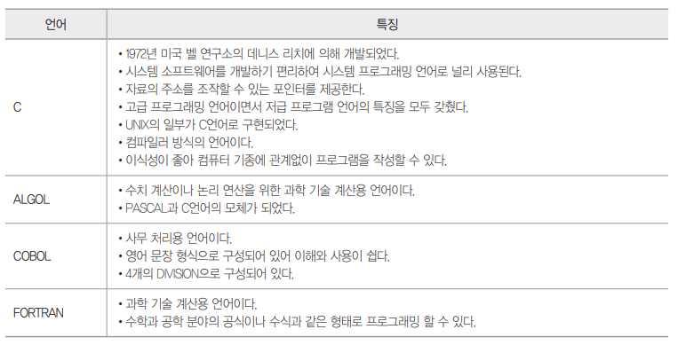

# Syntax_Language

### 이민아 

---

## Index

- [절차형 프로그래밍 언어](#절차형-프로그래밍-언어)

- [객체지향 프로그래밍 언어](#객체지향-프로그래밍-언어)

- [스크립트 언어](#스크립트-언어)

- [선언형 언어](#선언형-언어)

  

----

## 절차형 프로그래밍 언어

### 1. 정의

- 일련의 처리 절차를 정해진 문법에 따라 순서대로 기술해 나가는 언어

### 2. 유형

- **C**
  - 자료의 주소를 알 수 있는 포인터
  - 고급 및 저급 프로그래밍 언어 특징 모두
  - UNIX의 일부가 C로 구성
  - 컴파일러 방식의 언어
  - 이식성이 좋아 컴퓨터 기종에 관계없이 프로그램 작성
- **ALGOL**
  - 수치계산이나 논리 연산을 위한 과학 기술 계산용 언어
  - PASCAL과 C언어의 모체
- COBOL 
- FORTRAN

---

## 객체지향 프로그래밍 언어

### 1. 정의

- 현실 세계의 개체를 기계의 부품처럼 하나의 객체로 만들어 기계적인 부품들을 조립하여 제품을 만들듯이 소프트웨어를 개바할 때에도 객체들을 조립해서 프로그래밍 작성

### 2. 유형

- Java

  - 분산 네트워크 환경에 적용 요이
  - 멀티 스레드 기능으로 여러 작업 동시에
  - 운영체제 및 하드웨어에 독립적
  - 이석성이 강하다
  - 캡슐화가 가능하고 재사용성이 높다

- C++ 

  - C언어 객체지향 개념 적용

  - 모든 문자 객체로 모델링

- Smalltalk

  - 1세대 객체지향 프로그래밍 언어 중 하나로 순수한 객체지향 프로그래밍 언어
  - 최초로 GUI 제공한 언어

### 3. 구성 요소 ★

- **객체** : **속성**(데이터) **메소드**(데이터 처리 연산) 결합시킨 **실체**

  - 데이터 구조와 그 위에서 수행되는 연산들을 가지고 있는 SW 모듈
  - 속성 : 한 클래스 내 속한 객체들이 가진 **데이터값**들을 데이터 단위별로 정의하는 것으로서 성질, 분류, 식별, 수량 또는 현재 상태
  - 메소드 : 객체가 **메시지**를 받아 실행해야 할 때 **구체적인 연산** 정의하는 것으로 객체의 상태를 참조하거나 변경하는 수단

- **클래스** 

  - 두 개 이상의 유사한 객체들을 묶어서 **하나의 공통된 특성** 표현 요소

  - **객체의 유형 또는 타입**
  - 데이터를 **추상화**하는 **단위**

- 메시지 

  - **객체들 간**에 상호작용을 하는데 사용되는 수단으로 객체의 메소드를 일으키는 **외부의** 요구 사항
  - 메시지를 받은 객체는 대응하는 연산을 수행하여 예상된 결과 반환

### 4. 특징

- 캡슐화

- 정보은닉 : 다른 객체에게 자신의 정보를 숨기고 자신의 연산만을 통하여 접근 (캡슐화의 핵심 개념)

- 추상화 : 클래스

- 상속성 : 상위클래스와 하위클래스

- **다형성** 

  - 메시지에 의해 객체(클래스)가 연산을 수행하게 될 때 하나의 메시지에 대해 각 객체가 가지고 있는 고유한 방법으로 응답하는 능력 

  - 객체(클래스)들은 동일한 메소드명을 사용하며 같은 의미의 응답

---

## 스크립트 언어

### 1. 정의

- HTML 문서 안에 직접 프로그래밍 언어를 삽입하여 사용하는 것으로 기계어로 컴파일 되지 않고 별도의 번역기가 소스를 분석하여 동작하게 하는 언어

### 2. 유형

- 서버형 스크립트 언어

  > 서버에 해석되어 실행된 후 결과만 클라이언트로 보내는 언어

  - 파이썬
  - ASP(Active Server Page)
  - JSP(Java Server Page)
  - PHP(Professional Hypertext Preprocessor)
  - 펄(Perl)
  - 루비(Ruby)

- 클라이언트용 스크립트 언어

  > 클라이언트 웹 브라우저에서 해석되어 실행되는 스크립트 언어

  - 자바 스크립트
  - VB 스크립트

---

## 선언형 언어

### 1. 정의

- 프로그램이 수행해야 할 문제를 기술하는 언어로 목표를 명시하고 알고리즘은 명시하지 않는다

### 2. 유형

- 함수형 언어 : 수학적 함수 조합하여 문제 해결하는 언어
  - LISP (재귀 / 연결리스트)
- 논리형 언어 : 기호 논리학에 기반을 둔 언어로 논리 문장을 이용
  -  PROLOG
- HTML 및 **XML** 

