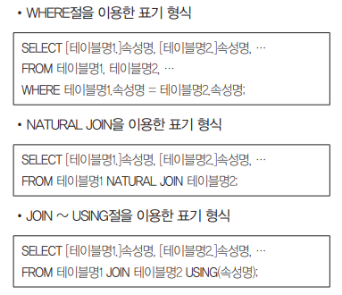

# Syntax_SQL

### 이민아 


---

## Index


- [개념](#개념)
- [DDL](#DDL)
- [DCL](#DCL)
- [DML](#DML)
- [JOIN](#JOIN)
- [절차형 SQL](#절차형-sql)
  - 트리거
  - 사용자 정의 함수
  - 커서
  - 프로시저


----

## 개념


- DDL 

  - DB 구조, 데이터 형식, 접근 방식 등 **DB 구축하거나 수정** 목적

  - **데이터 사전**이라는 특별한 파일에 여러 개의 테이블로서 저장
  
- DCL

  - 데이터 **보안, 무결성, 회복, 병행 제어** 등을 정의하는데 사용
  - 데이터베이스 **관리자**가 데이터 관리하는 목적
  
- DML

  - 데이터베이스 **사용자**가 응용 프로그램이나 질의어를 통해 저장된 데이터를 실질적으로 관리하는데 사용되는 언어
  
- JOIN

- 동적 SQL

  - 조건에 따라 SQL 구문 자체 변경하고 조작 가능

- 절차형 SQL

  > **특정 사용자**가 **실행 순서**를 정해놓고 사용하는 SQL문

  - 트리거
  - 사용자 정의 함수
  - 커서
  - 프로시저


----

## DDL

> 데이터 정의어 (Data Define Language)


### 1. CREATE

#### (1) CREATE TABLE

> `CREATE TABLE 테이블명` 

- KEY

  - `PRIMARY KEY(속성명)` : 기본키

  - `UNIQUE` : 대체키로 사용할 속성 또는 속성의 집합을 지정하는 것으로 중복된 값 가질 수 없다

  - `FOREIGN KEY(속성명) REFERENCES 테이블명(속성명)`

    - `ON DELETE` 옵션 : NO ACTION, CASCADE, SET NULL, SET DEFAULT

    - `ON UPDATE` 옵션 : NO ACTION, CASCADE, SET NULL, SET DEFAULT

- 제약조건

  - `CONSTRAINT` : 제약 조건의 이름 지정하며 이름 지정할 필요없으면 CHECK절만 사용

  - `CHECK` : 속성값 제약 조건 정의

- [input]

```sql
CREATE TABLE Instructor
-- CREATE TABLE 테이블명
(	id CHAR(5),
 	-- 속성명 자료형 
 	name CHAR(15) NOT NULL,
 	-- 속성명 자료형 NOT NULL
 	dept CHAR(15),
 	-- 속성명 자료형 (외래키)
 	PRIMARY KEY(id),
 	-- 기본키 PRIMARY KEY(속성명)
 	FOREIGN KEY(dept) REFERENCES
 	-- 외래키 FOREIGN KEY(속성명) REFERENCES
 		Department(name)
 			ON DELETE SET NULL
 			-- 삭제되는 경우 ON DELETE
 			-- 관련된 모든 튜플의 속성값은 NULL (SET NULL)
 			ON UPDATE CASCADE
 			-- 변경되는 경우 ON UPDATE
 			-- 관련된 모든 속성값도 같은 값으로 변경(CASCADE)
);
```

#### (2) CREATE VIEW 

> `CREATE VIEW 뷰명`  `AS SELECT` 

- [input]

```sql
CREATE VIEW 출석부
-- CREATE VIEW 뷰명
AS SELECT 성명, 사진, 학년
-- AS SELECT 속성명
-- 서브쿼리
FROM 학생
-- FROM 테이블명
WHERE 학생=2;
-- WHERE 속성명 조건
-- UNION이나 ORDER BY 사용불가
```


### 2. ALTER / DROP

#### (1) ALTER TABLE

> `ALTER TABLE 테이블명`

- 속성
  - `ADD 속성명 자료형` 추가
  - `ALTER | MODIFY 속성명 `  정의 변경
  - `DROP COLUMN 속성명 CASCADE` 삭제

- [input]

```sql
-- ALTER TABLE 테이블명 ADD 속성명 자료형
-- ALTER TABLE 테이블명 DROP COLUMN 속성명 CASCADE
-- ALTER TABLE 테이블명 ALTER | MODIFY 속성명
ALTER TABLE HRD ALTER 주민번호 NUMBER(6);
ALTER TABLE HRD MODIFY 주민번호 NUMBER(6);
-- HRD 테이블에서 주민번호의 속성의 크기를 6으로 변경
```

#### (2) DROP TABLE

> `DROP TABLE 테이블명`

- `CASCADE`  : 제거할 요소 참조하는 **모든** 개체 **함께 제거(참조 무결성** 제약 조건)
- `RESTRICTED`  : 다른 개체가 제거할 요소를 참조중인 경우 **제거 취소**

- [input]

```sql
-- DROP TABLE 테이블명 CASCADE
-- DROP TABLE 테이블명 RESTRICTED 
DROP TABLE 사원 CASCADE
-- 사원 테이블을 제거하고 참조하는 모든 데이터도 함께 제거
```


---

## DCL

> 데이터 제어어 (Data Control Language)


### 1. GRANT / REVOKE ★

#### (1) 사용자 등급 지정 및 해제

> `GRANT 사용자등급 TO 사용자_ID_리스트 ` , `REVOKE 사용자등급 FROM 사용자_ID_리스트 `

- [input]

```sql
-- GRANT 사용자등급 TO 사용자_ID_리스트 
-- REVOKE 사용자등급 FROM 사용자_ID_리스트 
```

#### (2) 테이블 및 속성에 대한 권한 부여 및 취소

- 권한 : `ALL`, `SELECT`, `INSERT`, `DELETE`, `UPDATE`, `ALTER` 등
- `GRANT` 
  - `WITH GRANT OPTION` : 부여받은 권한을 다른 사용자에게 **다시 부여**할 수 있는 권한
  - `ON 테이블명 TO 사용자`
- `REVOKE`
  - `GRANT OPTION FOR` : 다른 사용자에게 권한을 부여할 수 있는 권한을 취소
  - `CASCADE` : 권한 취소 시 권한 부여받았던 사용자가 부여한 권한도 **연쇄적 취소**
  - `ON 테이블명 FROM 사용자`

- [input]

```sql
-- GRANT 권한_리스트 ON 테이블명 TO 사용자 (WITH GRANT OPTION)
GRANT ALL ON 사원 TO 김영웅;
-- REVOKE (GRANT OPTION FOR) 권한_리스트 ON 테이블명 FROM 사용자 (CASCADE)
REVOKE SELECT, INSERT, DELETE ON 고객 FROM 이민지;
```


### 2. COMMIT / ROLLBACK / SAVEPOINT 

#### (1) COMMIT

- **트랜잭션이 성공적으로 끝나면** DB가 새로운 **일관성** 상태를 가지기 위해 변경된 **모든** 내용을 DB에 반영해야 하는 데 사용하는 명령

#### (2) ROLLBACK 

- **아직 COMMIT 되지 않은** 변경된 모든 내용들을 **취소하고** DB를 **이전** 상태로 되돌리는 명령어

#### (3) SAVEPOINT 

- 트랜잭션 내에서 **ROLLBACK할 위치인 저장점**을 지저하는 명령어
- 저장점을 지정할 때에는 **이름 부여**
- ROLLBACK시 지**정된 저장점까지 트랜잭션 처리 내용이 취소**


----

## DML

> 데이터 조작어 (Data Manipulation Language)


### 1. SELECT ★

#### (1) SELECT

> `SELECT (PREDICATE) (*|테이블명.)속성명 (AS 헤더) FROM 테이블명 `

- 속성명
  - `*` : 모든 속성
  - `테이블명.속성명` : 2개 이상의 테이블 대상으로 검색
  - `AS` : 테이블 헤더 이름 지정
-  PREDICATE : 불러올 튜플 수를 제한할 명령어
  - ALL
  - DISTINCT : 중복 튜플 존재 시 그중 첫번째만 검색
  - DISTINCTROW : 중복된 튜플 검색하지만 선택된 속성값이 아닌 튜플 전체 대상

#### (2) 조건 / 그룹 / 순서 / 개수 ★

> `FROM` `WHERE` `GROUP BY` `HAVING` `SELECT` `DISTINCT` `ORDER BY` `LIMIT`

- 조건 (WHERE)
- 그룹 (GROUP BY)
  - HAVING : 그룹의 조건 
- 순서 (ORDER BY)
  - ASC|DESC : 생략하면 ASC 자동
- 개수 (LIMIT)

- [input]

```sql
-- WHERE 조건 
-- GROUP BY 속성명 HAVING 조건 
-- ORDER BY 속성명 (ASC|DESC)
```

#### (3) 집계 함수

> 일반적으로 **GROUP BY와 사용**


- [input]

```sql
SELECT COUNT(DISTINCT DEPT) FROM STUDENT WHERE DEPT='전산과';
-- 전산과인 경우 DEPT를 중복 제거한 후 개수를 구하는 경우(1)
```

- **집계 함수** : 여러 행과 테이블 전체로부터 하나의 결과값 반환 
- 그룹 함수 : 소그룹 간의 중간 합계, 소계 산출 함수
  - ROLLUP : 소계, 중간 집계값 산출
  - CUBE : 다차원 집계 생성
  - GROUPING SET : 컬럼에 대한 개별 집계
- 윈도 함수 : DB 사용한 온라인 분석 처리 용도 사용하기 위해 SQL에 추가한 함수
  - 순위 함수
  - 행 순서 함수
  - 그룹 내 비율 함수

#### (4) 중복 조건 ★


### 2. INSERT ★

- [input]

```sql
-- INSERT INTO 테이블명(속성명1, 속성명2) VALUES (값1, 값2);
```


### 3. DELETE ★

- [input]

```sql
-- DELETE FROM 테이블명 WHERE 조건; 
DELETE FROM 사원 WHERE 이름='홍길동'; 
```


### 4. UPDATE ★

- [input]

```sql
-- UPDATE 테이블명 SET 속성명='값' WHERE 조건;
UPDATE 고객 SET 등급='VIP' WHERE 구매금액 >= 10000;
```


-----

## JOIN


### 1. JOIN 

#### (1) 정의

- 2개의 테이블에 대해 연관된 튜플들을 결합하여 하나의 새로운 릴레이션

#### (2) 유형

- INNER JOIN(교집합)

  > 관계가 설정된 두 테이블에서 조인된 필드가 일치하는 행만 표시

  

- OUTER JOIN(합집합)

  - **LEFT JOIN(부분집합)** 

    > INNER JOIN 조건에 만족하지 않는 튜플들에 NULL값 붙여 추가

    

    

  - **RIGHT JOIN(부분집합)**

    


### 2. 문제 (Programmers) 

#### (1) 없어진 기록 찾기

- [input]

```sql
SELECT OUTTABLE.ANIMAL_ID, OUTTABLE.NAME
-- ID와 이름
-- A.FIELD1, A.FILED2
FROM ANIMAL_OUTS OUTTABLE LEFT JOIN ANIMAL_INS INTABLE 
-- FROM A_TABLE A OO JOIN B_TABLE B
ON OUTTABLE.ANIMAL_ID = INTABLE.ANIMAL_ID
-- ON A.KEY = B.KEY
-- 입양을 간 기록은 있고 (ANIMAL_OUTS)
WHERE INTABLE.ANIMAL_ID IS NULL
-- WHERE B.KEY IS NULL(A, B 교집합 제외 A-B)
-- 보호소에 들어온 기록이 없는 동물(ANIMAL_INS)
ORDER BY ANIMAL_ID
-- ID 순으로 조회
```

#### (2) 보호소에서 중성화한 동물 

- [input]

```sql
SELECT A.ANIMAL_ID, A.ANIMAL_TYPE , A.NAME
-- 동물의 아이디와 생물 종, 이름을 조회
FROM ANIMAL_INS A LEFT JOIN ANIMAL_OUTS B
ON A.ANIMAL_ID = B.ANIMAL_ID
-- ANIMAL_OUTS 테이블의 ANIMAL_ID는 ANIMAL_INS의 ANIMAL_ID의 외래 키
WHERE A.SEX_UPON_INTAKE LIKE 'Intact%' 
AND B.SEX_UPON_OUTCOME NOT LIKE 'Intact%'
-- 보호소에 들어올 당시에는 중성화(SEX_UPON_INTAKE)X
-- 보호소를 나갈 당시에는 중성화(SEX_UPON_OUTCOME)O
ORDER BY A.ANIMAL_ID
-- 아이디 순으로 조회
```

#### (3) 오랜기간 보호한 동물(1)

- [input]

```sql
SELECT A.NAME, A.DATETIME
-- 이름과 보호 시작일
FROM ANIMAL_INS A LEFT JOIN ANIMAL_OUTS B
ON A.ANIMAL_ID = B.ANIMAL_ID
-- ANIMAL_OUTS 테이블의 ANIMAL_ID는 ANIMAL_INS의 ANIMAL_ID의 외래 키
WHERE B.ANIMAL_ID IS NULL
-- 아직 입양을 못 간 동물 중(ANIMAL_OUTS에 없는 경우)
ORDER BY A.DATETIME
-- 보호 시작일 순으로 조회
LIMIT 3
-- 가장 오래 보호소에 있었던 동물 3마리
```

#### (4) 있었는데요 없었습니다

- [input]

```sql
SELECT A.ANIMAL_ID, A.NAME
-- 아이디와 이름을 조회
FROM ANIMAL_INS A LEFT JOIN ANIMAL_OUTS B
-- LEFT JOIN 
ON A.ANIMAL_ID = B.ANIMAL_ID
-- ANIMAL_OUTS 테이블의 ANIMAL_ID는 ANIMAL_INS의 ANIMAL_ID의 외래 키
WHERE A.DATETIME > B.DATETIME
-- 보호 시작일(A.DATETIME)보다 입양일(B.DATETIME)이 더 빠른 동물
ORDER BY A.DATETIME
-- 보호 시작일이 빠른 순으로 조회
```


-----------

## 절차형 SQL

> **특정 사용자**가 **실행 순서**를 정해놓고 사용하는 SQL문


### 1. 트리거 ★

#### (1) 정의 

- DB 시스템에서 **삽입, 갱신, 삭제 등의 이벤트**가 발생할때마다 관련 작업이 자동으로 수행되는 **절차형 SQL**
- DB에 저장되며 데이터 변경 및 무결성 유지, 로그 메시지 출력 등의 목적으로 사용

#### (2) 구성도 


#### (3) 명령어


#### (4) 유형

- 행 트리거 : 데이터 변환시 실행
- 문장 트리거 : 트리거에 의해 한 번 실행


### 2. 사용자 정의 함수 

#### (1) 정의 

- **프로시저와 유사하게** SQL을 사용하여 **일련의 작업을 연속적**으로 처리하며 종료시 처리 결과를 **단일값으로 반환**하는 **절차형 SQL**
- 조회, 삽입, 삭제, 수정 등 **DML 문의 호출**에 의해 실행
- 예약어 **RETURN을 통해 값을 반환**하여 출력 파라미터가 없다

#### (2) 구성도 


#### (3) 명령어


### 3. 커서

#### (1) 정의

- 쿼리문의 처리 결과가 저장되어 있는 **메모리 공간을 카리키는 포인터**
- 내부에서 자동 생성 혹은 사용자가 직접 정의해서 사용
- 수행 : (선언/명시적 커서) 열기 → 패치 → 닫기 

#### (2) 속성 


#### (3) 유형

- 묵시적 커서

  - **DBMS에서 자체적으로** 열리고 패치되어 사용이 끝나면 닫힌다
  - 커서의 속성을 조회하여 쿼리 정보 열람 가능

- 명시적 커서 

  - 사용자가 **직접 정의**해서 사용하는 커서

  - 절차형 SQL에서 SELECT 문의 결과로 반환되는 여러 튜플들 제어
  - 3단계 열기 패치 닫기 전에 **선언 필수**


### 4. 프로시저

#### (1) 정의

- **절차형 SQL**을 활용하여 특정 기능을 수행하는 일종의 **트랜잭션** 언어
- 호출을 통해 실행되어 미리 저장해 놓은 SQL 작업 실행
- DB에 저장되어 수행되어 **스토어드 프로시저(Stored Procedure)**
- 시스템의 일일 마감작업, 일괄(Batch) 작업 등에 사용

####  (2) 유형 ★

- **PL/SQL** : 표준 SQL기반으로 Oracle에서 개발한 데이터 조작언어

- **JDBC  (Java DataBase Connectivity)** 

  **Java 언어로 다양한** 종류의 DB에 접속하고 SQL문 수행할 때 **표준 API**

#### (3) 구성도 


#### (4) 프로시저 명령어

- CREATE
- REPLACE


---

## References


- 시나공 정보처리기사 실기 대비용 핵심요약
- Programmers 문제풀이


---

